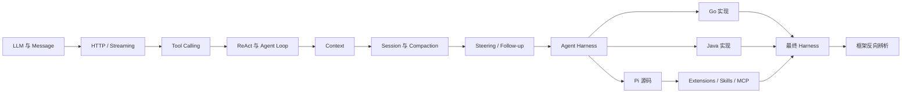

# 课程地图

## 阶段和产出

| 阶段 | 关键问题 | 产出 |
| --- | --- | --- |
| 1–2 | 模型一次请求看到什么？ | HTTP client、统一 Message、SSE 解析 |
| 3–4 | 谁执行 Tool？循环何时停？ | Tool registry、max steps、错误结果 |
| 5–6 | 进程重启后如何继续？ | Context 投影、Session、基础压缩 |
| 7 | Loop 外谁负责可靠性？ | Harness 分层设计和事件协议 |
| 8–10 | Pi 如何把这些连接起来？ | 源码调用链、调试记录、工具分析 |
| 11–16 | 如何安全地扩展、检索和观察？ | Extension、Skill、MCP、RAG、权限、Trace |
| 17–18 | 能否不用框架重写？ | Go/Java 可运行项目及离线测试 |
| 19–20 | 哪些设计是必需的？ | 最终架构与框架评估表 |

完成一阶段后，先写出该阶段的核心问题答案，再继续下一阶段。若答案只能复述术语，说明应该回到示例或测试。
