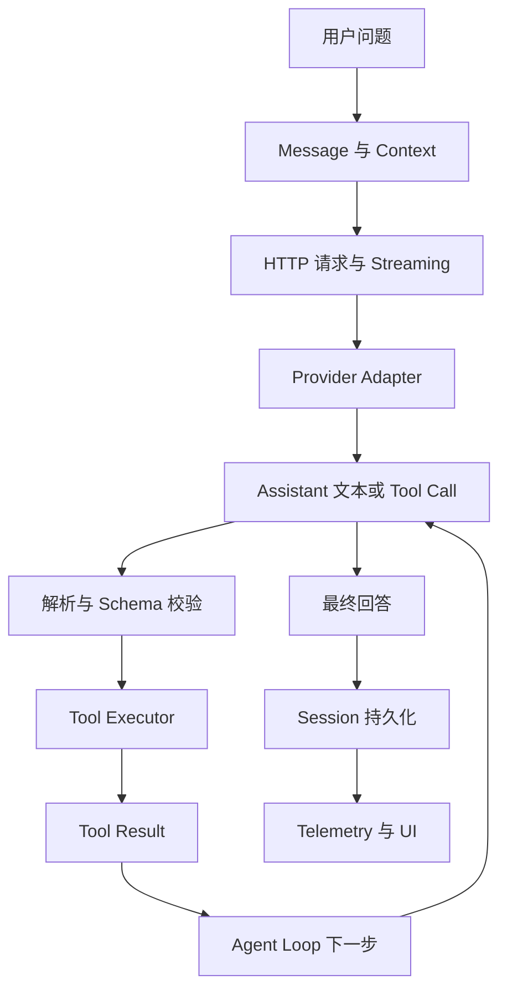
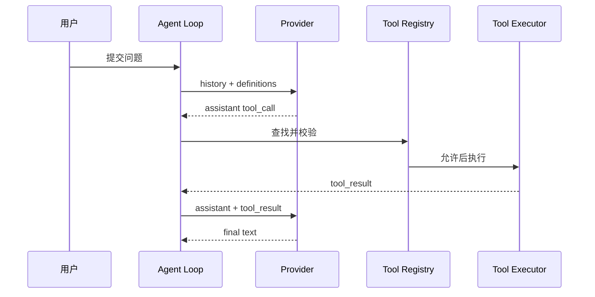

# 课程地图

## 这条路线要解决什么问题

很多 Agent 教程直接从 `Agent.invoke()` 开始，读者能得到答案，却不知道一次请求中发生了什么。本课程反过来：先发一条普通 HTTP 请求，再逐层加入结构化输出、工具、循环、Session 和恢复。每一层都有自己的输入、输出和测试边界。



图中最容易误读的一点是：`C` 只代表模型输出，`E` 才代表真正的副作用。Harness 负责把这些步骤串起来、记录状态并处理失败；它不是模型，也不是某个 Tool。

## 阶段 0：建立阅读方式

### 学习目标

- 知道原创教材、Pi 源码分析和 Pi 官方文档中文参考版的区别。
- 能用“模型输出 / Runtime 动作 / Harness 状态”给一段描述分类。
- 知道 TypeScript、Go、Java 只是在表达同一组边界时采用不同语言机制。

### 产出

写一张自己的职责表，并标出 `LLM`、`Agent Loop`、`Tool Runtime`、`Session`、`CLI/TUI` 各自不负责什么。

## 阶段 1：从 LLM 到 Agent

### 学习目标

理解 Token、Context Window、Message role、System Prompt、Sampling、Streaming、Usage、Thinking 和 Stop Reason。重点问题是：**模型到底返回了什么？**

### 产出

能够手写一份包含 `system`、`user` 和 `assistant` 的请求/响应 JSON，并解释每个字段是否属于模型内容、控制信号或账务信息。

## 阶段 2：HTTP、Provider 与结构化输出

### 学习目标

从 `net/http` 或 `HttpClient` 发送请求，理解状态码、认证、JSON 解码和 SSE 事件边界；知道 Chat Completions、Responses、Anthropic Messages 的差异应停留在 adapter。

### 产出

一个离线 fake server 测试：先返回文本，再返回被切开的 SSE，再返回 429/坏 JSON；客户端能给出可定位的错误。

## 阶段 3：Tool Calling 与 Agent Loop

### 学习目标

理解工具定义只是模型可见的 metadata；Runtime 还需要查找、解析、Schema 校验、权限判断和执行。然后用有限循环处理多次 tool call，并在 `maxSteps`、abort、retry 时终止。

### 产出

calculator Agent：第一轮返回工具调用，第二轮看到 Tool Result 后返回最终文本。测试要证明工具真的被调用，且 unknown tool 不会执行任意函数。



## 阶段 4：Context、Session 与 Compaction

### 学习目标

区分“这次请求看到的 Context”和“跨进程保存的 Session”。理解 context window 变满时不能只删除最早字符串：工具调用必须配对，系统约束不能随意丢，摘要要明确进入下一次 context 的位置。

### 产出

一个 JSONL Session 保存/恢复测试和一个确定性 compaction 测试。记录压缩前后的 message、保留的尾部以及可能丢失的细节。

## 阶段 5：Steering、Follow-up 与 Harness

### 学习目标

解释运行中的新指令为什么要排队到 turn boundary；区分 steering、follow-up、next-run、abort。随后把模型、Tool Registry、权限、重试、Session、事件和 Telemetry 组合成 Harness。

### 产出

一次竞态实验：工具执行期间提交“不要修改数据库”，断言它不会偷偷插入已经发出的 provider request，而会在安全边界被消费。

## 阶段 6：阅读 Pi

依次阅读：

1. `packages/ai/src/types.ts` 和 API adapters，确认统一类型如何投影到厂商请求。
2. `packages/agent/src/agent-loop.ts`，确认 `for await`、prepare、execute 和事件。
3. `packages/agent/src/agent.ts`，确认生命周期、队列和 abort。
4. `packages/coding-agent/src/core/agent-session.ts`，确认工具、Session、资源和 Extensions 的组合。

每页都绑定固定 commit `853a80d26c90a14c1886f0ebb8ffaae133ca2185`，不要用行号代替 symbol。

## 阶段 7：扩展边界

Extensions 通过宿主 API 改变行为，Skills 通过渐进披露提供指令资源，MCP 通过 JSON-RPC 连接外部进程，RAG 通过检索给模型补充知识。它们不是同一个插件名词。

### 产出

画四张小图，分别回答：

- Extension 的代码在哪个进程执行？
- Skill 全文何时进入 Context？
- MCP Tool 如何变成 Agent Tool？
- RAG 结果如何带 tenant filter 和 citation？

## 阶段 8：Go 与 Java

两套实现沿同一条能力路线，但不复制语言写法：

| 阶段 | Go | Java |
| --- | --- | --- |
| 01–02 | `net/http`、JSON、SSE | `HttpClient`、Jackson、SSE |
| 03–05 | interface、Registry、文件/命令 Tool | interface、`JsonNode`、JDK Tool |
| 06–08 | struct、`context.Context`、goroutine | record/class、Token、`ExecutorService` |
| 09–11 | JSONL、queue、channel/回调 | JSONL、queue、Listener |
| 12–14 | explicit registry、Skill、stdio JSON-RPC | SPI、`ServiceLoader`、Skill、JSON-RPC |
| 15 | `Harness` 组合边界 | `Harness` 组合边界 |

两者都使用 `ScriptedModel`，所以测试不需要密钥，也不会因为远端模型改变而随机失败。

## 阶段 9：最终 Harness 与框架

最终设计不是再写一个 `while (true)`，而是明确 `ModelProvider`、`PromptBuilder`、`ContextManager`、`MessageStore`、`ToolExecutor`、`RetryPolicy`、`PermissionManager`、`CompactionManager`、`PluginManager`、`MCPManager` 和 `Telemetry` 的边界。

完成后再看 Spring AI、LangChain4j、LangChain、LangGraph、Eino、ADK 和 Agents SDK，逐项标注它们替你完成了哪个边界、隐藏了什么状态、默认如何处理失败。

## 动手实验：制作阶段验收卡

### 目标

把本课程变成可以检查的工程产出，而不是一串读过的标题。

### 准备

为每个阶段建立一张卡片，包含“输入、输出、状态改变、失败场景、测试命令”五栏。先填写阶段 1–3，再逐步补齐后续阶段。

### 步骤

1. 在阶段 1 卡片写一份普通聊天 JSON，并标出 token/usage/stop reason。
2. 在阶段 2 卡片写 HTTP 2xx、429、坏 JSON 和断流的处理方式。
3. 在阶段 3 卡片写 calculator 的两轮消息及 `toolCallId` 配对。
4. 在阶段 4–5 卡片加入 Session、Compaction、Steering 和 Abort 的状态变化。
5. 在阶段 8 卡片填写 Go/Java 的测试命令和 Fake Model 行为。
6. 在阶段 9 卡片写出你认为框架替你隐藏的 Harness 模块，并注明证据。

### 观察点

“模型返回 Tool Call”和“Tool 已执行”必须是两格；“请求失败”和“运行失败”也必须分开。若一张卡把它们合成一句“框架处理了”，说明边界仍然不清楚。

### 预期结果

每个阶段都有可运行或可检查的产出，后续章节能引用前一阶段的输入，而不是重新定义概念。

### 思考题

如果阶段 2 的 SSE parser 没有测试分片边界，阶段 3 的 Loop 测试即使通过是否仍可信？如果阶段 4 只保存 `List<Message>`，阶段 5 能否安全实现 Steering？

## 总验收

完成课程不以“页面看过”为准，而以能否画出并实现下面这条链路为准：

```text
用户输入
→ Context 构建
→ System Prompt / Session History / Tool Definitions
→ Provider Request
→ Streaming Response
→ Tool Call
→ Parse + Schema + Permission
→ Tool Execution
→ Tool Result
→ 下一轮 Agent Loop
→ Compaction / Steering / Retry（必要时）
→ Final Answer
→ Session Persistence + Telemetry
```

## 小结与自测

如果你只能说“框架会自动处理”，说明还没有完成底层学习。请用自己的实现回答三个问题：

1. 模型看到了哪些内容，但没有执行哪些动作？
2. 哪一步产生了不可逆副作用，谁在它之前写了权限或意图？
3. 进程在 Tool 执行中崩溃时，重启后如何判断重试、跳过或标记失败？
