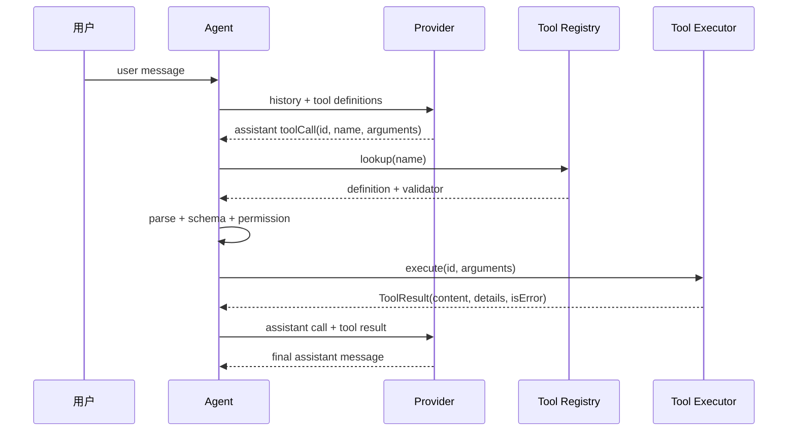

# Message 与 API 数据结构

## 学习目标

本页要解决的不是“怎么定义一个 Message class”，而是：同一段对话为什么要同时存在 Session Message、Agent Message、Provider Message 和 Tool Result？读完后，你应能从一条 tool call 追踪到下一轮请求，并解释哪些字段必须保持配对。

## 前置场景：一条消息的四种形态

用户说：“读取 `README.md`，然后总结。”内部可能经历：

```text
User input
  -> AgentMessage(user)
  -> Provider payload(user)
  -> AssistantMessage(toolCall)
  -> ToolResultMessage(callId)
  -> Provider payload(tool result)
  -> AssistantMessage(final text)
```

它们表达相同的一次任务，但不能强行复用同一个厂商 DTO。原因很具体：OpenAI Responses 使用 output items，Anthropic 使用 content blocks，Session 还可能保存 UI label、thinking signature 或扩展自定义事件。

## Pi 的统一类型

固定研究文件：`packages/ai/src/types.ts`；研究 commit：`853a80d26c90a14c1886f0ebb8ffaae133ca2185`。重点 symbol 是 `Message`、`Context`、`AssistantMessage`、`ToolCall`、`ToolResultMessage`、`Usage` 和 `AssistantMessageEvent`。

可以把概念简化成：

```typescript
type Message = UserMessage | AssistantMessage | ToolResultMessage;

interface Context {
  systemPrompt?: string;
  messages: Message[];
  tools?: Tool[];
}
```

这段代码的关键不是 TypeScript union 的写法，而是它表达了**允许的消息集合是有限的**。`AssistantMessage` 可以包含文本、thinking、Tool Call 和 stop reason；`ToolResultMessage` 必须关联 `toolCallId`。Provider 适配器再把它们转成厂商能接受的 payload。

`AgentMessage` 是 Agent 层对消息的扩展。它可以保存 UI-only 或 custom message，但不保证每种消息都能直接发送给模型。`agent-loop.ts` 在 Provider 边界调用转换逻辑（例如 `convertToLlm`），过滤或合成可发送的消息。

## 字段应该怎样理解

| 字段 | 用途 | 典型拥有者 | 常见误解 |
| --- | --- | --- | --- |
| `role` | 区分 user/assistant/tool/system 语义 | Message contract | 任意字符串都能让 Provider 理解 |
| `content` | 文本或内容块 | assistant/tool | 空文本代表没有响应，可能其实只有 Tool Call |
| `toolCallId` | 把结果配回一次调用 | Runtime/Provider | 只要工具名相同就能配对 |
| `name` | 查找 Tool 或标记结果来源 | Registry/adapter | name 本身授予执行权限 |
| `arguments` | 模型生成的原始参数 | Runtime 输入 | JSON 合法就可信 |
| `stopReason` | 驱动继续、重试或结束 | Runtime | 它只是展示给用户的文案 |
| `usage` | token、缓存和成本 | Provider/Telemetry | 不是消息正文，可以丢掉 |
| `responseId` | Provider 的追踪/延续句柄 | Provider | 所有 API 都可用同一种续传方式 |

## Tool Call 的完整生命周期



逐步看状态改变：

1. 用户输入先成为历史中的 user message。
2. Provider 返回 assistant message；此时还没有文件读取结果。
3. Runtime 用 `name` 查找 registry，用 `id` 保存配对关系，用 arguments 做不可信输入。
4. 只有 Schema、业务规则和权限通过后才调用 `execute`。
5. Runtime 把结果做成 tool result message，并保留 `toolCallId`。
6. 下一次 Provider 请求同时看到调用和结果，模型才能知道刚才的动作发生了什么。

如果第 3 步发现 unknown tool，仍可以追加 error Tool Result 让模型改正；不能调用一个“差不多同名”的函数。

## 三家 API 的投影

### OpenAI Chat Completions

内部消息通常投影为 `messages` 数组，assistant 可以有 `tool_calls`，工具结果使用 `role: "tool"` 和 `tool_call_id`。请求和响应的数组形状相对直观，但 arguments 往往是 JSON 字符串，需要再次解析。

### OpenAI Responses

Responses API 使用 output items 表达 message、function call 和 function output；流事件的粒度也与 Chat Completions 不同。不要在 Agent Loop 里假设一定存在 `choices[0].message`。

### Anthropic Messages

system 通常单独传递，assistant/user 的 content 是 blocks，tool use 和 tool result 也是 blocks。一个 assistant block 可能同时有文本和工具调用，因此“content 非空就结束”的判断不可靠。

### Google Gemini

函数调用和函数响应通常作为 parts；角色、工具声明和响应结构与 OpenAI/Anthropic 不同。adapter 应把它们统一成内部 Tool Call/Tool Result，而不是把 Gemini parts 传遍应用。

## Provider 边界的规则

Provider adapter 应负责：

- 将内部 Message 转成厂商请求。
- 将 tool definitions 转成厂商 schema。
- 解析普通响应和流事件。
- 归一化 Tool Call、Usage、Thinking 和 Stop Reason。
- 保留必要的 provider response id/raw data。
- 把认证、HTTP 错误和重试信号交给明确的策略层。

Agent Loop 应负责：

- 判断 assistant 是否包含 Tool Call。
- 调用 Registry、校验参数和权限。
- 执行工具并生成统一 Tool Result。
- 决定继续下一轮、消费 follow-up 或结束。

不要让 `AgentLoop` 直接 import `@anthropic-ai/sdk` 或 OpenAI response item；那会让每个控制流分支都绑定一个厂商。

## Go 与 Java 对照

| 内部概念 | Go 示例 | Java 示例 |
| --- | --- | --- |
| Message | `Message` struct | `Message` record/class |
| 原始参数 | `json.RawMessage` | Jackson `JsonNode` |
| Model | `Model.Complete` | `Model.complete` |
| Tool Call | `ToolCall` | `ToolCall` |
| Tool Result | `ToolResult` + `RoleTool` message | `ToolResult` + `Message.tool` |
| Provider payload | `map[string]any` | Jackson object tree |

Go 的 `json.RawMessage` 和 Java 的 `JsonNode` 都保留了“先拿原始输入、稍后校验”的边界；不能在反序列化时直接映射成任意业务对象并跳过授权。

## 动手实验：观察两轮请求

### 目标

证明 Tool Call 是模型输出，Tool Result 是 Runtime 追加的消息。

### 准备

打开：

- `examples/go-agent/internal/agent/agent_test.go` 的 `TestToolCallIsExecutedAndReturnedToModel`。
- `examples/java-agent/src/test/java/learning/agent/AgentTest.java` 的 `executesToolAndSendsToolResultBack`。

### 步骤

1. 找到第一轮 `ScriptedModel` response，记录 `id/name/arguments`。
2. 找到 `AgentLoop` 调用 Registry 的位置。
3. 在测试中打印 `model.Requests[1].Messages` 或 Java `model.requests().get(1)`。
4. 断言最后一条 message 的 role 是 `tool`。
5. 修改 Tool Result 的内容，观察第二轮模型最终回答随之变化。
6. 把工具名改成 `missing`，确认不会执行 calculator。

### 观察点

第一轮模型并没有得到文件内容。工具执行后的结果必须带 call id，否则模型可能无法把多个并行调用分别对应起来。

### 预期结果

Go/Java 测试都能证明第二轮 request 包含 Tool Result，并且 unknown tool 的 dispatch 计数为零。

### 思考题

如果两个 Tool Call 都叫 `read`，为什么仍需要两个不同的 call id？如果 Provider 返回的 arguments 不是合法 JSON，应当在 adapter 报错、Registry 报错还是 Tool 内部报错？请说明每种选择的可恢复性。

## 小结

统一 Message 类型的价值是把 Provider 差异留在边界，把 Agent Loop 写成稳定的状态机。Message 历史负责表达上下文，Tool Call 表达意图，Tool Result 表达执行事实，Usage/Stop Reason 表达控制和诊断。四者混成一段文本，后续校验、重试和恢复都会失去可靠依据。
