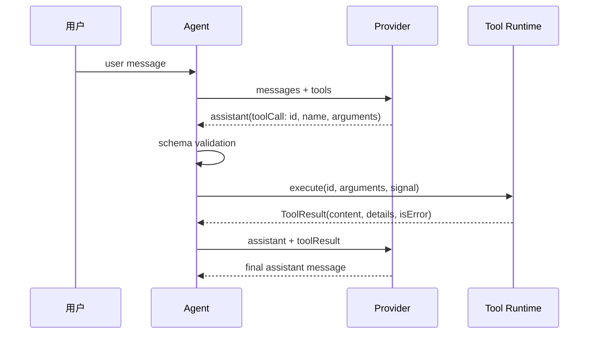

# Message 与 API 数据结构

## Pi 的统一类型

固定研究文件：`packages/ai/src/types.ts`，核心 symbol 是 `Message`、`Context`、`AssistantMessage`、`ToolCall`、`ToolResultMessage`、`Usage` 和 `AssistantMessageEvent`。

```typescript
type Message = UserMessage | AssistantMessage | ToolResultMessage;

interface Context {
  systemPrompt?: string;
  messages: Message[];
  tools?: Tool[];
}
```

`AgentMessage` 是 Agent 层对 Message 的扩展，允许 UI-only 或 custom message；`agent-loop.ts` 在 Provider 边界调用 `convertToLlm`，过滤或转换不能直接发送的消息。这是一个很实用的分层：Session 可以保存更多信息，Provider 只收到它理解的投影。

## Tool Call 的生命周期



`id` 用来把结果与请求配对；`name` 用来查 registry；`arguments` 是不可信输入。工具执行成功后，Runtime 才创建 `toolResult` 消息。

## 厂商差异放在哪里

OpenAI Chat Completions 常把工具结果作为 `tool` message；Responses API 使用 output item 和对应的 function output；Anthropic Messages 使用 content blocks；Google Gemini 使用 function call/response parts。不要让 `AgentLoop` 直接拼这些结构。Provider adapter 应负责转换，并统一回传 Pi 的 `AssistantMessageEvent`。

## 练习

用项目中的 Go/Java `ScriptedModel` 打印：请求消息、模型响应、工具执行参数和下一次请求消息。验证工具结果中包含 `toolCallId`，而不是仅有一段文本。
