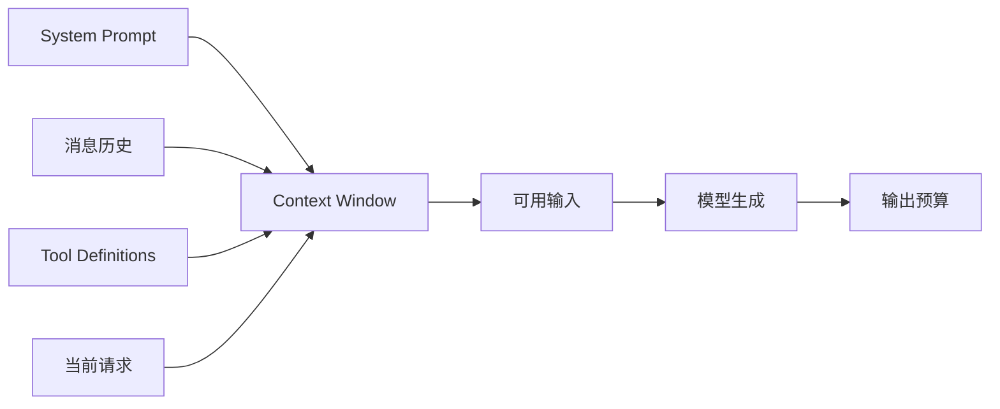

# 核心概念

## 学习目标

本页结束时，你应该能读一份 LLM response，并回答：哪些字段会被再次放入上下文，哪些字段只是控制流，哪些字段用于计费和观测？还要能解释为什么 `String.length()` 不是 token 数量，以及为什么 `length` 不一定表示“模型回答太长”。

## 前置场景：一次回答并不只有文本

用户问“读取配置并总结”，模型可能返回：

```json
{
  "role": "assistant",
  "content": "",
  "thinking": [{"type": "thinking", "text": "需要先读取文件"}],
  "tool_calls": [{
    "id": "call-7",
    "name": "read",
    "arguments": {"path": "config.yaml"}
  }],
  "stop_reason": "tool_use",
  "usage": {
    "input_tokens": 840,
    "output_tokens": 42,
    "reasoning_tokens": 18
  }
}
```

这里不能只取 `content`：`tool_calls` 驱动下一步，`stop_reason` 告诉 Loop 不能在这一轮结束，`usage` 影响预算和 Telemetry。`thinking` 是否可见、是否会被重放，取决于 Provider 和统一消息契约；业务不应把它当成稳定的事实来源。

## Token

### 通俗解释

Token 是模型分词器处理的离散片段。英文单词、标点、中文字符和代码片段可能各占不同数量的 token。一个 Java `String` 的字符数、UTF-16 code unit 数和 Provider 的 token 数不是同一个指标。

### 工程定义

Token 是 Context Window、输入/输出计费和某些采样预算使用的计量单位。准确数量必须由 Provider tokenizer 或响应中的 `Usage` 给出；本地估算只能用于提前裁剪。

```text
"hello"        -> 可能是 1 个或多个 token
"读取 config"  -> 由具体 tokenizer 决定
String.length  -> 只能告诉你 Java 字符长度，不能告诉你 token 数
```

### 错误处理

不要用字符数硬编码“剩余 1000 token”。更安全的做法是：先保留 system prompt、当前用户请求和 tool call 配对关系，再用 provider tokenizer 或保守估算决定是否 compaction。估算误差必须留安全余量。

## Context Window

Context Window 是一次模型请求可处理的总 token 预算，通常包含输入消息、工具定义、模型输出预留和 Provider 特有字段。不同 Provider 对 system、tool schema、thinking budget 的计量方式可能不同。



输入过长与输出达到上限是两种故障：前者通常在请求前或 Provider 返回错误，后者可能给出 `stop_reason: length`。两者都不能简单重试原请求，否则会重复付费并再次失败。

## Message 与 roles

`Message` 是带语义 role 和内容块的数据结构。常见 role 有：

| role/块 | 意义 | 谁产生 |
| --- | --- | --- |
| `system` | 宿主约束、工作规则和环境说明 | Harness/应用 |
| `user` | 用户意图 | 用户或队列 |
| `assistant` | 模型文本、thinking 或 Tool Call | Provider/模型 |
| `tool` | Tool 执行结果，通常带 call id | Runtime/Tool Executor |

`tool` 消息不是用户伪造的自然语言，也不是模型生成的“我已经完成”。它应与同一 assistant message 中的 `ToolCall.id` 配对。Session 可以保存 UI 细节和内部事件，但 Provider 只应收到可投影的合法消息。

## System Prompt、Context 和 Message History

System Prompt 是 Context 的一部分，但不是 Context 的同义词。可以把一次请求写成：

```text
provider request
├── system instruction
├── conversation messages
├── tool definitions
├── current user message
└── provider options
```

System Prompt 通常有较高优先级，但仍不能替代权限检查。即使 prompt 写着“只读”，Runtime 仍应在 `write` 或 `shell` 执行前进行 allowlist、路径和审批检查。

## Sampling

Sampling 控制模型从候选 token 分布中如何选择输出。常见选项包括 `temperature`、`top_p`、最大输出 token 和 seed（并非所有 Provider 都支持）。

- `temperature` 较高通常增加随机性；不是“智能度”开关。
- `top_p` 截断累计概率范围；通常不建议与 temperature 随意同时调大。
- seed 即使被支持，也不能保证跨 Provider、版本和硬件完全复现。
- 工具参数的正确性不能靠低 temperature 保证，必须在 Runtime 校验。

对 Agent 测试而言，`ScriptedModel` 比降低 temperature 更可靠，因为它直接固定响应序列。

## Streaming

Streaming 把一次未完成的响应拆成增量事件，例如 text delta、thinking delta、tool-call name delta 和 arguments delta。增量不是完整消息，客户端必须累计并在结束事件后构造 settled message。

```text
start
  -> text_delta("读取")
  -> text_delta("文件")
  -> done(stop_reason="stop")
```

网络层的 chunk 不等于 SSE event；一个 JSON 可能跨多个 chunk，一个 chunk 也可能包含多个 event。详见 [HTTP、SSE 与 Streaming](/02-llm-api/http-and-streaming)。

## Structured Output 与 Tool Calling

Structured Output 约束模型输出的形状，例如一个 JSON object；Tool Calling 是其中一种带 `name`、`id` 和 arguments 的结构化消息。两者都只描述模型想表达什么：

```text
结构合法 ≠ 参数有意义 ≠ 用户已授权 ≠ 函数已执行
```

`{"path":"../../secret"}` 可以是合法 JSON，也可能违反 workspace policy。必须按“解析 → schema → 业务规则 → 权限 → 执行”的顺序处理。

## Stop Reason

Stop Reason 是 Runtime 判断下一步的信号，不等于自然语言内容。常见语义包括：

| stop reason | Loop 通常做什么 |
| --- | --- |
| `stop`/无 tool call | 结束本次 run，除非有 follow-up |
| `toolUse`/`tool_use` | 校验并执行 Tool，再发下一请求 |
| `length` | 判断 overflow、compaction 或有限失败 |
| `error` | 进入 retry 或失败终态 |
| `aborted` | 传播取消并保存可恢复前缀 |
| `deferred`/pending | 挂起并等待外部结果（若系统支持） |

不同 Provider 的原始名称不相同，adapter 应先归一化，不能让核心 Loop 到处判断厂商字符串。

## Usage 与成本

`Usage` 常包含 input、output、reasoning、cache read/write 和 total token；成本还需要结合模型价格表。Usage 是事实记录，不应因为 UI 没显示最终文本就丢弃。重试、compaction 和 deferred fetch 是否计费，要按 Provider 返回和系统策略记录。

Telemetry 至少要保存 provider、model、step、耗时、stop reason、usage 和错误分类；默认不记录 prompt、文件内容、tool arguments 或 credentials，除非有明确脱敏策略。

## Thinking / Reasoning

Thinking 可能是 Provider 返回的可见内容、签名块、内部预算或仅一个 usage 字段。它不是所有模型都提供，也不保证可重放。Harness 应把 thinking 当成可选消息块：需要发回 Provider 时按 adapter 契约处理，需要展示时单独渲染，不能让业务逻辑依赖“模型一定会解释推理”。

## Pi 中的源码定位

研究 commit：`853a80d26c90a14c1886f0ebb8ffaae133ca2185`。

- `packages/ai/src/types.ts`：`Context`、`Message`、`AssistantMessage`、`ToolCall`、`ToolResultMessage`、`Usage` 和 `AssistantMessageEvent`。
- `packages/ai/src/models.ts`：`Model`、`Provider`、模型选择和 stream dispatch。
- `packages/ai/src/utils/event-stream.ts`：`EventStream` 与最终 `result()` 的组合。
- `packages/agent/src/agent-loop.ts`：读取 stream、判断 Tool Call、执行后继续或结束。

源码事实是类型和控制流；“为什么选择某种字段”如果没有源码/文档证据，只写成设计分析，不冒充作者声明。

## Go 与 Java 对照

| 任务 | Go | Java |
| --- | --- | --- |
| 消息 | `struct` + `json` tag | record/class + Jackson |
| 原始工具参数 | `json.RawMessage` | `JsonNode` |
| 取消 | `context.Context` | `CancellationToken`/interrupt |
| 异步流 | callback、channel 或 `bufio.Scanner` | callback、`Flow` 或 `HttpResponse` 行流 |
| 计量 | `Usage` struct | `Usage` record |

两种实现都把 Provider payload 和内部消息分开；这让测试可以在不访问真实 API 的情况下验证状态转换。

## 动手实验：给 response 分类

### 目标

从一个 Tool Calling response 识别内容、控制信号和诊断数据。

### 准备

打开 `examples/go-agent/internal/agent/model_test.go` 或 Java 的 `AgentTest`，找到 `ScriptedModel` 的两轮响应。

### 步骤

1. 写下第一轮 assistant 的 role、content 和 Tool Call。
2. 标出 `id`、`name`、arguments 分别用于配对、查找和参数校验。
3. 找到 `Tool.Execute`/`Tool.execute` 的调用位置。
4. 对照第二次 Model request，确认 tool result 是 Runtime 追加的。
5. 把 `stop_reason` 和 `usage` 标记为控制/账务数据，而不是用户文本。

### 观察点

Tool Call 没有执行结果；执行失败时仍可生成 error Tool Result。第二轮请求的历史比第一轮多了 assistant tool call 和 tool result。

### 预期结果

你可以明确说出“模型生成了调用意图，Runtime 验证并执行了工具，Usage 记录了成本，Stop Reason 驱动了 Loop”。

### 思考题

如果上下文只剩 100 token，应该先删掉 system prompt、工具定义、旧历史还是当前 Tool Result？哪些选择会造成安全或配对错误？

## 小结与自测

- Token 是计量单位，不是字符数。
- Context Window 是一次请求预算，不是 Session 文件。
- Message 内容、Stop Reason 和 Usage 的生命周期不同。
- Structured Output 只约束形状；Schema 通过不代表有权限。
- Thinking 是可选 Provider 能力，不能作为业务事实。

用一段 JSON 向同伴解释它属于哪一层；如果对方能指出模型输出、Runtime 动作和 Harness 状态的边界，本页目标才算完成。
