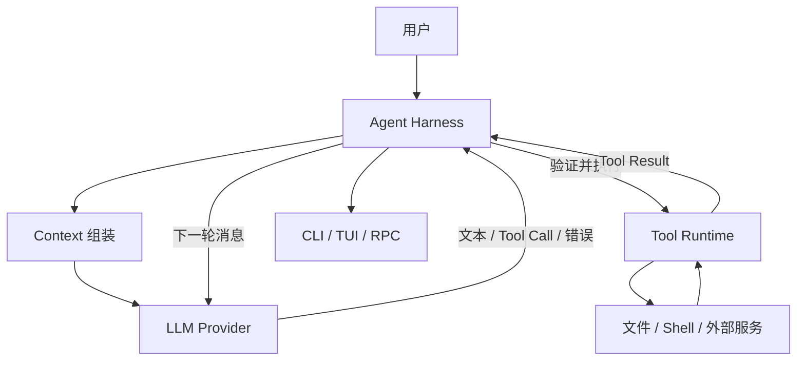

# 从 LLM 到 Agent

## 先校正一个常见理解

“LLM 是 token prediction”作为底层直觉基本正确，但工程上还要看请求协议：模型接收 `system`、`user`、`assistant`、`tool` 等消息和工具定义，返回文本、思考块、Tool Call 或错误。它不会直接调用 Java 方法，也不知道本地文件是否存在。

Agent 是把模型输出接回下一次请求的运行时闭环：



## 六个边界

| 组件 | 它做什么 | 它不做什么 |
| --- | --- | --- |
| LLM | 生成候选文本或结构化调用 | 不打开文件、不创建进程、不保存 Session |
| Agent Runtime | 选择何时请求、分派 Tool、回传结果 | 不等于某个模型本身 |
| Harness | 管理状态、恢复、队列、权限、重试、资源和遥测 | 不应把每个厂商 API 类型泄漏给业务 |
| CLI/TUI | 接收用户输入、展示流和状态 | 不应决定 Tool 的安全策略 |
| MCP | 规定跨进程/网络发现和调用外部能力的协议 | 不是一个自动拥有权限的 Agent |
| Skill/RAG | 分别提供可渐进加载的指令资源、或检索相关知识 | 都不自动等于可执行函数 |

## 一次请求的形状

```text
Context = system prompt + message history + tool definitions + provider options
LLM(Context) -> AssistantMessage
AssistantMessage(toolCall) -> validate -> execute -> ToolResult
ToolResult appended to Context -> next LLM request
```

“模型上下文”不是只指聊天文本。Pi 的 `Context` 在 `packages/ai/src/types.ts` 中还含 `systemPrompt`、`messages`、`tools`；Provider 选项在另一层传递。理解这个差异能避免把 token 统计、Session 文件和 Context Window 混为一谈。

## 核心问题

模型到底返回了什么？答案是一个受 Provider 适配器约束的消息/事件流，可能包含 `toolCall`；真正的函数执行发生在 Agent Runtime。
