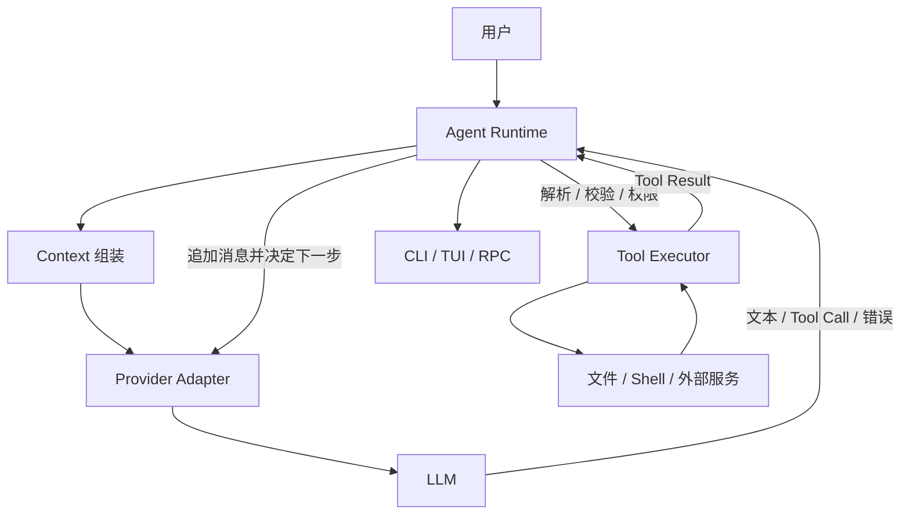

# 从 LLM 到 Agent

## 学习目标

读完本页，你应该能用一张请求图回答三个问题：

1. LLM 接收和返回什么？
2. Agent Runtime 在模型两次响应之间做了什么？
3. Harness、MCP、Skill、RAG 和 UI 为什么不能互相替代？

## 前置知识

你只需要知道 HTTP 请求由请求体和响应体组成，并能读懂 JSON。先不要假设“模型会调用函数”或“Agent 就是一个更聪明的模型”；本页正是用来拆开这两个常见误解。

## 从一个普通 LLM 请求开始

最小的聊天程序只有一次调用：

```text
用户问题
  -> 组装 messages
  -> LLM API
  -> assistant text
  -> 展示给用户
```

例如，请求可能是：

```json
{
  "model": "example-model",
  "messages": [
    {"role": "system", "content": "回答要简洁。"},
    {"role": "user", "content": "2 + 3 等于多少？"}
  ]
}
```

模型返回的是一条 assistant 消息，例如：

```json
{
  "role": "assistant",
  "content": "5",
  "stop_reason": "stop",
  "usage": {"input_tokens": 32, "output_tokens": 1}
}
```

`content` 是模型生成的内容；`stop_reason` 是 Runtime 用来判断是否结束的控制信号；`usage` 是账务/诊断数据。它们在不同 Provider 中字段名会变化，不能简单把整个 JSON 当成一段自然语言。

## “Token prediction”哪里正确，哪里不够

把 LLM 理解成根据上下文预测下一个 token，是理解训练和生成机制的好起点。但在工程上还必须加三层：

- **协议层：** Runtime 把 system、user、assistant、tool、工具定义和选项编码成 Provider 能理解的请求。
- **生成层：** 模型按采样策略生成文本或结构化块，并可能以流式事件返回。
- **适配层：** Provider adapter 把厂商特有的响应转换成统一的消息、Tool Call、Usage 和 Stop Reason。

模型不会检查你的 Java 方法签名，也不会因为看见 `read_file` 就真的读取磁盘。它只是生成一个候选结构：

```json
{
  "type": "tool_call",
  "id": "call-1",
  "name": "read_file",
  "arguments": {"path": "README.md"}
}
```

这里没有任何文件内容，也没有执行成功的证据。真正打开文件的是 Runtime 里的 Tool Executor。

## Agent 是什么

Agent 是一个由模型参与决策、由 Runtime 驱动状态转移的闭环。最小伪代码如下：

```text
messages = [user message]
while steps < maxSteps:
    response = model.complete(messages, tools)
    messages.append(response.assistant)

    if response 没有 tool call:
        return response.assistant

    for call in response.toolCalls:
        arguments = parse(call.arguments)
        tool = registry.find(call.name)
        result = tool.execute(arguments)
        messages.append(toolResult(call.id, result))
```

每次循环都要回答：模型看到了什么、模型返回了什么、Runtime 是否执行了副作用、下一次请求多了什么消息。`maxSteps` 是必要的保护：模型可能持续产生工具调用，不能假设它一定会主动停止。



## 六个边界

| 组件 | 负责 | 不负责 |
| --- | --- | --- |
| LLM | 生成文本、thinking 或 Tool Call 候选 | 不打开文件，不创建进程，不保存会话 |
| Provider | 认证、请求格式、流解析、厂商字段归一化 | 不决定业务 Tool 是否有权限 |
| Agent Runtime | 处理 assistant step、调用工具、追加结果、判断继续/结束 | 不等于模型，也不自动提供持久化恢复 |
| Agent Harness | 组织 Runtime、Session、队列、重试、权限、资源、Telemetry | 不应把所有厂商 API 类型泄漏给业务 |
| Tool | 在受控边界执行一个能力并返回结果 | 不应把模型生成的参数当成可信授权 |
| CLI/TUI/RPC | 接收输入、呈现事件、提供控制入口 | 不应绕过 Runtime 执行危险操作 |

这张表不是行业唯一分层；重点是每个副作用和状态都必须有明确拥有者。

## MCP、Skill 与 RAG 放在哪里

### MCP

MCP 是连接 Agent 与外部工具/资源服务器的协议。MCP Client 可能发现一个远端 calculator，再把它适配成本地 Agent Tool。它规定 JSON-RPC、initialize、tools/list、tools/call 等交互，但不会自动授予访问数据库的权限。

### Skill

Skill 是指令、参考资料和脚本组成的可加载资源。系统可以先把 `name` 和 `description` 放入 system prompt，模型判断相关后再用 `read` 读取 `SKILL.md`。Skill 通常改变“怎么完成任务”，不是一个天然的 RPC 端点。

### RAG

RAG 先从知识库检索相关片段，再把结果注入 Context，或把检索暴露成 `search_knowledge` Tool。RAG 解决的是知识选择，不会替代 Session，不会自动记住用户，也不会自动执行写操作。

## Pi 中的真实入口

研究 commit：`853a80d26c90a14c1886f0ebb8ffaae133ca2185`。

- `packages/ai/src/types.ts`：统一的 `Context`、`Message`、`AssistantMessage`、`ToolCall`、`Usage` 和流事件类型。
- `packages/ai/src/models.ts`：Provider/Model 选择与 `streamSimple` 等模型边界。
- `packages/agent/src/agent-loop.ts`：`runAgentLoop`、`executeToolCalls` 和流式 assistant step。
- `packages/agent/src/agent.ts`：`Agent` 生命周期、steering/follow-up 队列和 abort。
- `packages/coding-agent/src/core/agent-session.ts`：Coding Agent 将 Session、资源、工具和 Agent 组合起来。
- `packages/agent/src/harness/agent-harness.ts`：公共 Harness API scaffold，当前不能描述为已完成 durable runtime。

从这些路径可以看出：Pi 的 `Agent`/Loop 是可运行控制流，Harness 还涉及更外层的持久化、恢复和能力组织。不要看到类名 `AgentHarness` 就假设所有方法已有实现。

## Go 与 Java 对照

| 问题 | Go | Java |
| --- | --- | --- |
| 模型接口 | `Model.Complete(context.Context, Request)` | `Model.complete(Request, CancellationToken)` |
| 工具接口 | `Tool.Execute(context.Context, json.RawMessage)` | `Tool.execute(CancellationToken, JsonNode)` |
| 取消 | `context.Context` | token + thread interruption |
| 流式结果 | callback/行解析 | callback/`HttpResponse` 行流 |
| 测试模型 | `ScriptedModel` | `ScriptedModel` |

两种语言的对象都只是 Runtime 的边界，不会让模型直接获得文件系统权限。

## 动手实验：把模型输出分三类

### 目标

观察一份响应，区分内容、控制信号和副作用。

### 准备

进入 `examples/go-agent` 或 `examples/java-agent`，使用离线 `ScriptedModel`；不需要 API key。

### 步骤

1. 找到第一轮 assistant 的 `ToolCall`。
2. 在测试中打印 call 的 `id`、`name` 和 `arguments`。
3. 找到 Tool Registry 的 `Execute` 调用。
4. 打印执行前后的消息历史。
5. 对照第二轮 request，确认 Tool Result 是 Runtime 追加的。

### 观察点

模型输出里只有工具名和参数；文件内容只在 Tool 执行后出现。第二轮 request 比第一轮多了 assistant tool call 和 tool result。

### 预期结果

你能指出：`ToolCall` 是数据，`Execute` 是动作，`ToolResult` 是动作产生的事实。

### 思考题

如果把 `ToolCall` 直接当成“已执行”，在工具失败、权限拒绝或参数非法时会发生什么？如果 UI 自己执行工具，Agent Loop 还能可靠重试吗？

## 小结

LLM 生成候选输出，Provider 处理协议，Agent Runtime 驱动循环，Harness 组织状态与可靠性，Tool Executor 才产生受控副作用。MCP、Skill、RAG 解决不同的扩展问题。记住这条边界，后面读 Tool Calling 和 Pi 源码时就不会把模型幻觉当成系统事实。
