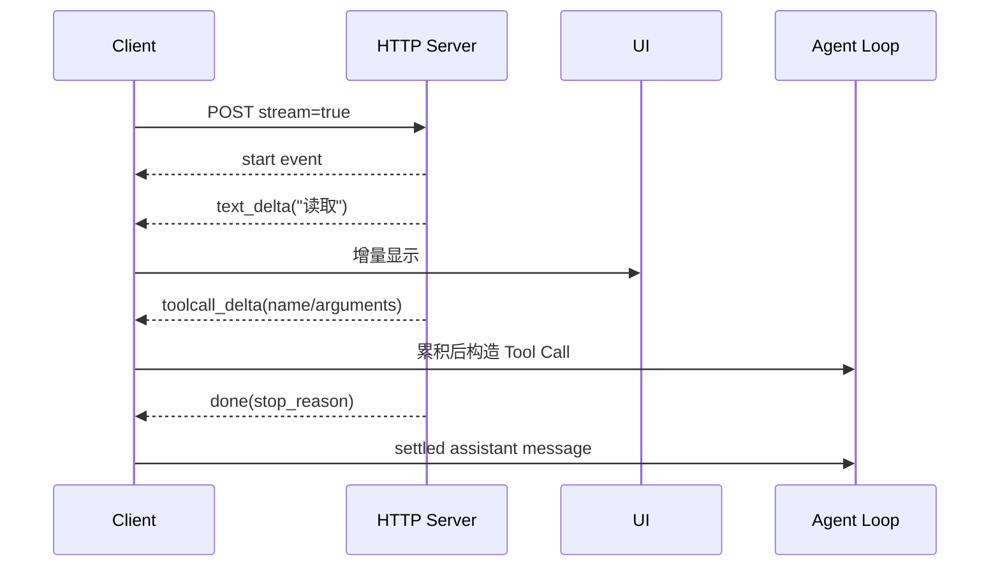

# HTTP、SSE 与 Streaming

## 学习目标

本页完成后，你应该能从零解释一次 LLM HTTP 调用：请求头有什么、状态码如何分类、普通 JSON 和 SSE 有什么不同、网络 chunk 为什么不是事件边界，以及断流/429/坏 JSON 应该在哪一层处理。

## 前置场景：先不要 Agent

先实现这个没有工具、没有循环的程序：

```text
User text
  -> HTTP POST /chat/completions
  -> JSON response
  -> print assistant text
```

如果这个路径还不能可靠处理认证和错误，就不应直接接入 Agent Loop。Loop 只能消费稳定的 Model 接口，不能同时负责 TCP、JSON、重试和 UI。

## 普通 HTTP 请求

一个 OpenAI-compatible 请求可能是：

```http
POST /v1/chat/completions HTTP/1.1
Host: example.test
Authorization: Bearer <key>
Content-Type: application/json
Accept: application/json

{
  "model": "example-model",
  "messages": [{"role":"user","content":"hello"}],
  "stream": false
}
```

每一部分都有边界：

| 部分 | 作用 | 失败例子 |
| --- | --- | --- |
| URL/method | 指定 Provider endpoint 和操作 | 404、连接失败 |
| `Authorization` | 认证，不是业务权限 | 401/403 |
| `Content-Type` | 声明 JSON 请求 | 415 或错误解析 |
| `model` | 选择模型 | unknown model |
| `messages` | 提供上下文 | schema error、context too long |
| `stream` | 选择完整 JSON 或事件流 | adapter 解析错误 |

客户端至少应检查 2xx，再解码 JSON。不要在 `json.Decoder` 之前把所有非 200 都当成“模型拒绝”；429 和 5xx 可能适合重试，401 通常需要修复凭据。

## 状态码分类

```text
网络失败       -> 没有得到 HTTP response，检查 timeout/cancellation
401/403        -> 凭据或服务端权限，通常不重试
400/422        -> 请求格式、参数或 context 问题，修请求
408/429        -> 超时/限流，按 retry-after 和预算重试
500–599        -> Provider 暂时错误，有界重试
2xx + 坏 JSON  -> 响应契约或代理损坏，不应伪装成 final text
```

重试必须有上限、退避和取消。重试一次 Provider request 与重跑整个 Agent step 不是同一件事：前者可能只是网络失败，后者可能重新执行 Tool。

## SSE 的事件格式

Server-Sent Events 是服务器保持一个 HTTP 响应，并按事件发送文本帧。常见帧以空行结束：

```text
event: message
data: {"delta":"Hel"}

data: {"delta":"lo"}

data: [DONE]

```

解析规则是“按空行组装 event，再处理其 data 字段”。网络层可能这样切分：

```text
read #1: data: {"del
read #2: ta":"Hel"}\n\n
read #3: data: {"delta":"lo"}\n\n
```

因此下面这种写法是错的：

```text
for each network read:
    json.Unmarshal(read) // read 不是 JSON 边界
```

正确思路是：

```text
line buffer = ""
for each byte/line from response:
    append to buffer
    if blank line:
        event = parse fields in buffer
        handle event.data
        clear buffer
```

`data: [DONE]` 是某些 API 的约定，不是 SSE 标准本身；adapter 必须按目标 Provider 处理结束信号。事件也可能包含空 data、comment 或多行 data，不能假设只有一个简单 JSON 字符串。

## Streaming 与最终消息

Streaming 改变的是传输方式，不改变 Agent 的语义。UI 可以边收 `text_delta` 边显示，但 Agent Loop 要等到结束事件后拿到 settled `AssistantMessage`，再决定是否有 Tool Call。



一个 `EventStream<T, R>` 可以同时提供异步事件和最终 `result()`；事件适合 UI，最终结果适合 Loop/Session。两条路径必须共享同一份累计状态，避免 UI 显示了一个版本、Session 保存了另一个版本。

## Pi 的流契约

研究 commit：`853a80d26c90a14c1886f0ebb8ffaae133ca2185`。

- `packages/ai/src/utils/event-stream.ts`：`EventStream<T, R>`、`AssistantMessageEventStream` 和可中止的事件流。
- `packages/ai/src/types.ts`：`AssistantMessageEvent` 的 `start`、delta、`done`、`error` 等事件语义。
- `packages/agent/src/agent-loop.ts`：消费 response stream，等待 settled assistant，再进入 Tool Call 分支。
- `packages/ai/src/api/*.ts`：不同 Provider 的 SSE/HTTP 解析和消息转换。

TypeScript 的 `for await (const event of stream)` 类似“不断从异步来源取事件”；Java 可以用 callback/`Flow`，Go 可以用 channel 或逐行读取。它不是同步 `Iterator`，网络等待期间不能阻塞地假设马上有下一项。

## 断流、取消与重试

断流至少有三类：

1. 尚未收到完整 assistant：不能把部分文本当成 final；按 Provider 能力重试或返回错误。
2. 已收到完整 Tool Call 但未执行：需要决定是否丢弃未 settled 响应，不能凭半个 arguments 执行。
3. Tool 已执行、回传前断开：重试可能重复副作用，必须依赖 operation intent/idempotency 或标记 unknown。

`AbortSignal`、Go `context.Context` 和 Java cancellation token 只表达取消意图。HTTP 客户端应把它传到请求和读取循环；工具执行也要主动检查，不能以为取消 socket 就能撤销已经发生的写入。

## Go/Java 对照

| 层 | Go | Java |
| --- | --- | --- |
| 请求 | `http.NewRequestWithContext` | `HttpRequest` + `HttpClient` |
| JSON | `encoding/json` | Jackson |
| 流读取 | `bufio.Scanner`/行缓存 | `BodyHandlers.ofLines()`/字节缓冲 |
| 取消 | `context.Context` | `CancellationToken`、Future/interruption |
| 测试服务器 | `httptest.Server` | `HttpServer`/本地 handler |

## 动手实验：切碎 SSE

### 目标

证明 parser 依赖事件边界，而不是网络 read 边界。

### 准备

打开 Go 的 `model_test.go`、Java 的 `HttpModelTest.java`，使用本地 fake server，不设置真实 API key。

### 步骤

1. server 返回三条 `data:`，把第一条 JSON 切在 `"del` 和 `ta` 之间。
2. 客户端累计 text delta，并记录每次回调。
3. 断言最终文本等于所有 delta 拼接。
4. 返回空 `choices` 或坏 JSON，确认错误包含 decode/contract 信息。
5. 在第二条事件前取消 context/token，确认请求结束，不等待完整 body。
6. 返回 429 和 `retry-after`，观察 retry 层是否有界。

### 观察点

回调次数由事件决定，不由 socket read 次数决定；`done` 后才构造最终 response。取消不是普通 final answer。

### 预期结果

文本增量顺序稳定、分片 JSON 可解析、坏响应不会变成空回答、取消能够结束读取。

### 思考题

如果第一条 `text_delta` 后断流，是否能安全重试？如果已收到完整 `tool_call` 但工具尚未执行呢？如果工具已写文件但 response 丢失呢？请为三种情况分别写状态和恢复策略。

## 小结

HTTP 负责传输，SSE 负责事件帧，Provider adapter 负责转换，Agent Loop 负责控制流。chunk、event、message 和 step 是四个不同粒度。先把这些粒度分清，再谈 Streaming Agent，否则最容易出现重复请求、丢 Tool Call 和把半截 JSON 当成参数的问题。
