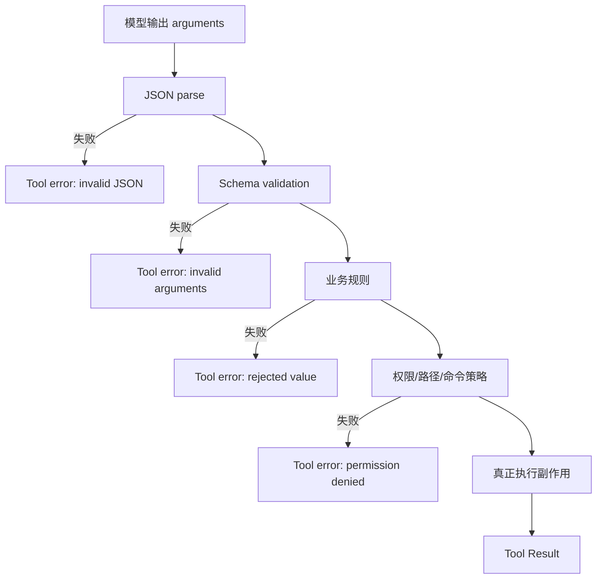

# Structured Output 与校验

## 学习目标

读完后，你应该能区分四件事：JSON 能否解析、是否符合 schema、是否满足业务规则、是否被当前用户授权。它们是四道不同的门。尤其要记住：**schema 通过不等于安全，也不等于函数已经执行。**

## 问题场景

模型请求读取文件：

```json
{
  "name": "read_file",
  "arguments": {"path": "../../.ssh/id_rsa"}
}
```

这段 arguments 可能是合法 JSON，也可以符合“path 是 string”的 schema，但它不应越过 workspace 权限。反过来，`{"path": "README.md", "extra": true}` 可能违反严格 schema，却不一定是恶意请求。解析、结构校验和授权必须分别记录原因。

## Structured Output 是什么

Structured Output 要求模型输出一个预期形状，例如：

```json
{
  "type": "object",
  "properties": {
    "operation": {"type": "string", "enum": ["add", "subtract"]},
    "left": {"type": "number"},
    "right": {"type": "number"}
  },
  "required": ["operation", "left", "right"],
  "additionalProperties": false
}
```

它可以帮助 Provider 生成更稳定的 JSON，但能力因 Provider、模型和流式模式而异。客户端仍需处理：空响应、半截 JSON、错误类型、缺字段、额外字段和模型输出的自然语言前后缀。

## Tool Definition 的三道门



执行顺序应是：

1. **Parse：** 把原始字符串解析成 JSON 值，拒绝语法错误。
2. **Schema：** 校验 object、字段类型、required、enum 和额外字段。
3. **业务规则：** 例如 `right` 不能为零、`topK` 必须在 1–20、路径不能是空字符串。
4. **权限：** 规范化路径、限制 workspace、命令 allowlist、人工审批或 sandbox。
5. **Execute：** 只有前四步成功才打开文件、启动进程或访问网络。

任何一步失败，都可以生成带 `isError` 的 Tool Result 回传给模型；但被拒绝的调用不能变成“执行成功”。

## Schema 能做什么，不能做什么

| Schema 能检查 | Schema 不能保证 |
| --- | --- |
| JSON 是 object 还是 array | 路径是否属于当前 workspace |
| 字段是否存在、类型是否正确 | 当前用户是否允许写文件 |
| 字符串 enum、数字范围（实现支持时） | shell 命令是否危险 |
| 是否允许额外字段 | 远端服务是否可用 |
| 参数是否可被解析 | Tool 是否已经执行 |

`additionalProperties: false` 只拒绝未声明字段；它不是防 prompt injection 的机制。Schema 也不能替代 secret redaction、网络策略、超时和资源限制。

## Pi 中的实际路径

研究 commit：`853a80d26c90a14c1886f0ebb8ffaae133ca2185`。

- `packages/agent/src/types.ts`：`AgentTool`、`ToolCall` 和 Tool Result 的统一契约。
- `packages/agent/src/agent-loop.ts`：`prepareToolCall`、`executePreparedToolCall`、`executeToolCalls` 等调用边界。
- `packages/coding-agent/src/core/tools/index.ts`：`createTool`、`createToolDefinition` 和 coding tool registry。
- `packages/coding-agent/src/core/tools/read.ts`、`write.ts`、`edit.ts`：定义与实际执行分离。
- `packages/coding-agent/src/core/extensions/runner.ts`：Tool Call/Result hooks 可在执行前后观察或改变行为。

Pi 的 loop 事实是：先找到工具并准备/验证参数，再执行；不要因为模型输出了合法的 Tool Call 就绕过 Runtime。

## 错误如何回到模型

```text
invalid JSON
  -> ToolResult(isError=true, 可读错误)
  -> 追加到消息历史
  -> 模型可以修正参数

权限拒绝
  -> ToolResult(isError=true, 不泄露 secret/path 细节)
  -> 记录拒绝事件
  -> 模型不能通过重试绕过 policy

Provider 错误
  -> retry policy 判断是否重试
  -> 耗尽后 run failed/error stop reason
```

Tool 参数错误通常是当前 run 可以继续的错误；Provider 认证错误、Session 损坏或安全策略故障可能需要结束。错误分类比统一抛出一个 `Exception` 更重要，因为 Harness 要据此决定重试、提示还是终止。

## Go 与 Java 对照

| 阶段 | Go | Java |
| --- | --- | --- |
| 原始输入 | `json.RawMessage` | Jackson `JsonNode` |
| 查找 | `Registry.Get/Validate` | `ToolRegistry.find/validate` |
| schema gate | object/required 检查 | object/required 检查 |
| 权限 | `PermissionPolicy` | `PermissionPolicy` |
| 失败返回 | `ToolResult{IsError:true}` | `ToolResult.error(...)` |

Go/Java 示例的 policy 只是教学级 workspace/危险命令检查，不是操作系统 sandbox；实际系统仍需容器、最小权限账户、网络控制和审计。

## 动手实验：四个参数用例

### 目标

证明每一道门都独立存在，并证明校验失败不会调用 Tool。

### 准备

使用示例里的 calculator 或自定义 counter Tool，并在测试中记录执行次数。

### 步骤

1. 传入合法 `{operation:"add",left:2,right:3}`，断言执行一次。
2. 传入坏 JSON，例如 `{"left":`，断言返回 invalid JSON，执行次数不变。
3. 传入缺少 `operation`，断言 schema error，执行次数不变。
4. 传入未知 operation，断言业务错误，执行次数不增加。
5. 给 `read` 传入 workspace 外路径，断言 permission denied。
6. 给 unknown tool 传入任意 arguments，断言 Registry 不调用任何已有 Tool。

### 观察点

错误结果仍可以进入下一轮 Loop；但“下一轮可以修正”不等于“当前副作用已经发生”。测试应同时断言结果内容和 dispatch 计数。

### 预期结果

Go 的 `agent_test.go` 和 Java 的 `AgentTest` 都覆盖 unknown tool、invalid arguments；合法 calculator 才会改变执行记录。

### 思考题

如果模型反复发送被拒绝的路径，应该让 Loop 无限重试吗？如何为同一个 Tool 设置失败次数上限？Schema 中加入 `pathPattern` 是否足以阻止符号链接绕出 workspace？

## 小结

结构化输出降低了解析不确定性，但它只处理形状。安全边界必须继续经过业务规则、权限和 sandbox。Runtime 既是参数校验者，也是“模型意图”和“真实副作用”之间的证据边界：只有它调用 `execute`，才算真的执行了工具。
