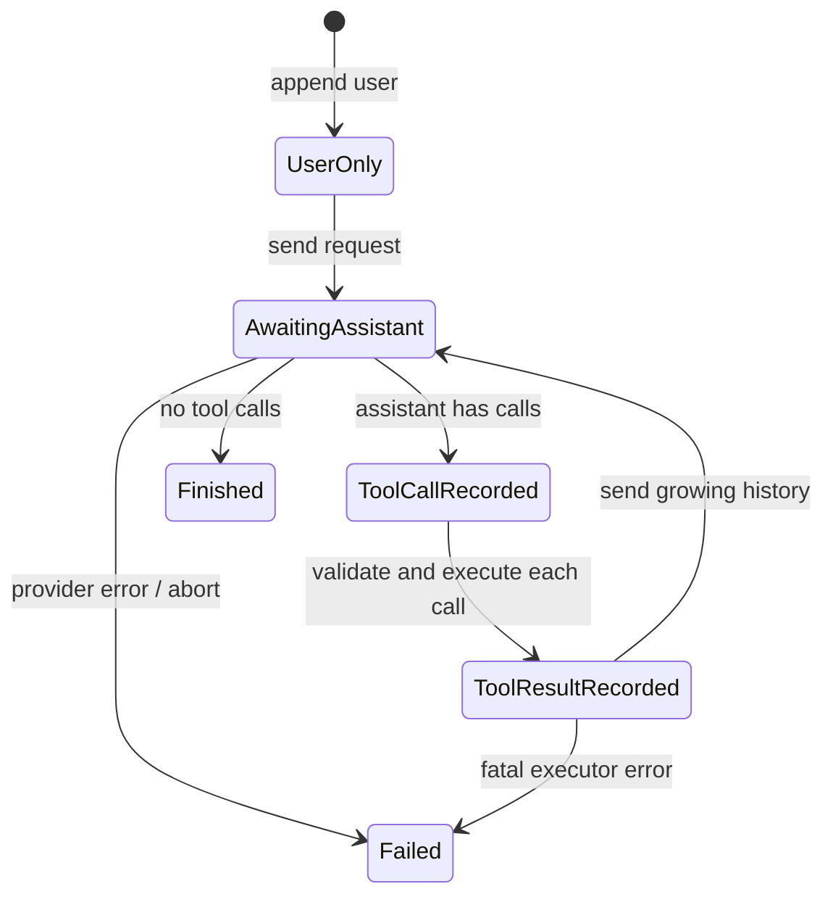

# 从零写 Agent Loop

## 学习目标

本页从一个计算器开始，逐步写出“请求模型、执行工具、回传结果、得到最终回答”的循环。完成后你应该能说明：每轮请求带什么、消息何时增长、循环何时停止，以及为什么 `maxSteps` 不是可选装饰。

## 前置知识与问题

普通聊天只有一次模型调用：

```text
user -> model -> assistant text
```

如果模型需要读取文件，模型本身不会打开文件。Runtime 必须在两次模型调用之间工作：解析模型输出，找到 Tool，验证参数，执行它，再把结果编码成下一轮消息。这个“在响应之间推进状态”的部分就是 Agent Loop。

## 第一版：只支持最终文本

```text
messages = [userMessage]
response = model.complete(messages, tools=[])
return response.assistant
```

输入是用户消息，输出是最终文本，状态从一条 user message 变为 user + assistant。若 response 是网络超时，程序应返回错误而不是构造一个假答案。

## 第二版：加入 Tool Call

```text
messages = [userMessage]
for step in 1..maxSteps:
    response = model.complete(messages, toolDefinitions)
    messages.append(response.assistant)

    if response.toolCalls is empty:
        return response.assistant

    for call in response.toolCalls:
        result = registry.dispatch(call)
        messages.append(toolResult(call.id, result))

return maxStepsError
```

每轮先追加完整 assistant message，再执行调用。这样下一轮可以看到模型当时提出了什么；只追加结果而丢掉 assistant call 会使许多 Provider 拒绝不成对的消息。

### 一轮具体示例

```json
{"role":"user","content":"2+3 等于多少？"}
```

第一轮模型返回：

```json
{
  "role": "assistant",
  "tool_calls": [{
    "id": "call-1",
    "name": "calculator",
    "arguments": {"operation":"add","left":2,"right":3}
  }]
}
```

Runtime 解析 arguments，调用 calculator，得到：

```json
{"role":"tool","tool_call_id":"call-1","content":"5"}
```

以上三个代码块分别表示输入、模型候选动作和执行结果。`call-1` 只标识配对关系，不表示函数已经执行；只有最后一个结果是工具事实。若参数不是 JSON、工具不存在或除数为零，应生成明确错误结果。

## 消息历史的状态变化



`AwaitingAssistant` 表示网络或模型等待，不能同时假设 Tool 已执行。`ToolCallRecorded` 是数据状态；`ToolResultRecorded` 才是执行后状态。错误状态要保留已有前缀，便于诊断和恢复。

## 第三版：校验、权限与错误结果

```text
call = parse(response.toolCall)
if call.name not in registry:
    append errorToolResult(call.id, "unknown tool")
else if schema invalid:
    append errorToolResult(call.id, "invalid arguments")
else if permission denied:
    append errorToolResult(call.id, "permission denied")
else:
    append execute(call)
```

Schema 负责形状，例如 `left` 必须是 number；Permission 负责策略，例如路径必须位于 workspace。两者都在真正执行前完成。错误结果让模型可以改正调用，但不能把每个错误都无限重试。

## 第四版：多调用和执行模式

一个 assistant 可以同时返回 `read(a)` 与 `read(b)`。如果两者没有依赖，可以并行；如果是 `write(config)` 后 `read(config)`，必须保序。即使并行，结果 message 也应按源索引和 call id 稳定写入。

```text
prepared = calls.map(prepare)
if mode == sequential:
    results = prepared.map(execute)
else:
    results = parallelExecute(prepared)
messages.append(results.inSourceOrder())
```

`parallelExecute` 的输入是已经通过准备和权限检查的调用；输出是按原始位置重排后的结果。不要在并行 goroutine 或 Future 中直接拼接共享消息历史，否则完成顺序会改变 Provider 看到的语义。

## 第五版：事件和取消

Loop 应发出 `step_start`、`assistant`、`tool_start`、`tool_end`、`tool_result` 和 `run_end`。事件是观察面，不应成为第二个消息状态机。取消信号要传给模型请求、工具和 backoff；收到 abort 后，未开始的调用不应偷偷启动。

Java 的 `async/await` 对应 `Future`/callback 的组合；Go 则常把 `context.Context` 作为第一个参数。两种实现都必须处理“网络已取消但远端可能已计费”的事实。

## 第六版：重试和有限终止

只对可重试的 Provider 请求做有限重试，例如 429、408、部分 5xx；不要自动重试已经成功写文件的 Tool。指数退避也要响应 cancellation。最终停止条件包括：没有 Tool Call、stop reason、达到 `maxSteps`、预算/截止时间耗尽、用户 abort、不可恢复错误。

```text
for step <= maxSteps:
    response = completeWithRetry(request)
    if response.error: return failed(prefix, error)
    append assistant
    if no calls: return completed
    append tool results
return failed(history, "max steps exceeded")
```

`return failed(history, ...)` 的重点是保留历史前缀。只返回字符串会丢掉哪一个 Tool 已经执行、哪个参数非法等证据。

## Pi 源码证据

研究 commit：`853a80d26c90a14c1886f0ebb8ffaae133ca2185`。

- `packages/agent/src/agent-loop.ts` 的 `runAgentLoop` 和 `runAgentLoopContinue` 是循环入口。
- `executeToolCalls` 选择 sequential/parallel，并保持结果的调用顺序。
- `prepareToolCall` 负责 lookup、参数准备、schema 和 `beforeToolCall`；`executePreparedToolCall` 才调用 `AgentTool.execute`。
- `packages/agent/src/agent.ts` 的 `runWithLifecycle` 连接 abort、steering、follow-up 和事件。
- `packages/agent/src/types.ts` 的 `AgentEvent`、`AgentTool` 描述控制流和工具边界。

这些 API 说明 Pi 的低层 Loop 不负责完整 Session 持久化；Coding Agent 在更上层把 Loop 接到 session、context 和 UI。

## Go 与 Java 对照

| 边界 | Go | Java |
| --- | --- | --- |
| Model | `Complete(ctx, Request)` | `complete(Request, CancellationToken)` |
| 结构化参数 | `json.RawMessage` | Jackson `JsonNode` |
| 并行 | goroutine + WaitGroup | `ExecutorService` + Future |
| 事件 | callback | Listener / `EventSink` |
| Fake model | `ScriptedModel` | `ScriptedModel` |

不要把语言异步 API 当成 Agent 语义。语义是“每一轮 request 必须看到合法的完整历史”，实现手段才是 goroutine 或 executor。

## 动手实验

### 目标

用离线模型验证一个两轮 Loop，并观察每一次请求的 messages。

### 准备

进入 `examples/go-agent` 或 `examples/java-agent`；运行测试，不需要真实 Provider。

### 步骤

1. 让 `ScriptedModel` 第一轮返回 calculator call。
2. 让第二轮返回 `5`，设置 `maxSteps=2`。
3. 断言请求数量为 2。
4. 断言第二个请求最后一条消息是 `tool`。
5. 改用 unknown tool，断言执行器调用次数仍为零。
6. 设置 `maxSteps=1`，断言返回有限终止错误。

### 观察点

第一轮 response 不是 final；第二轮请求增加 assistant call 和 tool result。非法调用仍应形成可供模型读取的错误结果；`maxSteps` 把坏模型从无限循环中拉出。

### 思考题

为什么不能只把 `ToolResult` 放回模型而不保存 assistant call？如果写文件的 HTTP 响应丢失，模型重试会不会重复副作用？哪个层负责决定 retry，哪个层负责决定是否有权限？

## 小结

最小 Loop 只有几行，但可靠 Loop 需要历史、配对 id、schema gate、权限、并行策略、事件、取消、重试和终止上限。先用 FakeModel 把每个状态写成测试，再接真实 Provider；这是学习 Harness 而不是调用框架 API 的关键。
