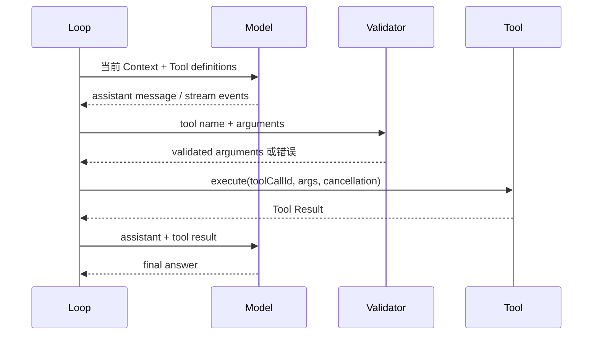

# 从零写 Agent Loop

## 最小伪代码

```text
messages = [userMessage]
for step in 1..maxSteps:
    response = model.complete(messages, tools)
    messages.append(response)
    if response 没有 tool call:
        return response
    for call in response.toolCalls:
        validate(call)
        result = execute(call)
        messages.append(result)
return error("max steps exceeded")
```

它只解决“如何继续”。真实 Harness 还必须规定：请求怎么流式返回，多个 Tool 是否并行，Tool 出错是否回传，用户如何 abort，重试会不会重复副作用，Session 如何保存，以及队列消息在哪个边界进入 Context。

## 一次事件顺序



## 先写 FakeModel

单元测试不应依赖收费 API。`ScriptedModel` 用队列保存预先写好的响应：第一项返回 calculator Tool Call，第二项返回 final text；它还记录每次收到的 messages，测试可以断言 Tool Result 确实被回传。

## 核心问题

为什么模型会连续调用多个工具？因为第一轮响应包含 Tool Call，Loop 执行后把结果追加到下一轮 Context；只要下一轮仍包含 Tool Call，循环就继续。它不是模型“直接运行了 while”，而是 Runtime 反复发起请求。

## 练习

先实现只有 `calculator` 的 Loop，再添加：unknown tool、invalid arguments、Tool exception、max steps 和空 Tool Call。每个错误路径写一个测试。
