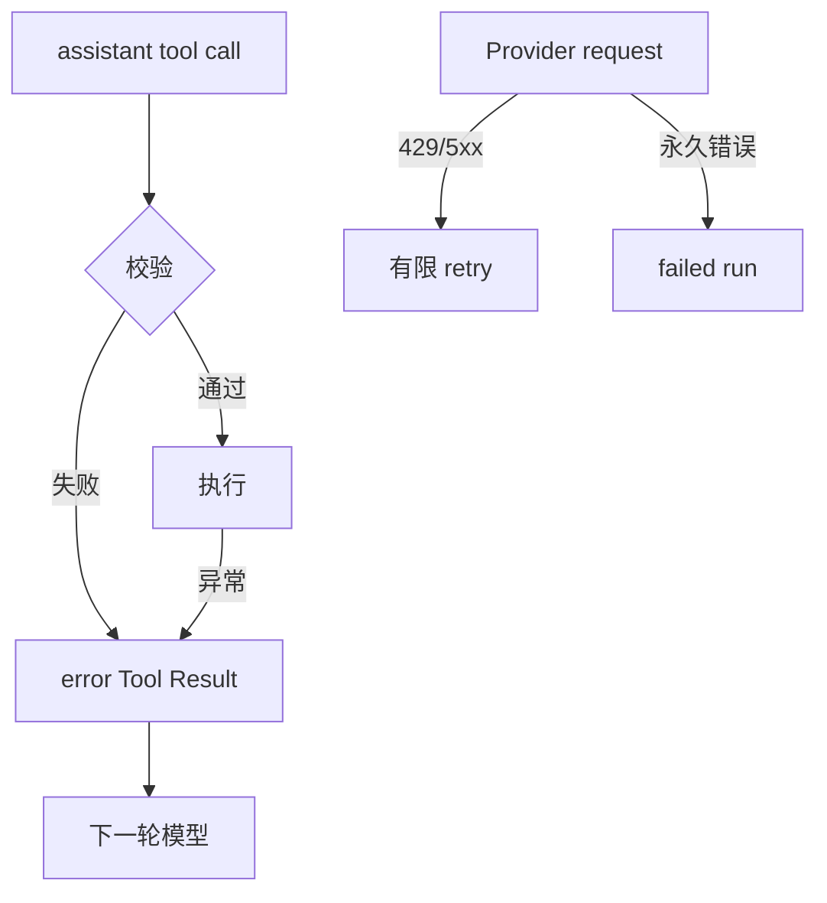

# Agent 错误与边界矩阵

## 先建立判断顺序

遇到异常时不要先问“要不要 retry”，先问三个问题：

1. 错误发生在 Provider、Loop、Registry、Tool、Transport 还是 Persistence？
2. 错误发生前有没有外部副作用？
3. 下一轮模型是否能从一个结构化结果中修正？

```text
分类来源 -> 判断副作用 -> 记录 prefix -> 选择 retry/result/fail -> 通知用户
```

如果已经执行了写文件，重试就可能重复写入；如果只是 429，重试通常不会产生本地副作用。错误字符串不能替代这个分类。

## 错误矩阵

| 场景 | 所在边界 | 推荐处理 | 是否回模型 |
| --- | --- | --- | --- |
| HTTP timeout | Provider | 有 deadline 的有限 retry | 否，耗尽后报告 |
| 429 | Provider | 读取 `Retry-After` 并退避 | 否 |
| 5xx | Provider | 分类后有限 retry | 否 |
| 401/403 | Provider | 停止并检查凭据 | 否 |
| invalid JSON response | Provider | 保留原始错误，不拼接假消息 | 否 |
| broken SSE | Stream | 关闭连接，按幂等策略重试 | 否 |
| context too long | Context | compaction 后最多 recovery 一次 | 否 |
| unknown tool | Registry | `isError=true` 的 Tool Result | 是 |
| invalid arguments | Schema | 带字段路径的错误结果 | 是 |
| permission denied | Policy | 拒绝执行，写审计事件 | 可让模型修正 |
| Tool exception | Executor | 脱敏后构造错误结果 | 通常是 |
| Tool timeout | Executor | 取消子任务并记录未知状态 | 视策略 |
| MCP disconnected | Transport | 标记工具不可用，不伪造成功 | 否 |
| plugin load failed | Loader | 隔离或 fail-fast，取决于配置 | 否 |
| invalid SKILL.md | Resource | 告警并跳过，不注入坏 prompt | 否 |
| session corrupted | Persistence | 报行号/版本，只读恢复或人工修复 | 否 |
| user abort | Harness | 传播取消并结束当前 run | 否 |
| budget exceeded | Harness | 禁止新请求和副作用 | 否 |

表格的“回模型”只表示是否值得把错误作为 Tool Result 让模型改正，不表示模型一定能解决它。比如 unknown tool 可修正名称，401 则需要用户凭据。

## Tool 错误的结构

```json
{
  "role": "tool",
  "tool_call_id": "call-9",
  "is_error": true,
  "content": "permission denied: path is outside workspace"
}
```

输入是原始 call id 和已脱敏错误；输出是配对的 Tool Result；状态追加一次“调用未成功”的事实。常见错误是返回普通 assistant 文本，导致模型看不到哪个调用失败，也无法在下一轮修正。

## Provider 错误和 Tool 错误不同

Provider 错误发生在模型请求本身，通常没有可合法追加的 assistant message；它应被 retry policy 或 run failure 处理。Tool 错误发生在 assistant call 已经被记录之后，可以追加一个带同一 id 的结果，让模型决定修复。



图中校验/执行错误有一个可回模型的结果节点；Provider 永久错误没有可伪造的 Tool Result。Retry 只沿着明确允许的边发生。

## 终止边界

Loop 至少要处理：final text、没有 Tool Call、Tool batch 的 `terminate`、`maxSteps`、预算、deadline、abort、fatal error 和不可压缩的 context limit。`stopReason` 不能单独决定结束，因为队列可能还有 follow-up，或 assistant 仍包含 Tool Call。

## Pi 的源码证据

研究 commit：`853a80d26c90a14c1886f0ebb8ffaae133ca2185`。

- `packages/agent/src/agent-loop.ts`：`prepareToolCall`、`executePreparedToolCall` 与 Tool Result 事件。
- `packages/agent/src/agent.ts`：`runWithLifecycle`、`abort` 和生命周期事件。
- `packages/ai/src/utils/provider-retry.ts`：Provider retry 分类与可取消等待。
- `packages/coding-agent/src/core/agent-session.ts`：上层 compaction、retry、session 和 UI 事件。

这些模块共同决定错误如何流动，不能只在 `AgentTool.execute` 中 catch 一切异常。

## 动手实验

### 目标

为每种错误选择一个可断言的终点。

### 准备

使用 Go/Java `ScriptedModel`、本地 fake HTTP server 和临时目录；不填真实密钥。

### 步骤

1. 注入一次 503 和一次成功响应，断言 model attempt 为 2。
2. 注入 unknown tool，断言没有调用任何真实 Tool。
3. 注入缺少 required 字段，检查 `isError` 和 `tool_call_id`。
4. 让 Tool 返回 error，确认下一轮 request 看到结果。
5. 让 context 在 backoff 期间取消，确认立即结束。
6. 损坏 session 中间行，断言错误包含行号。

### 观察点、预期与思考题

观察 retry 只发生在 Provider；Tool 错误会成为配对结果；abort 不启动 follow-up；坏持久化不会静默清空历史。思考：如果文件已经写成功但响应丢失，凭什么判断重试安全？应保存哪些 intent、checksum 或幂等键？

## 小结

可靠错误处理不是“大 catch + 打印字符串”。它要知道错误层级、副作用状态、是否能回模型，以及最终是否有界结束。用矩阵先定义语义，再让 Go/Java 测试覆盖每一条路径，才能避免模型看见假结果或系统重复执行危险操作。
