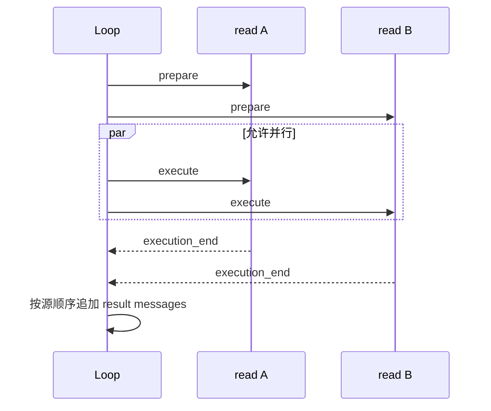

# 多个 Tool Call：串行还是并行

## 先看数据依赖

```text
read A + read B              可并行
write config + read config   通常必须串行
create directory + write file 必须按依赖排序
两个互不相干的 HTTP 查询   可并行但要限制并发
```

并行不是“更快就总是更好”：文件锁、权限审批、速率限制和副作用顺序都可能使并行结果不可预测。声明 Tool 是 `sequential` 约束，不能只看调用顺序猜测。

## Pi 的具体行为

在 `packages/agent/src/agent-loop.ts` 中，`executeToolCalls` 先检查全局 `toolExecution` 和每个 `AgentTool.executionMode`。串行路径逐个 prepare/execute/finalize；并行路径先按源顺序 prepare，然后对可执行项用 `Promise.all`。完成事件按完成时机发出，但 Tool Result message 按 assistant 中的源顺序构造，便于 Provider 配对。



## 终止批次

Pi 的 `terminate` 是每个 Tool Result 的提示，只有全部 finalized calls 都设为 true 才终止自动下一轮。空批次不能误判为 terminate。blocked/invalid Tool 仍需产生错误结果，让模型知道调用没有发生。

## 实现练习

给 Go/Java 示例加入两个延迟不同的 read Tool：断言执行完成时间可以不同，但发送给模型的结果顺序稳定；再加入一个必须串行的 write Tool，断言 registry 不允许并行化它。
