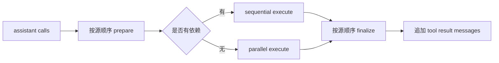

# 多个 Tool Call：串行还是并行

## 学习目标

本页解决一个容易被“并发更快”误导的问题：多个 Tool Call 什么时候可以并行？完成后你应能画出准备、执行、收尾三阶段，并说明为什么完成事件可以乱序，而写回模型的结果必须按 source order。

## 先看依赖，而不是看数量

```text
read A + read B                 没有数据依赖，可并行
两个互不相干的 HTTP 查询          可并行，但受速率限制
write config + read config       有依赖，必须串行
create directory + write file   必须先 create
两次向同一账户扣款               通常串行且需要幂等保护
```

输入是 assistant 返回的调用列表和工具声明；输出是执行结果列表。并行策略不能凭模型调用顺序推断安全性，因为模型未必知道文件锁、事务或额度限制。

## 三阶段模型

```text
phase 1 prepare: lookup + parse + schema + permission + before hook
phase 2 execute: 真正运行 read/write/network/process
phase 3 finalize: after hook + normalize + result message
```

准备阶段可在多个 call 上按源顺序完成；执行阶段才产生副作用；收尾阶段把结果和 call id 配对。若 phase 1 有一个 call 非法，不应因此跳过其他合法调用的诊断结果，但也不能让非法调用进入 execute。



图中的 source order 是 assistant 数组中的 index。执行完成时间可能不同，但最终给模型的历史顺序必须稳定。

## 为什么消息顺序必须稳定

假设模型发出 `read(A)`、`read(B)`，B 先完成。如果 Runtime 先把 B 写入 history，下次请求会看到 B、A，与 assistant call 的顺序不一致；某些 Provider 会拒绝不匹配的 tool result，调试日志也难以对应。正确做法是把结果暂存在 `results[index]`，最后按 index 追加。

```text
calls[0] = A, calls[1] = B
completed: B -> results[1], A -> results[0]
append: results[0], results[1]
```

输入是两个完成回调，输出仍是 A 结果、B 结果。共享数组的每一个 index 只能由对应 worker 写入；不要让 goroutine/Future 直接 append 到 history。

## Pi 的源码证据

研究 commit：`853a80d26c90a14c1886f0ebb8ffaae133ca2185`。`packages/agent/src/agent-loop.ts` 的 `executeToolCalls` 根据全局 `toolExecution` 和 `AgentTool.executionMode` 选择串行或并行；`prepareToolCall` 与 `executePreparedToolCall` 把验证和副作用分开；`packages/agent/src/types.ts` 定义 execution mode 和 Tool。

Pi 的并行路径先准备调用，再对允许执行的项使用 Promise 并发，最终按 source order 生成 Tool Result。事件 `tool_execution_end` 反映真实完成时刻，不等于历史消息的追加时刻。不要把“事件先到”误解成“message 应先写”。

## `terminate` 与批次收尾

每个 Tool Result 可以带 `terminate` 提示，但批次只有在所有 finalized result 都满足终止条件时才自动停止。一个成功的 read 和一个失败的 grep 不能被聚合成“全部成功”。空批次也不能误判为 terminate。

```text
terminate = true
for result in results:
    terminate = terminate && result.terminate
```

输入是每个结果的布尔值，输出是批次控制信号。它不是 kill 信号，不会取消已经运行的 Tool；它只帮助 loop 判断是否继续下一轮。

## Go 实现

Go 示例的 `LoopOptions.ToolMode` 控制路径。并行实现为每个 call 启动 goroutine，把结果写入预分配 slice；`sync.WaitGroup` 等全部完成后按 slice 顺序追加 `RoleTool` message。需要共享资源时选 `Sequential`，不要只因测试通过就默认并行。

## Java 实现

Java 示例使用 `ExecutorService` 提交任务，保存对应 Future，再依序 `get()`。Future 完成快慢不改变收集顺序。生产实现还应处理中断、超时、executor 关闭和拒绝提交；不要让一个失败的 Future 静默吞掉整个 batch 的状态。

## 事件与副作用

并行会改变事件时序：`tool_start(A)`、`tool_start(B)` 后可能先出现 `tool_end(B)`。Telemetry 应同时记录 call id、source index、duration、error；Session 若要恢复，则还要记录 intent 和结果，不能只凭事件重建。

安全层应在并行前完成权限检查。否则 A 已经写入后，B 才被发现越权，系统就留下部分副作用。取消也不能假设所有 worker 同时停止：每个 Tool 都要主动检查 signal/token。

## 动手实验

### 目标

验证“执行可以乱序，回传不能乱序”。

### 准备

使用 Go/Java 示例，注册两个延迟不同的只读 Tool；测试使用临时目录。

### 步骤

1. 让 A 延迟 80ms，B 延迟 10ms。
2. 让 FakeModel 同时返回 A、B。
3. 在 Tool 入口和 result append 处记录时间与 index。
4. 设置 `Parallel`，确认 B 先完成但 A 结果先写回。
5. 将其中一个 Tool 标为 `sequential`，确认不重叠。
6. 让一个结果返回 error，检查另一结果仍有明确配对。

### 观察点与思考题

观察点是完成事件时间、source index 和下一次 request 的 message 顺序。思考：两个 write 是否只要路径不同就能并行？如果远端 API 有全局速率限制，Tool 声明之外还需要哪一层并发控制？

## 小结

并行策略由数据依赖、副作用、权限、资源限制和恢复语义共同决定。Pi 把 prepare、execute、finalize 分开并保持 source order；Go 和 Java 用 slice/Future 收集结果。并发不是 Tool Loop 的默认优化，而是必须被测试和约束的架构选择。
