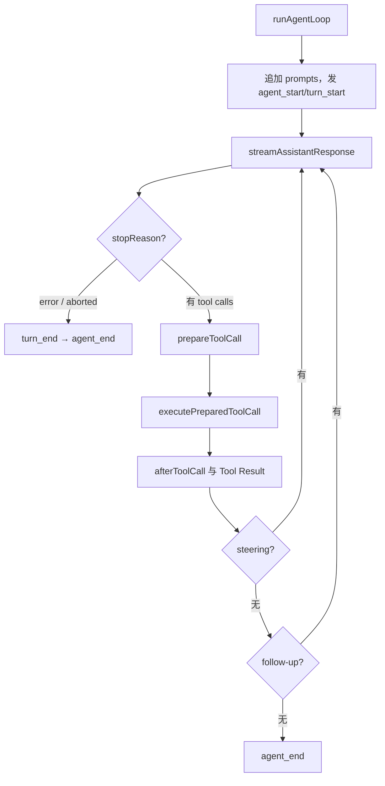

# Pi Agent Loop 源码导读

<Info>

源码基线：`853a80d26c90a14c1886f0ebb8ffaae133ca2185`。文件：`packages/agent/src/agent-loop.ts`；核心 symbol：`agentLoop`、`runAgentLoop`、`agentLoopContinue`、`runAgentLoopContinue`、`executeToolCalls`。

</Info>

## 文件为什么存在

它是低层控制流，不负责把 session 写盘，也不负责 TUI。`agentLoop` 返回 `EventStream<AgentEvent, AgentMessage[]>`；`runAgentLoop` 用新 prompt 扩展 Context；`runAgentLoopContinue` 从现有 Context 继续，且要求最后一条能转换为 user/toolResult 的消息。

## 主流程

源码的 `runLoop` 有两层循环：内层处理 Tool Calls 和 steering，外层在 Agent 本来要停止时检查 follow-up。每轮结束后可通过 `prepareNextTurn` 替换 context/model/thinking level。

## Provider 边界

`streamAssistantResponse` 先调用可选 `transformContext`，再 `convertToLlm`，构造 `Context`，动态解析 API key，调用 `streamFunction`。它消费 `AssistantMessageEventStream`：`start` 建立 partial message，delta 更新最后一条，`done/error` 取 `response.result()` 并发出 `message_end`。因此 Agent 层不需要知道 SSE 或某个厂商 response item。

## Tool 边界

`prepareToolCall` 依次做查找、`prepareArguments`、schema validation、`beforeToolCall` 和 abort 检查；只有返回 `prepared` 才会调用 `execute`。`afterToolCall` 可替换 content、details、usage、isError、terminate。`shouldTerminateToolBatch` 只有在批次中每个 finalized result 都有 `terminate: true` 时才返回 true。

## 顺序与并行

`executeToolCalls`：配置为 `sequential`，或任一 Tool 声明 `executionMode: "sequential"` 时串行；否则先按 source order 做准备，再用 `Promise.all` 执行，最终按 source order 发出 Tool Result message。`tool_execution_end` 则在各 Tool 完成后发出。

## 关键 TypeScript 解释

- `Promise`：一次异步结果；`async/await` 让顺序控制流可读。
- `AsyncIterable`：可被 `for await` 消费的事件序列，类似 Java 的异步回调流而非同步 `Iterator`。
- `AbortSignal`：只读取消状态；Provider/Tool 必须主动遵守。
- 联合类型：`AgentMessage`/`AgentEvent` 通过 `type` 或 `role` narrowing 进入不同分支。

## 实验：观察一次 read

在 `runAgentLoop` 的 `streamAssistantResponse` 前后记录 message 数量；在 `prepareToolCall`、`executePreparedToolCall` 和 `emitToolResultMessage` 设置断点。用 faux provider 观察：模型响应、验证后的 args、执行结果、下一次 provider Context。不要修改核心源码提交；调试完成后撤销临时日志。
