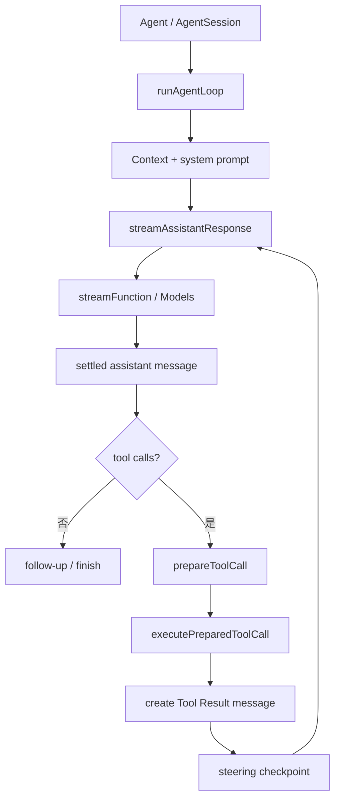

# Pi Agent Loop 源码导读

<Info>

源码基线：`853a80d26c90a14c1886f0ebb8ffaae133ca2185`。文件：`packages/agent/src/agent-loop.ts`；核心 symbol：`agentLoop`、`runAgentLoop`、`agentLoopContinue`、`runAgentLoopContinue`、`executeToolCalls`、`prepareToolCall`、`executePreparedToolCall`。

</Info>

## 阅读目标

本页不从几百行源码开始背诵，而是先建立调用链，再定位 symbol。读完后你应能回答：谁创建 loop、context 从哪里来、provider stream 如何变成 settled assistant、哪个函数执行 Tool、steering/follow-up 在何时插入，以及 abort 为什么不是普通错误。

## 文件为什么存在

`agent-loop.ts` 是 Pi 的低层控制流。它知道如何：

1. 接收已有 `AgentMessage[]`。
2. 组装或转换给 Provider 的 context。
3. 消费 assistant stream。
4. 处理 Tool Call 批次。
5. 追加 Tool Result。
6. 在 turn 边界检查 steering 和 follow-up。
7. 发出给上层 UI/Telemetry 的事件。

它不负责把整个 session 写进磁盘，也不负责渲染 TUI。上层 `Agent` 和 Coding Agent Session 才提供生命周期与持久化边界。

## 调用链先验



每个箭头都表示数据和控制权转移，不表示函数同步返回。`streamAssistantResponse` 可能等待异步事件；`executePreparedToolCall` 可能运行 shell 或网络操作；调用方必须处理 abort 和错误。

## 入口的三种语义

`agentLoop` 返回一个 `EventStream`，因此调用者既可以订阅事件，又可以等待最终 promise。`runAgentLoop` 表示从新的 prompt 启动；它要把 prompt 追加到现有上下文。`runAgentLoopContinue` 表示继续现有 context，且会检查最后一条消息是否能转换为 user 或 tool result。不要把 Continue 理解成“重新发送任意损坏历史”。

输入是 context、model、工具、stream function 和 callbacks；输出不是一个简单 string，而是按顺序的 `AgentEvent` 与最终消息数组。错误可能在 stream 事件、Provider、Tool、hook 或 abort 处出现。

## `runLoop` 的两层循环

源码中的重要结构是“turn 内循环 + follow-up 外层语义”：

```text
runLoop(context, options):
    while true:
        prepare next turn
        while true:
            response = streamAssistantResponse(context)
            append assistant response
            if response is error or aborted:
                end run
            if response has no tool calls:
                break
            results = executeToolCalls(response.toolCalls)
            append tool result messages
            if steering exists:
                append steering at checkpoint
        if follow-up exists:
            append follow-up and continue
        return final assistant
```

内层继续处理工具；外层让本来要停止的 assistant 继续处理 follow-up。伪代码不是源码逐行复制：实际实现还处理 `prepareNextTurn`、model/thinking level、context transform、usage、事件和 abort。

## 消息如何变化

```text
已有 user                         -> request 1
request 1 的 assistant(tool call)  -> append assistant
每个 tool result                   -> append tool result
steering（在边界消费）              -> append user message
request 2                           -> context 重新转换
assistant(final)                    -> run end
```

输入是当前 `AgentMessage[]`；每轮输出都会追加到同一个逻辑历史。context transform 可以改变给 Provider 的视图，但不等于偷偷修改 session tree。读取源码时要区分“内存中的 context”与“已持久化的 entry”。

## Provider 边界：`streamAssistantResponse`

这个函数先调用可选的 `transformContext`，再通过 `convertToLlm` 形成 Provider 需要的 messages，动态解析认证信息，最后调用 `streamFunction`。它消费 `AssistantMessageEventStream`：

- `start` 建立 partial assistant message。
- `text_delta`、thinking delta 或 tool-call delta 更新部分结果。
- `done` 通过 `stream.result()` 得到 settled message。
- `error` 让本轮以错误结束。

这就是为什么 Agent Loop 不需要知道某次请求是 SSE、HTTP chunk 还是 Provider 专用事件。`packages/ai/src/types.ts` 的 `AssistantMessageEvent` 是跨 Provider 的契约；原始厂商 JSON 留在 adapter 边界。

## Tool 边界：prepare 与 execute 分离

`prepareToolCall` 先查找工具，再调用可选的 `prepareArguments`，进行参数校验、before hook 和 abort 检查。它返回 prepared call 或一个错误结果。只有准备成功，`executePreparedToolCall` 才调用 `AgentTool.execute`。

这种分离解决一个具体问题：有些工具在真正执行前需要异步准备、图片/路径规范化或权限检查。如果把 lookup、验证和副作用写在同一个函数里，调用者无法证明“拒绝时没有执行”。

`afterToolCall` 可修改 content、details、usage、isError 和 terminate。注意它是 hook 语义，不应被当作永久 Session 记录；上层需要自己决定哪些字段持久化。

## `executeToolCalls` 的并行规则

Pi 根据全局 `toolExecution` 和每个 `AgentTool.executionMode` 选择路径。串行时一个 call 完成后才准备下一个；并行时先按 source order 完成 prepare，再用 `Promise.all` 执行允许并行的 calls，最后按原始顺序构造 Tool Result messages。完成事件可以乱序，但历史不能因完成速度改变。

```text
calls = [A, B]
prepared = [prepare(A), prepare(B)]
execution completion: B, A
message order: result(A), result(B)
```

如果 A 是 write、B 是 read same file，工具应声明 sequential 或上层提供依赖分析。Promise 并发只解决等待时间，不解决副作用冲突。

## Steering、Follow-up 与 abort

`Agent` 为 loop 提供 queue callback。steering 在下一次 turn checkpoint 处理，改变当前任务；follow-up 在 assistant 没有 Tool Call、原本要结束时处理；abort 由 `AbortController` 传播给正在等待的 Provider/Tool。abort 不等于把正在运行的外部进程从世界上抹掉，结果和 durable recovery 仍需上层设计。

事件例如 `agent_start`、`turn_start`、`message_start`、`tool_execution_start`、`tool_execution_update`、`tool_execution_end`、`turn_end`、`agent_end`。事件是观察面，queue 和 context 是状态面；不要在 UI listener 中私自追加消息。

## TypeScript 语法对 Java/Go 的映射

- `Promise<T>`：未来产生一个 T，接近 Java `Future<T>` 或 Go goroutine 通过 channel 返回。
- `async/await`：把 Promise 链写成顺序样式，不会自动提供取消。
- `AsyncIterable`：可 `for await` 消费的事件序列，类似 callback/channel 的异步流。
- `AbortSignal`：只读取消状态，接近 Go `context.Context` 的 Done；不是线程强杀。
- 联合类型：`AgentEvent` 通过 tag narrowing 进入不同分支，类似 Java sealed hierarchy 的判别。

这些只是阅读辅助；不能把 TypeScript 的运行时 Promise 误写成 Pi 的 durable operation。

## 源码实验：一次 read 的完整生命周期

### 目标

观察模型返回 read call 后，从 stream 到 Tool Result 的每一层。

### 准备

使用 faux provider 和已有 agent tests；固定 commit 为 `853a80d26c90a14c1886f0ebb8ffaae133ca2185`。不要向源码提交临时日志。

### 步骤

1. 在 `runAgentLoop` 调用处记录 prompt 前的 message 数量。
2. 在 `streamAssistantResponse` 观察 assistant partial 和 settled message。
3. 在 `prepareToolCall` 观察 name、call id、准备后的参数。
4. 在 `executePreparedToolCall` 观察真正进入 `AgentTool.execute` 的时刻。
5. 在 Tool Result message 生成处记录 `toolCallId`。
6. 在下一次 Provider request 处检查 assistant call/result 是否成对。
7. 注入一次 invalid arguments，确认执行函数不被调用。

### 观察点和预期

第一轮只产生候选 call；prepare 成功后才产生副作用；Result message 必须携带同一个 id。stream 的 delta 不是最终 assistant message，只有 done/result 后才能安全进入后续控制流。

## Go 与 Java 对照

| Pi | Go | Java |
| --- | --- | --- |
| `AbortSignal` | `context.Context` | `CancellationToken` + interruption |
| `Promise` | goroutine/channel | `Future`/Executor |
| `AsyncIterable` | channel/callback | Listener/Flow（示例用 callback） |
| `AgentTool` | `Tool` interface | `Tool` interface |
| Event union | `Event.Type` | `Event.type()` |

Go/Java 示例刻意保留同步 `Run` 主线，让异常和历史更容易断言；这不是说生产系统不能提供异步 API。

## 小结

阅读 Pi Loop 要抓住三条线：Provider stream 产生 settled assistant，prepare/execute 把 Tool Call 变成受控副作用，queue/event 在 turn 边界和观察面协作。`agent-loop.ts` 是控制流而不是完整 Harness；Session、权限和恢复必须继续向上追到 `Agent`、`AgentSession` 及其资源模块。
