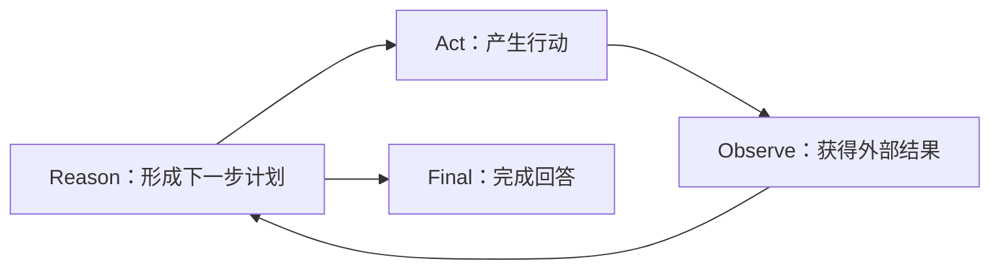

# ReAct：推理与行动交替

## 论文中的问题

ReAct（Yao 等，2022）把语言模型的 reasoning traces 与 actions 交错起来：推理形成计划、处理异常，行动访问 Wikipedia 等外部环境，观察结果再进入下一轮推理。原始论文见 [arXiv:2210.03629](https://arxiv.org/abs/2210.03629)。

## 和现代 Tool Calling 的关系

共同点是“模型输出行动意图，环境返回观察，模型继续生成”。差别在输出载体：经典示例可能是 `Thought / Action / Observation` 文本；现代模型通常产生结构化 `tool_call`，思考内容可能是 Provider 私有或根本不暴露。不要要求每个 Agent 把隐藏推理打印出来，也不要把可观察的 Tool Call 和模型内部 reasoning 当成同一件事。

## 工程翻译

- Reason：模型请求前的 Context、模型输出和下一轮决策。
- Act：Runtime 根据 name/arguments 查找并执行 Tool。
- Observe：Tool Result 作为带 `toolCallId` 的消息回到 Context。
- Guard：max steps、权限、超时和取消阻止循环失控。

## 练习

用 calculator 的两轮 ScriptedModel 画出每个事件：`assistant(toolCall)`、`tool_execution_start`、`toolResult`、下一次请求、`assistant(stop)`。不要把“模型说要算”写成“已经算完”。
