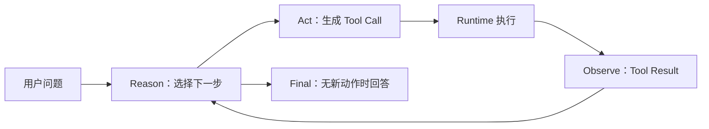

# ReAct：推理与行动交替

## 学习目标

读完本页，你应该能够解释 ReAct 的循环、区分文本协议和原生 Tool Calling，并用测试事件追踪一次工具调用。这里的推理指可观察的决策步骤，不要求输出模型的私有思维链。

## 前置知识

模型接收 messages 并生成 assistant 输出；Runtime 可以把输出追加到下一次请求。Tool Executor 才能访问文件、网络或进程。若这三个边界没有分开，后面的 `Observation` 就会被误写成模型事实。

## 先看没有工具的请求

```json
{
  "messages": [
    {"role": "user", "content": "北京现在天气如何？"}
  ]
}
```

模型只能根据已有参数和上下文回答。输入是消息列表，输出是 assistant text，状态增加一条 assistant message；它没有网络权限，也没有实时数据执行证据。

提供工具后，模型看到的是定义而不是函数指针：

```json
{
  "name": "get_weather",
  "description": "查询城市当前天气",
  "parameters": {
    "type": "object",
    "properties": {"city": {"type": "string"}},
    "required": ["city"]
  }
}
```

这段 JSON 的输入是工具 metadata，输出是模型可选择的结构化动作；它不会启动 HTTP 请求。JSON Schema 也不代表用户已授权访问网络。

## 经典 ReAct

ReAct（Yao 等，2022）把 reasoning traces 与 actions 交错起来，论文见 [arXiv:2210.03629](https://arxiv.org/abs/2210.03629)。一个简化的文本轨迹是：

```text
Question: 北京现在天气如何？
Thought: 需要实时数据。
Action: get_weather[北京]
Observation: 晴，25°C
Thought: 观察结果足够回答。
Final: 北京现在晴，25°C。
```

`Question` 来自用户，`Thought` 是模型的计划，`Action` 是可解析动作，`Observation` 是环境返回的结果，`Final` 是给用户看的回答。Runtime 必须解析 Action；拼写、引号或参数格式错误都会造成协议错误。

### 为什么要交替

单次生成不能观察尚未发生的外部动作。模型先提出动作，Runtime 执行后把结果作为新 message 追加，下一次生成才拥有新证据：



图中模型只负责 `Reason/Act/Final` 的生成；`Runtime 执行` 是外部代码；`Observe` 的内容来自工具返回。任何一条边都可能失败，不能把循环当成无限可靠的链条。

## 原生 Tool Calling 的变化

现代 Provider 通常把动作放在结构化字段中：

```json
{
  "role": "assistant",
  "content": null,
  "tool_calls": [
    {
      "id": "call_17",
      "type": "function",
      "function": {
        "name": "get_weather",
        "arguments": "{\"city\":\"北京\"}"
      }
    }
  ]
}
```

Runtime 先保存 assistant message，再按 `id`、`name` 和参数解析。执行后追加配对结果：

```json
{
  "role": "tool",
  "tool_call_id": "call_17",
  "content": "晴，25°C"
}
```

`tool_call_id` 的作用是把结果配回一次调用；缺少它或错配多个调用会破坏下一次 Provider 请求。模型没有执行证明，Tool Result 才是 Runtime 对动作的记录。

经典 ReAct 与原生 Tool Calling 的共同点是 Reason → Act → Observe；不同点是动作载体、参数校验和思维可见性。现代 Provider 的 thinking 可能是私有 block，不能要求程序解析 `Thought:`；程序应依赖稳定的 Tool Call、stop reason 和事件。

## messages 如何增长

```text
m0 user(question)
m1 assistant(tool_call: call_17)
m2 tool(call_17, weather result)
m3 assistant(final)
```

每次模型请求都带上可见历史。第一轮没有 `m2`，所以不能声称知道天气；第二轮包含 `m1+m2`，模型才可以引用工具结果。多个 Tool Call 时，每一个都要有独立 id 和对应 result。

上下文增长会带来 token 成本和窗口上限。Harness 需要限制 `maxSteps`、截断过长结果，并在必要时 compaction；不能把所有旧消息无条件保留。

## Pi 的源码证据

研究 commit：`853a80d26c90a14c1886f0ebb8ffaae133ca2185`。

- `packages/agent/src/agent-loop.ts`：`runAgentLoop` 组织 assistant step；`executeToolCalls` 执行一批调用；`prepareToolCall` 做查找、参数准备和 hook；`executePreparedToolCall` 才调用工具。
- `packages/agent/src/types.ts`：`AgentTool`、`AgentMessage`、`AgentEvent` 定义运行时边界。
- `packages/ai/src/types.ts`：`ToolCall`、`AssistantMessage`、`Usage` 和流事件是 Provider-neutral 类型。
- `packages/agent/src/agent.ts`：`Agent` 的 steering/follow-up 队列和 `AbortController` 不属于模型本身。

这些符号证明 Pi 的现代实现仍是 ReAct 的工程变体，但把动作从文本解析换成了类型化事件。源码事实不等于设计动机；“为什么这样分层”是教学分析，不是作者声明。

## Go 与 Java 对照

| 概念 | Go 示例 | Java 示例 |
| --- | --- | --- |
| 模型边界 | `Model.Complete(context.Context, Request)` | `Model.complete(Request, CancellationToken)` |
| Tool Call | `ToolCall` + `json.RawMessage` | `ToolCall` + `JsonNode` |
| 取消 | `context.Context` | `CancellationToken` 和 interruption |
| 观察结果 | `RoleTool` message | `Message.Role.TOOL` |
| 假模型 | `ScriptedModel` | `ScriptedModel` |

Go 的 `context.Context` 不是强杀；Java 的 token 也不是撤销远端 HTTP 计费。两者都要让模型、Tool 和 backoff 主动检查取消。

## 动手实验：追踪 calculator

### 目标

证明 Tool Call、函数执行和 Tool Result 是三个不同对象。

### 准备

进入 `examples/go-agent` 或 `examples/java-agent`，运行离线测试；不要设置真实 API key。

### 步骤

1. 找到 `ScriptedModel` 第一轮的 `calculator` 调用。
2. 打印 call 的 `id`、name 和 arguments。
3. 在 Registry lookup 前后打印消息数量。
4. 在 `Execute`/`execute` 中打印真正收到的参数。
5. 检查第二次 `Request` 是否含 assistant call 和配对 tool result。
6. 将结果改成错误，观察模型是否得到 `isError`。

### 观察点与预期

第一轮只有用户消息；第二轮至少增加 assistant tool call 和 tool result。模型生成 `2+3` 不等于计算完成，只有 calculator 返回 `5` 后 Runtime 才有执行事实。

### 思考题

如果结果 id 写成 `call_18` 会发生什么？如果 schema 合法但路径指向 `~/.ssh/id_rsa`，为什么仍要经过 Permission Policy？如果模型连续产生 Tool Call，哪一个 `maxSteps` 或预算条件负责结束？

## 小结

ReAct 是“生成动作、观察环境、继续生成”的控制思想，不是必须打印 `Thought:` 的格式。原生 Tool Calling 让动作结构更稳定，但没有消除校验、权限、取消、消息配对和终止问题。Pi 的 `prepare → execute → result` 边界，以及 Go/Java 的 ScriptedModel 测试，正是把这个思想变成可验证工程代码的方式。
