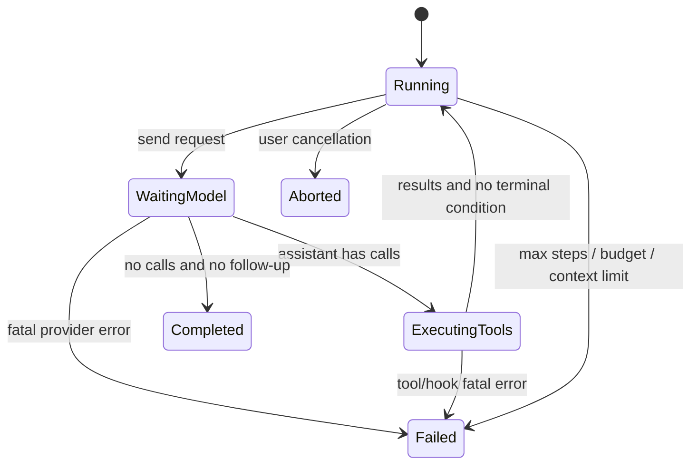

# 终止、重试与取消

## 学习目标

你将建立一张“错误发生在哪里、能否重试、状态是否已产生副作用”的判断表。完成后应能实现有 `maxSteps` 的 Loop，并解释为什么取消 backoff、Provider request 和 Tool 都必须经过同一个信号。

## 先问：谁拥有终止决定

模型返回 `stop` 只是 Provider 的提示，不是完整的本地策略。Runtime 还必须检查：

- assistant 是否真的没有 Tool Call。
- 是否仍有 steering/follow-up 队列。
- 是否达到 `maxSteps` 或 token/cost budget。
- 是否超过 context window 或 deadline。
- 用户是否 abort。
- Tool、hook、Provider 是否产生 fatal error。

```text
模型 stop
 -> 检查 tool calls
 -> 检查 follow-up
 -> 检查 budget/deadline
 -> 保存 terminal outcome
 -> 才结束 run
```

输入是 assistant response 和当前 Harness state；输出是 completed、failed 或 aborted。常见错误是看到 `stop` 就返回，导致已经排队的 follow-up 永远不执行，或没有保存失败前缀。

## 终止状态机



每条边都应该生成事件和可诊断结果。`Aborted` 不是 Provider `error` 的同义词：它说明取消意图来自用户或上层控制，而不是请求格式坏了。

## Retry 与重新执行不是一回事

Provider retry 重新发送同一个尚未产生本地 Tool 副作用的请求；Tool retry 可能重复写文件、发邮件或扣款，因此必须由工具声明幂等或由 Harness 记录 operation id。不要用“捕获异常后再次调用自身”代替策略。

### 可重试的 Provider 错误

通常可以有限重试 408、409、429、部分 5xx、网络暂时断开。429 需要尊重 `Retry-After`；永久 401、错误模型名、无效 JSON schema 通常不应盲重试。

```text
for attempt = 1..maxAttempts:
    response = provider.request(request)
    if success: return response
    if not retryable(error): return error
    wait(backoff(attempt), cancellation)
return exhausted
```

输入是同一份 request、错误分类、attempt 上限和取消信号；输出是 response 或最终错误。每次 attempt 都要记录，不能让进程重启后把预算归零。backoff 期间也要检查取消，否则用户 abort 仍会被定时器阻塞。

### Context overflow recovery

`context too long` 不是普通 5xx。Harness 可以保留 system/最近尾部、生成 summary，再只重试一次。若已经达到 intended output cap，`length` 可能是正常截断；若本轮仅因 context clamp 而截断，不能把它当成成功 assistant。

## Pi 的源码证据

研究 commit：`853a80d26c90a14c1886f0ebb8ffaae133ca2185`。

- `packages/ai/src/utils/provider-retry.ts` 的 `retryProviderRequest` 对 Provider 错误分类并进行有界等待。
- `packages/agent/src/agent.ts` 的 `runWithLifecycle` 创建 `AbortController`，`abort()` 触发信号并等待生命周期收尾。
- `packages/agent/src/agent-loop.ts` 的 `agentLoop`/`runAgentLoop` 在 assistant、Tool 和 abort 事件之间推进状态。
- `packages/coding-agent/src/core/agent-session.ts` 负责更上层的 retry、overflow recovery、compaction 和 session 事件。

源码事实是“有哪些分支和调用”；重试次数、幂等和持久化边界需要结合上层设计，不能只看一个 catch block。

## Abort 的正确传播

```text
user presses Escape
 -> Agent.abort()
 -> AbortController.abort()
 -> provider fetch observes signal
 -> tool observes signal
 -> loop emits aborted end
```

`AbortSignal` 只表示取消请求，不保证正在运行的操作已经停止。shell 进程可能已产生输出，远端请求可能已经计费。Harness 应保存已执行前缀，并把“结果未知”的 Tool 标记为 interrupted，而不是伪造成功。

Go 使用 `context.Context`：HTTP request、timer、Tool 都选择 `ctx.Done()`。Java 示例使用 `CancellationToken` 和线程 interruption；`Future.cancel(true)` 不能撤销远端副作用。两种实现都应让每一个长循环主动检查。

## Pi 的事件顺序实验

### 目标

观察成功、retry、abort 和 max steps 的不同终点。

### 准备

使用 faux provider 或 Go/Java `ScriptedModel`，设置 `maxAttempts=2`、`maxSteps=2`；不要使用真实收费接口。

### 步骤

1. 第一次返回临时 503，第二次返回 final，记录两个 model attempt。
2. 让模型连续返回 Tool Call，设置 `maxSteps=1`。
3. 让模型延迟，调用 `Abort`/取消 context。
4. 在 backoff 期间取消，确认不用等完整 delay。
5. 检查最后事件是 completed、failed 还是 aborted。

### 观察点

Provider retry 不应增加 Tool 执行次数；max steps 应保留 assistant/tool 前缀；abort 不应把取消错误包装成“模型回答”。

### 思考题

如果写文件成功但模型响应超时，能否安全重试？需要保存什么 intent 或幂等键？如果有 follow-up，为什么“没有 Tool Call”仍可能不是真正的结束？

## 小结

终止是 Runtime 的状态机，stop reason 只是输入之一。重试要区分 Provider 请求、Tool 副作用和 context overflow；取消要传播到等待和执行两侧；所有路径都要有上限，并保留可诊断的历史前缀。这样 Loop 才不会无限运行或静默制造假成功。
