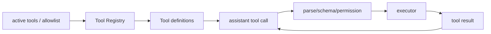

# Coding Agent 的基础工具

## 学习目标

你将从零拆解 `read`、`write`、`edit`、`grep` 和 `bash`。重点不是记住工具名，而是理解 definition、注册、参数验证、执行、输出限制、权限和 Loop 如何接在一起。完成后能设计一个只读模式，再逐步开放写入。

## 一个 Coding Agent 到底增加了什么

普通聊天只能生成建议；Coding Agent 需要把建议作用于仓库：

```text
LLM
 + tool definitions
 + Agent Loop
 + Tool Registry
 + filesystem/process executor
 + permission policy
 + output truncation
```

模型选择 Tool，Runtime 验证和执行，文件系统或进程返回结果，再把结果送回模型。模型不会因为看到了 `write` 就自动拥有磁盘权限。

## Pi 当前工具集合

研究 commit：`853a80d26c90a14c1886f0ebb8ffaae133ca2185`。入口是 `packages/coding-agent/src/core/tools/index.ts`；当前组合包括 `read`、`write`、`edit`、`grep`、`find`、`ls`、`bash`、`powershell`。`createCodingTools` 和 `createReadOnlyTools` 负责不同安全配置。

| Tool | 输入 | 实际动作 | 主要失败 |
| --- | --- | --- | --- |
| `read` | path、行范围 | 打开并读取文件 | 不存在、越权、编码错误 |
| `write` | path、content | 创建父目录并覆盖/写入 | 越权、磁盘/权限错误 |
| `edit` | path、oldText、newText | 唯一匹配后替换 | 0 次或多次匹配 |
| `grep` | pattern、path | 搜索文本并限制结果 | 正则错误、二进制、超长 |
| `find`/`ls` | path、过滤器 | 枚举路径 | 忽略规则、输出过长 |
| `bash` | command、cwd、timeout | 启动进程并收集输出 | 非零退出、超时、取消 |

表格的输入是模型参数，输出应成为 Tool Result；“实际动作”只在权限闸门通过后发生。错误必须包含可诊断信息，不应把失败变成空字符串。

## `read`：最小副作用仍是敏感操作

```json
{"name":"read","arguments":{"path":"src/main.go","startLine":1,"endLine":80}}
```

Runtime 先规范化路径，确认在 workspace 内，再打开文件。输出是带行号的有限文本，状态是“读操作已完成”。`~/.ssh/id_rsa` 即使能被操作系统读取，也不应因 Schema 合法而允许。

文件很大时，Pi 通过 `truncateHead`/`truncateTail` 或工具上限减少 context。结果应明确告诉模型发生了截断，并保留范围信息；静默裁掉中间内容会导致模型误改。

## `write`：不可逆程度更高

```json
{"name":"write","arguments":{"path":"tmp/hello.txt","content":"hello\n"}}
```

输入是目标路径和完整内容；输出是写入摘要；状态改变文件。执行器应创建必要父目录、处理编码和权限错误，并在写前后记录路径。生产实现还应考虑临时文件、原子替换、冲突检测和磁盘配额。

## `edit`：为什么要唯一匹配

```json
{"name":"edit","arguments":{"path":"a.go","oldText":"return nil","newText":"return err"}}
```

若 `oldText` 出现 0 次，不能猜测位置；出现多次，不能任选一处。只有恰好一次匹配才替换。输入是精确文本，输出是变更摘要，状态是文件发生确定修改。这个门槛比“正则全局替换”更容易审计。

## `grep` 和 `find`：读结果也要限制

搜索工具常返回大量路径/行。Runtime 应限制结果数、字节数和单行长度，区分“没有匹配”和“结果被截断”。模型若不知道结果不完整，可能错误地得出“整个仓库没有引用”。二进制文件和权限错误要明确标记。

## `bash`：过程边界

```json
{"name":"bash","arguments":{"command":"go test ./...","cwd":".","timeoutMs":30000}}
```

输入是命令、工作目录和超时；输出是 stdout、stderr、退出码；状态可能创建文件、访问网络或修改仓库。必须把 cwd 规范化到 workspace、传递取消、限制输出和记录退出码。`rm -rf`、`curl`、`git push` 不是普通只读操作。

## 输出截断不是错误吞掉

```text
raw output -> byte/line limit -> truncated result + marker -> next model request
```

输入是工具完整输出，输出是有上限且带标记的 Tool Result。状态上应保存“发生过截断”，而不是声称模型看到了全部结果。截断策略可以 head、tail 或摘要，但应按工具选择并可测试。

## 注册与 Prompt 一致

`createToolDefinition` 生成模型看到的描述；registry 保存真正 executor；active tool allowlist 决定本轮可用集合。三者必须一致：



图中 Config 不能只改 prompt；如果模型看到 write 而 registry 没有，会产生 unknown tool。Extension 可以增加或包装工具，但不应跳过宿主安全策略。

## 与 Pi 源码对应

- `packages/coding-agent/src/core/tools/read.ts`：read definition、路径读取和输出限制。
- `write.ts`：write definition 和文件写入。
- `edit.ts`：唯一匹配与编辑结果。
- `bash.ts`：命令执行、超时、输出和取消边界。
- `tools/index.ts`：`createTool`、`createToolDefinition`、`createCodingTools`、`createReadOnlyTools`。
- `packages/coding-agent/src/core/agent-session.ts`：将工具集合接入 Agent 和 extension hooks。
- `packages/agent/src/agent-loop.ts`：`prepareToolCall`、`executePreparedToolCall` 连接 definition 与 executor。

源码事实是文件和 symbol 的职责；对于权限、sandbox 和项目可信度，应继续阅读 `packages/coding-agent/docs/security.md` 与 trust manager，不能从工具名推测安全保证。

## Go 与 Java 对照

| 能力 | Go | Java |
| --- | --- | --- |
| 读写路径 | `os.Open`/`os.WriteFile` | `Files.readString`/`Files.writeString` |
| 进程 | `exec.CommandContext` | `ProcessBuilder` |
| 参数 | `json.RawMessage` | Jackson `JsonNode` |
| 并行 | goroutine | `ExecutorService` |
| 结果 | `ToolResult` | `ToolResult` |

标准库不会替你完成授权。Go 的 `CommandContext` 和 Java 的 process destroy 都需要额外处理子进程树、输出上限和权限。

## 动手实验

### 目标

做一个只读到可写的最小 Coding Agent。

### 准备

创建临时 workspace，运行 Go/Java 示例测试；不要把 workspace 指向 home 或生产仓库。

### 步骤

1. 只注册 `read` 和 `grep`，让模型定位一处文本。
2. 为 `read` 加 workspace 外路径测试。
3. 注册 `write`，写入临时文件并 reload 验证。
4. 用 `edit` 测试 0/1/2 次匹配。
5. 用延迟 `bash` 测试超时和取消。
6. 生成超长 grep 结果，确认有截断标记。
7. 打开 allowlist，确认模型看见的 definitions 与 registry 相同。

### 观察点与思考题

观察 Tool Call 的参数、规范化路径、执行事件、退出码和 Result message。思考：为什么 read 仍可能泄露秘密？如何让 bash 只允许测试命令？如果写操作在结果落盘前崩溃，Session 应保存哪些信息？

## 小结

Coding Agent 的核心不是多几个命令，而是把模型意图接到受控副作用。definition、registry、prepare、permission、executor 和截断结果必须共同工作；开放 write/bash 前先建立只读模式和失败测试。
