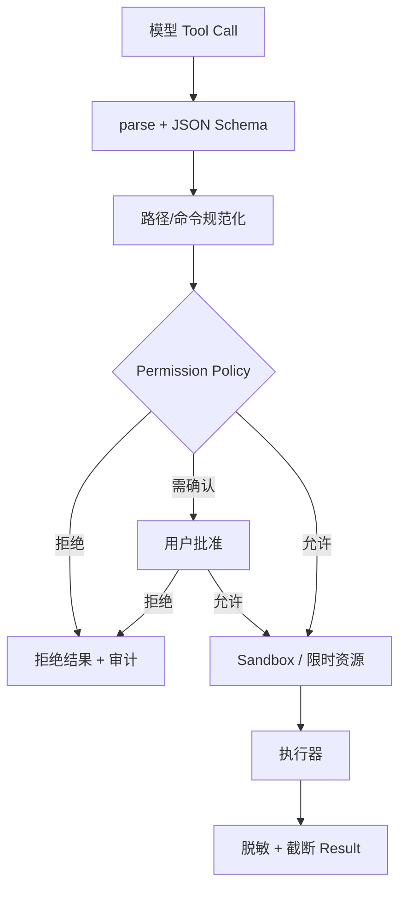

# Tool 与安全边界

## 学习目标

本页回答一个必须反复确认的问题：模型输出为什么不是授权？你将把 Schema、路径策略、命令审批、sandbox、timeout、资源限制和审计日志放到同一条执行管线中，并知道 Go/Java 示例哪些地方只是教学保护。

## 一个具体风险

下面三个 call 的 JSON 都可能完全符合 Schema：

```json
{"name":"read","arguments":{"path":"~/.ssh/id_rsa"}}
{"name":"bash","arguments":{"command":"rm -rf /tmp/workspace"}}
{"name":"bash","arguments":{"command":"git push origin main"}}
```

模型生成了 name 和 arguments，但没有获得文件、shell 或网络权限。输入是候选意图，输出必须先经过策略；在策略通过前，任何 executor 都不应被调用。

## 推荐执行管线

```text
model tool call
 -> parse raw JSON
 -> schema validation
 -> normalize path/command
 -> permission policy
 -> user approval（必要时）
 -> sandbox/container
 -> timeout/resource/network limit
 -> execute
 -> redact secrets
 -> bounded tool result
 -> audit event
```

每一段都有不同责任：Schema 检查形状；normalize 消除 `../`、符号链接和命令歧义；policy 决定允许范围；sandbox 约束操作系统权限；executor 产生副作用；redaction 防止结果泄露凭据。不要把它们合并成一个 `isValid` 布尔值。



拒绝路径不应进入 executor；执行失败也不能被包装为成功。图中的 Result 是模型可见结果，Audit 是管理员可见记录，二者不必包含同样细节。

## Schema 不等于授权

```json
{
  "type":"object",
  "properties":{"path":{"type":"string"}},
  "required":["path"]
}
```

它只说明 `path` 是 string。以下字符串都可能通过 Schema：`src/main.go`、`../secrets.txt`、`/etc/passwd`。Permission 还要检查绝对路径、workspace、符号链接最终目标和是否为敏感文件。

同样，`bash` 的 `command` 是 string 并不代表安全。命令策略应考虑 shell 解析、重定向、管道、环境变量、网络和子进程；黑名单只能作为教学起点，不能当生产隔离。

## Pi 的事实边界

研究 commit：`853a80d26c90a14c1886f0ebb8ffaae133ca2185`。

- `packages/coding-agent/src/core/tools/` 定义 read/write/edit/bash 等工具，工具执行本身不是操作系统 sandbox。
- `packages/coding-agent/src/core/project-trust.ts`、`trust-manager.ts` 和 `docs/security.md` 描述项目可信度、安全配置及限制。
- `packages/agent/src/agent-loop.ts` 的 `prepareToolCall`/`executePreparedToolCall` 说明准备和执行是不同边界。
- `packages/agent/src/types.ts` 的 Tool hook 可拒绝或修改调用，但 hook 不是容器隔离。

源码能证明有哪些检查和入口；若当前版本没有完整 permission/sandbox，教材必须明确写“没有”，不能从安全文档标题推测已有能力。

## 教学 Go/Java 实现的限制

Go `PermissionPolicy` 只把路径限制在 workspace，并拒绝少量明显危险命令；Java 实现做同类规范化和黑名单检查。这能帮助测试边界，但绕不过恶意二进制、符号链接竞态、shell 语义、资源耗尽和宿主权限。

生产部署至少需要：

1. 最小权限操作系统账户。
2. 容器或专用 sandbox，限制文件、网络、CPU、内存和进程树。
3. 每个 Tool 的 allowlist 与人工审批策略。
4. timeout、输出上限和请求预算。
5. secret redaction，禁止把环境变量/凭据放入 prompt。
6. append-only 审计记录和可追踪的 operation id。
7. crash 后对未知副作用做 reconciliation，而不是自动重跑。

这些是部署边界，不是给教学代码贴一层注释就实现了。

## 输出和秘密处理

```text
executor output
 -> classify stdout/stderr
 -> remove credentials/tokens
 -> limit bytes/lines
 -> mark truncated
 -> tool result
```

输入是可能含秘密的原始输出，输出是脱敏且有上限的 Result。脱敏失败时宁可拒绝回传；截断时要标记不完整，避免模型以为“没有更多内容”。日志也要脱敏，不能只保护模型上下文。

## Go 与 Java 对照

| 安全边界 | Go 示例 | Java 示例 |
| --- | --- | --- |
| 路径 | `filepath.Abs`/workspace check | `Path.normalize`/workspace check |
| 进程 | `exec.CommandContext` | `ProcessBuilder` |
| 取消 | `context.Context` | `CancellationToken` |
| 结果 | `ToolResult` + error | `ToolResult` + error |
| 真实 sandbox | 示例未提供 | 示例未提供 |

两个示例都不宣称能抵御恶意模型或恶意工具；真实 sandbox 必须由宿主部署，而不是由 JSON Schema 负责。

## 动手实验

### 目标

证明四种输入的差异：合法、越权、危险和输出泄露。

### 准备

使用临时 workspace；创建普通文件和临时敏感文件；不要执行破坏性命令。

### 步骤

1. 读取 workspace 内文件，确认成功。
2. 读取 `../outside.txt`，确认未进入 executor。
3. 提交 `rm -rf` 字符串，确认策略拒绝。
4. 让测试 Tool 返回一个伪 token，确认 Result/log 都脱敏。
5. 生成超过上限的 stdout，确认结果带截断标记。
6. 取消延迟 Tool，确认没有假成功事件。

### 观察点、预期与思考题

观察 policy 判断发生在 execute 之前，拒绝带原因和审计事件；输出上限不会伪装成完整结果。思考：符号链接会如何绕过简单路径前缀检查？为什么黑名单不能替代 sandbox？未知 Tool 的错误是否应该触发自动 retry？

## 小结

安全边界是独立于模型的授权系统。Schema 解决输入形状，Permission 解决策略，Sandbox 解决宿主能力，Executor 执行副作用，脱敏/截断解决结果泄露。把模型输出当作请求而非授权，是构建 Coding Agent 的第一条安全原则。
