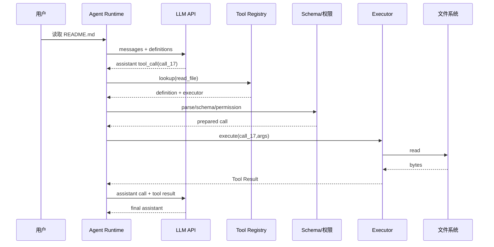

# 真正理解 Tool Calling

## 学习目标

读完本页，你应能从一份 API 请求中指出 Tool Name、Description、Schema、Arguments、Call ID 和 Result；能解释模型为什么不会直接调用 Java 方法；能为 unknown tool、invalid arguments、permission denied 和执行失败设计不同结果。

## 先从普通 HTTP 请求开始

没有工具时，Runtime 发送：

```json
{
  "model": "demo",
  "messages": [
    {"role":"system","content":"回答简洁。"},
    {"role":"user","content":"读取 README.md 的第一行"}
  ]
}
```

模型只能生成文字：“我无法访问文件”。输入是消息，输出是 assistant text，状态增加 assistant message；任何文件内容都不是模型凭空拥有的事实。

## Tool Definition 是什么

向模型声明一个可选工具：

```json
{
  "name": "read_file",
  "description": "读取 workspace 内的文件并返回文本",
  "parameters": {
    "type": "object",
    "properties": {
      "path": {"type":"string","description":"相对 workspace 的路径"},
      "startLine": {"type":"integer","minimum":1}
    },
    "required": ["path"]
  }
}
```

`name` 是 registry lookup 的键；`description` 帮模型选择工具；`parameters` 是参数形状约束。这个定义不会调用函数，也不会绕过权限。Schema 通过只说明 JSON 形状正确，不说明路径安全。

## Tool Call 是模型的候选动作

```json
{
  "role": "assistant",
  "content": null,
  "tool_calls": [{
    "id":"call_17",
    "type":"function",
    "function":{
      "name":"read_file",
      "arguments":"{\"path\":\"README.md\",\"startLine\":1}"
    }
  }]
}
```

模型输出 name、JSON 字符串和 id；Runtime 负责解析 JSON、查找工具、校验、权限检查和执行。模型没有打开文件。`call_17` 是一次调用的身份，稍后 Tool Result 必须用同一个 id 配对。

## Tool Result 是执行事实

```json
{
  "role":"tool",
  "tool_call_id":"call_17",
  "content":"# AI Agent 工程教材"
}
```

输入是工具执行的返回值和原 call id；输出是追加到下一轮 context 的消息；状态从 assistant call 变为“call 有 result”。没有 result 的 assistant call 可能使下一轮 Provider 拒绝请求，也会让模型无法判断执行情况。

## 完整时序



每一步的输入都应可记录：模型输入是 definitions，校验输入是 raw arguments，执行输入是 normalized args。每一步的输出也不同：Tool Result 是事实，最终 assistant 是模型对事实的解释。

## 四个闸门

```text
1. parse：arguments 是否是合法 JSON？
2. schema：类型、required、范围是否正确？
3. permission：路径、命令、网络是否符合策略？
4. execute：工具是否成功完成？
```

parse/schema 错误通常可以构造 `isError=true` 的 Tool Result 让模型修正；permission 拒绝也可以回传，但不能因为模型说“请允许”就跳过；execute error 要保留脱敏错误和 call id。不要在 schema 校验后直接执行。

## 常见失败示例

### unknown tool

```json
{"id":"call-1","name":"delete_everything","arguments":{}}
```

Registry 找不到 name，不能调用任何函数；结果应写明 unknown tool。输入是未注册 name，输出是错误 Tool Result，状态是“未发生副作用”。

### invalid arguments

```json
{"id":"call-2","name":"read_file","arguments":{"path":42}}
```

Schema 要求 string，执行器不应收到这个调用。错误中要指出 `path` 的类型，避免只返回“失败”。

### permission denied

```json
{"id":"call-3","name":"read_file","arguments":{"path":"~/.ssh/id_rsa"}}
```

Schema 合法，但政策禁止 workspace 外路径。输出是 permission denied；状态是“参数合法但未授权，未执行”。

### execution error

文件不存在、编码失败或 shell 退出码非零都属于执行错误。工具可以返回有限错误文本；不要把空结果或“成功”替代真实错误。

## Pi 的源码证据

研究 commit：`853a80d26c90a14c1886f0ebb8ffaae133ca2185`。

- `packages/ai/src/types.ts` 的 `ToolCall`、`ToolResult`、`AssistantMessage` 描述 Provider-neutral 数据。
- `packages/agent/src/types.ts` 的 `AgentTool` 加入 `label`、`execute`、可选 `prepareArguments` 和 `executionMode`。
- `packages/agent/src/agent-loop.ts` 的 `prepareToolCall` 做 lookup、prepare、校验和 before hook。
- `executePreparedToolCall` 才运行工具；`executeToolCalls` 负责批次模式；结果消息由 loop 追加。
- Coding Agent 工具定义位于 `packages/coding-agent/src/core/tools/`，注册入口是 `tools/index.ts`。

Pi 的低层 loop 负责控制流，但是否允许命令、如何隔离 shell 仍是上层安全边界，不能由 Tool Calling 自动提供。

## Go 与 Java 对照

| 概念 | Go | Java |
| --- | --- | --- |
| raw arguments | `json.RawMessage` | Jackson `JsonNode` |
| lookup | `Registry.Get/Validate` | `ToolRegistry.find/validate` |
| execute | `Tool.Execute(ctx, raw)` | `Tool.execute(token, args)` |
| result | `RoleTool` + `ToolCallID` | `Message.Role.TOOL` + call id |
| schema gate | object/required 校验 | object/required 校验 |

语言只改变 AST 和取消方式，不改变“模型输出意图、Runtime 执行”的责任边界。

## 动手实验

### 目标

用 calculator 和 read 两个工具观察四个闸门。

### 准备

进入 `examples/go-agent` 或 `examples/java-agent`，使用 `ScriptedModel` 和临时 workspace；不要读真实 home。

### 步骤

1. 让模型返回合法 calculator call，断言第二轮有 result。
2. 改 name 为 unknown，断言 Tool execute 次数为零。
3. 删除 required 字段，断言 `isError` 和 call id 保留。
4. 把路径改到 workspace 外，断言 policy 拒绝。
5. 让文件不存在，观察执行错误如何回模型。
6. 打印两轮 request，确认 assistant call 与 tool result 成对。

### 观察点与预期

第一轮没有文件内容；只有执行成功后才出现 Tool Result。非法或越权调用不会进入 execute。第二轮模型看到 call、result 和错误描述，而不是一个无法解释的字符串。

### 思考题

为什么“Schema 合法”不等于“用户授权”？如果 Provider 返回两个 call，结果怎样用 id 配对？如果 Tool 执行成功但进程在写 result 前崩溃，Harness 如何避免下次无条件重复执行？

## 小结

Tool Calling 是一种消息协议和 Runtime 边界，不是模型直接调用函数。Definition 负责让模型提出结构化意图，parse/schema/permission 负责安全准备，Executor 产生副作用，Tool Result 把事实送回下一轮。真正的 Agent 工程从这条边界之后才开始。
