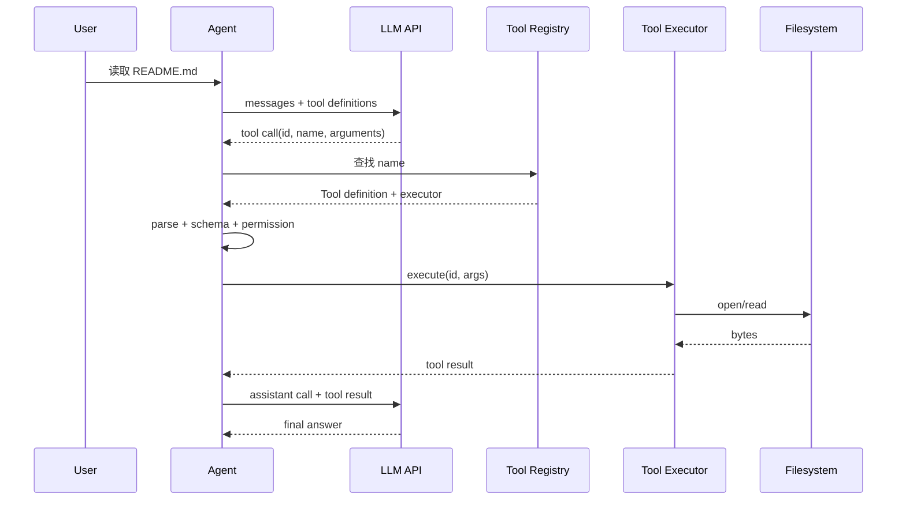

# 真正理解 Tool Calling

## 模型看到的 Tool

模型看到的是名称、自然语言描述和 JSON Schema：

```json
{
  "name": "read_file",
  "description": "读取工作目录中的指定文件",
  "parameters": {
    "type": "object",
    "properties": {"path": {"type": "string"}},
    "required": ["path"]
  }
}
```

这不是 Java reflection，也不是 Go 函数指针。模型只生成类似下面的结构：

```json
{"id":"call_17","name":"read_file","arguments":{"path":"README.md"}}
```

Agent Runtime 才负责 registry lookup、JSON decode、schema validation、permission check、执行和构造 Tool Result。

## 完整时序



## Pi 的对应类型

`packages/ai/src/types.ts` 的 `Tool` 只有定义；`packages/agent/src/types.ts` 的 `AgentTool` 增加 `label`、`execute`、可选 `prepareArguments` 与 execution mode；`packages/agent/src/agent-loop.ts` 的 `prepareToolCall` 和 `executePreparedToolCall` 把两者连接起来。

## 错误不要静默

未知工具、无效参数、被权限拦截和执行异常都应形成 `isError: true` 的 Tool Result。它能让模型修正调用；若故障属于 Provider 请求本身，才由 assistant 的 `error` stop reason 表示。
