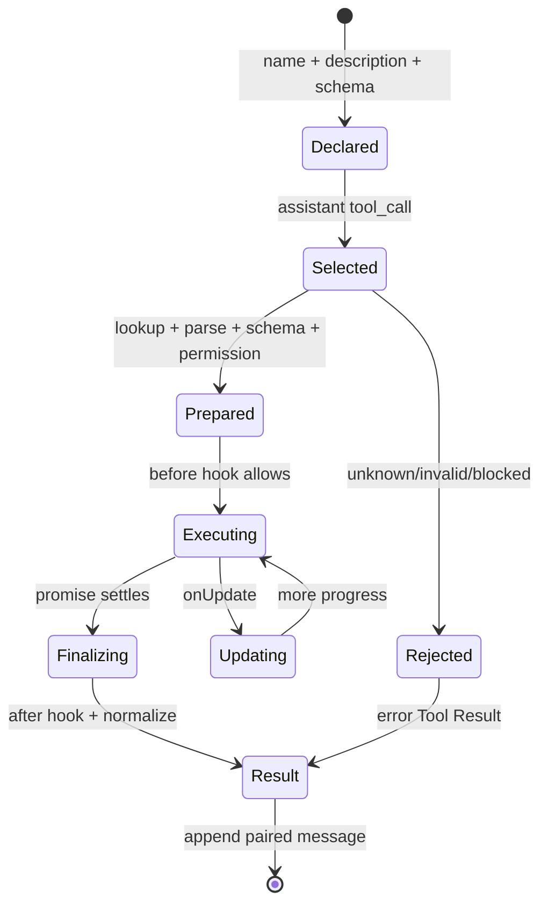

# Tool 生命周期

## 学习目标

本页把一次 Tool Call 拆为 declaration、selection、prepare、execute、update、finalize 和 result 七个阶段。完成后你应能证明：被拒绝的调用没有产生副作用，事件和持久化消息不是同一回事，`afterToolCall` 不能被误当成安全策略。

## 为什么不能只有一个 `execute`

下面的代码看似简单：

```text
tool = registry[name]
return tool.execute(arguments)
```

它把 lookup、参数解析、权限、执行、结果转换混在一起。输入只是一段模型生成的 JSON，可能是未知名称、坏参数或越权路径；如果直接执行，系统无法证明拒绝发生在副作用之前。

## 七个阶段



`Declared` 的输入是 Tool Definition，输出是模型可见 metadata；`Selected` 的输入是 assistant call，输出是一个候选动作；`Prepared` 才是允许进入副作用阶段的调用；`Result` 必须保留 call id。图中 Rejected 仍会产生结果消息，但不会进入 Executing。

## 1. Declaration 与 registry

```json
{
  "name":"read_file",
  "description":"读取 workspace 内文件",
  "parameters":{"type":"object","required":["path"]}
}
```

Registry 保存 definition 和 executor。模型请求只应拿到 active registry 的 definitions；如果 prompt 说有 `read_file`，实际 registry 却没有，模型会不断生成 unknown tool。注册时应拒绝重复名称，避免最后注册者静默覆盖。

Pi 的 `packages/coding-agent/src/core/tools/index.ts` 集中创建 coding tools；`packages/agent/src/types.ts` 的 `AgentTool` 是 loop 使用的运行时形状。定义和执行对象有关联，但不能把 definition 当成权限授予。

## 2. Selection：assistant call

模型返回：

```json
{
  "id":"call-7",
  "name":"read_file",
  "arguments":"{\"path\":\"src/main.go\"}"
}
```

输入是 assistant message 中的 call，输出是带 id 的候选动作，状态只记录“模型要求调用”。到此为止仍没有读取文件。常见错误是 UI 看见 name 就显示“读取成功”。

## 3. Prepare：lookup、参数和权限

```text
prepare(call):
    tool = registry.lookup(call.name)
    args = parse(call.arguments)
    validateSchema(tool.schema, args)
    normalized = normalizePathAndCommand(args)
    permission.check(normalized)
    beforeToolCall(call, normalized)
    return prepared(tool, normalized)
```

输入是 raw call；输出是 normalized prepared call 或结构化拒绝。状态变化是“是否允许副作用”。JSON Schema 只检查形状；路径限制、命令 allowlist、网络策略和人工确认必须由 Permission 层处理。

`prepareArguments` 可在 Pi 中把字符串或 provider 特殊参数变成执行形状。它失败时应产生带 call id 的 error result，不能继续 execute。before hook 也必须 fail closed：handler 出错不能默认为允许。

## 4. Execute：唯一副作用边界

```text
result = tool.execute(ctx, prepared.arguments, onUpdate)
```

执行输入是已经通过准备的参数、取消信号和更新回调；输出是 content、details、usage、isError、terminate 等结果；状态可能改变文件、进程或外部服务。执行失败要保留错误，脱敏后再交给模型。

读取同样是副作用边界：它访问文件和可能暴露秘密；shell 更危险。取消只表示停止意图，不能证明远端已经撤销。执行器应有 timeout、输出上限和资源限制。

## 5. Update：流式进度

`onUpdate` 可以报告 shell 输出、下载进度或部分读取结果。更新是临时事件，不是完整 Tool Result；它可能被 UI 展示但不适合作为下一轮 Provider message。每个 update 都要关联 tool call id，否则多个并行 Tool 的输出无法区分。

```text
tool_start(call-7)
tool_update(call-7, "read 100/500 lines")
tool_end(call-7, result)
message(tool_result, call-7)
```

输入是执行过程事件，输出是观察信息；最终状态要以 settled result 为准。断流时不要把最后一条 update 当成成功。

## 6. Finalize 与 after hook

`afterToolCall` 可修改 content、details、usage、isError、terminate。字段覆盖不是深合并：提供 `content` 时通常替换整个 content，不能假设只补一段。它适合格式化、脱敏或附加诊断；不应成为唯一权限检查。

`terminate` 是 loop 是否继续的提示，不是杀死进程的信号。一个 batch 只有所有 finalized result 都允许终止时，才能停止下一轮。finalize 失败也要形成明确错误状态。

## 7. Result message

```json
{
  "role":"tool",
  "tool_call_id":"call-7",
  "content":"package main\n...",
  "is_error":false
}
```

输入是 settled result 和原始 id，输出是下一次请求可见的 Tool Result。状态从“副作用结束”变成“结果已配对”。如果结果未写入就崩溃，持久化 Harness 需要 intent/result ledger；低层 event 不能替代恢复证据。

## Pi 的完整边界

研究 commit：`853a80d26c90a14c1886f0ebb8ffaae133ca2185`。

- `packages/agent/src/agent-loop.ts` 的 `prepareToolCall`：lookup、参数准备、schema/before hook 和 abort 检查。
- `executePreparedToolCall`：调用真正的 `AgentTool.execute`。
- `executeToolCalls`：串行/并行批次以及 source order。
- `packages/agent/src/types.ts`：`AgentTool`、`AgentToolResult`、`AgentEvent`。
- `packages/coding-agent/src/core/agent-session.ts`：`_installAgentToolHooks` 把 ExtensionRunner 的 tool hook 接到 loop。
- `packages/coding-agent/src/core/tools/index.ts`：`createTool`、`createToolDefinition` 和默认工具组合。

源码事实是这些函数的分工；“这样更安全”是根据边界做的教学分析，不是未经证实的作者动机。

## Go 与 Java 对照

| 阶段 | Go 示例 | Java 示例 |
| --- | --- | --- |
| Definition | `ToolDefinition` | `ToolDefinition` |
| Prepare | `Registry.Validate` | `ToolRegistry.validate` |
| Execute | `Tool.Execute(ctx, raw)` | `Tool.execute(token, JsonNode)` |
| Update | `EventSink` | `EventSink` |
| Result | `RoleTool` message | `Message.Role.TOOL` |
| Permission | `PermissionPolicy` | `PermissionPolicy` |

Go 的 `json.RawMessage` 和 Java 的 `JsonNode` 都只是解析容器；它们不自动进行业务授权。

## 动手实验

### 目标

验证每个阶段的输入输出，并证明拒绝时没有副作用。

### 准备

使用临时 workspace、calculator/read 和 `ScriptedModel`；不要连接生产 shell 或 home 目录。

### 步骤

1. 在 registry 注册一个必填 `path` 的 Tool。
2. 发送 unknown name，检查 execute 次数为零。
3. 发送 `path: 42`，检查 schema 错误和 call id。
4. 发送 workspace 外路径，检查 policy 错误。
5. 在合法调用中记录 start、update、end、result 顺序。
6. 让 after hook 覆盖 content，确认 message 使用最终值。
7. 注入取消，确认工具不会报告假成功。

### 观察点与预期

Registry 只解决查找；prepare 解决是否能执行；execute 才访问外部世界；result 才进入下一轮。update 可以有多条，最终消息仍只有一个配对结果。

### 思考题

如果 before hook 超时，默认应该允许还是拒绝？并行执行时哪个阶段可以并行？为什么事件日志不能单独用于 crash recovery？

## 小结

Tool 生命周期把模型意图、权限判断、副作用和模型可见结果拆开。Pi 的 prepare/execute/finalize 边界、Go/Java 的 registry 和测试，都是为了让“没有执行”“执行失败”和“执行成功”三个状态可证明，而不是只看一条自然语言日志。
