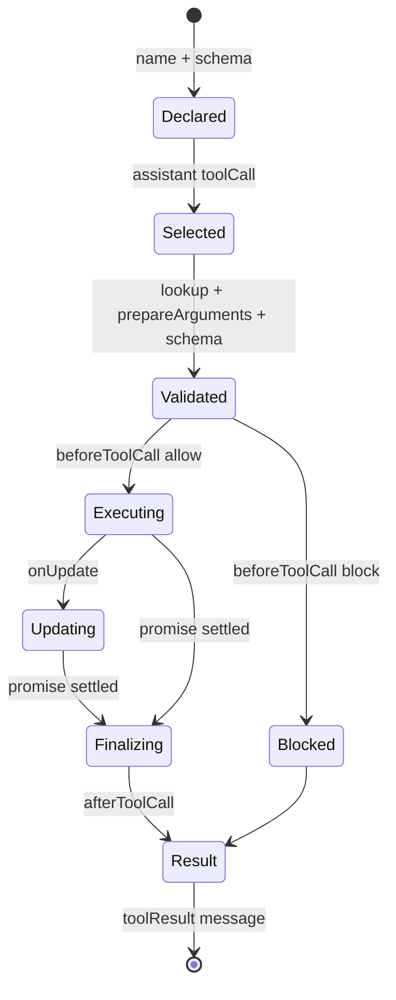

# Tool 生命周期

## Pi 的事件和回调

`agent-loop.ts` 先发 `tool_execution_start`，然后运行 `beforeToolCall`。Tool 的 `execute` 可以通过 `onUpdate` 发 `tool_execution_update`；完成后调用 `afterToolCall`，再发 `tool_execution_end` 和 `message_start/message_end`。事件是 UI/Telemetry 的观察面；`beforeToolCall`/`afterToolCall` 是能改变行为的 hook 面。

`afterToolCall` 是字段级覆盖：提供 `content` 就替换整个 content 数组，提供 `details` 就替换整个 details；没有深合并。`terminate` 是批次终止提示，不是强制 kill。

## Coding Agent 的额外包装

`packages/coding-agent/src/core/tools/index.ts` 集中创建 `read`、`bash`、`edit`、`write`，另有 `grep`、`find`、`ls`、`powershell`。`AgentSession._installAgentToolHooks` 把 ExtensionRunner 的 `tool_call`/`tool_result` 事件接到 Agent hooks，并可规范化图片结果。

## 练习

写一个 `beforeToolCall` 拒绝工作目录之外的路径，再写一个 `afterToolCall` 把内部 details 保留给日志、把简短文本给模型。断言被拒绝时真正的 Tool 函数没有执行。
