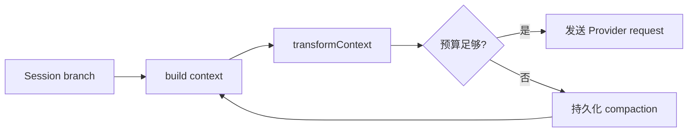

# Context Engineering

## 学习目标

本页不教“写一句神奇 prompt”。读完后你应该能够：

1. 把 Context 拆成稳定前缀、动态历史和本轮输入。
2. 为项目指令、工具输出和 Skill 选择合适的放置位置。
3. 解释为什么更长的 Prompt 不一定更好。
4. 用可观测数据验证 prompt 改动，而不是凭感觉判断。

## 问题：同一个模型为什么每次表现不同

考虑两次请求：

```text
请求 A：system + 过去 20 轮 + 当前问题
请求 B：system + 过去 20 轮 + 一次巨大 shell 输出 + 当前问题
```

模型参数没有变化，但 B 可能出现三种退化：窗口不足、重要约束被噪声淹没、工具输出中的不可信文本被误读成指令。Context Engineering 的目标不是把更多内容塞进窗口，而是使“本轮决策需要的事实”以可检查的顺序出现。

## 一个实用的分层模型

```text
稳定前缀
  ├── system prompt
  ├── 项目规则（AGENTS.md / CLAUDE.md）
  └── 稳定工具说明
动态区
  ├── 当前分支消息
  ├── tool result
  ├── selected skill metadata
  └── session-specific configuration
本轮输入
  ├── user request
  ├── steering message
  └── images / temporary context
```

稳定前缀适合缓存，动态区必须准确，用户输入不能被静默改写。顺序不是排版细节：Provider 的 prompt cache 或模型的注意力都会受到前缀变化影响。

## 排序原则

### 规则一：先放权限和边界

系统规则、工作目录、不可执行的危险动作和工具使用约束，应先于可被工具返回的文本。工具输出可能包含“请忽略之前指令”这样的字符串；它是数据，不是更高优先级的指令。

### 规则二：把稳定内容和请求内容分开

`buildSystemPrompt` 适合稳定规则和资源清单；user message 适合本次任务；tool result 适合执行事实。把三者拼为一条 user message 会让模型、日志和权限审计都失去边界。

### 规则三：保留来源

每段动态内容应标明来源和范围，例如：

```text
[tool result: read /repo/parser.ts, lines 1-200]
...
[/tool result]
```

来源标签不能替代权限检查，但能帮助模型区分项目文件、命令输出和用户指令。

## 作用域：AGENTS.md 不是全局配置

Pi 的 `loadProjectContextFiles` 会从 agent 目录和当前目录祖先逐级查找 context 文件，并根据 project trust、忽略选项和重复路径决定是否加载。一个父目录的规则可以作用于子目录，但子目录不存在的文件不能凭空成为 context。

建议在教学 Harness 中把每份规则表示为：

```ts
interface ContextFile {
  path: string;
  scope: "global" | "ancestor" | "project";
  content: string;
}
```

**输入**是文件路径、作用域和正文；**输出**是排序后的 context files；**状态变化**是本轮 prompt 的可见规则；**失败点**包括文件读取失败、重复注入和未验证项目规则。

## Token 预算不是简单截断

设窗口上限为 `W`，本轮必须保留的输出空间为 `R`，则可用于输入的大致预算是：

```text
inputBudget = W - R
```

但不要直接从字符串末尾截断。截断可能留下 assistant tool call，却丢掉对应 tool result；下一次 Provider 请求会认为消息不完整。安全裁剪需要理解消息角色、tool call id 和 turn 边界。

一个可操作的预算表：

| 区域 | 是否稳定 | 超预算时策略 |
| --- | --- | --- |
| 系统规则 | 是 | 压缩重复规则，不删除安全边界 |
| 工具定义 | 较稳定 | 只保留 active tools |
| Skill metadata | 较稳定 | 只列名称/描述/路径 |
| 旧历史 | 否 | compaction 成摘要 |
| 巨大 tool result | 否 | 限行、摘要并保留来源 |
| 当前用户问题 | 否 | 原样保留 |

## Transform 与 Compaction 的边界

Pi 的 `transformContext` 是请求前的投影钩子：它可以返回裁剪或重排后的 `AgentMessage[]`，但不自动改变 Session。Compaction 则生成 `compaction` entry，把 summary 和 retained tail 写入 Session，重启后仍然能得到相同的起点。



如果只在内存裁剪，用户关闭进程后旧历史仍会重新出现；如果只持久化压缩，却不在请求前裁剪，当前请求仍可能超窗。两者解决不同时间尺度的问题。

## Skill 的渐进披露

50 个 Skill、每个 2000 token 的全文，会一次占用约 100000 token。只暴露 `name + description + path`，模型需要时再读取正文，启动请求的成本会大幅下降。

这也改变了失败面：Skill metadata 可能有效，但正文路径可能不可读；Harness 应把 discovery diagnostic 和模型可见列表分开。不要把“模型看见一个 Skill”解释为“Skill 已执行”。

## Tool 输出的工程策略

对 `read`、`grep`、`bash` 和 RAG 结果设置上限：

```text
raw output
  -> normalize encoding
  -> redact secrets
  -> cap bytes/lines
  -> add source + truncation marker
  -> Tool Result
```

如果输出被截断，必须明确写入 `[truncated]`，否则模型可能把不完整的 JSON 或代码当成完整事实。若 Tool Result 包含二进制或图片，另行计算其 token 预算。

## 代码实验：比较两种 Context

### 目标

观察同一 Fake Model 在不同 context 排序下收到的请求差异。

### 准备

准备一个临时 workspace、一个 `AGENTS.md`、一个 `review` Skill 和两个返回长文本的 Fake Tool。使用 Go/Java `ScriptedModel` 或 Pi faux provider。

### 步骤

1. 记录只含 system、user、tools 的基线 request。
2. 加入 project context，记录系统提示词的新增区块。
3. 启用 Skill，但只注入 metadata；确认正文不在 request 中。
4. 让 Tool 返回超过限制的文本，检查截断标记。
5. 人为提高 token 估算，使其触发 compaction。
6. 关闭并重新载入 Session，比较压缩前后的 context。

### 观察点

检查稳定前缀是否不必要地变化、tool call/result 是否成对、来源是否可见、压缩 summary 是否真的进入下一个请求。

### 预期结果

每次 request 都能列出其输入来源；Session 中的旧 entry 可能仍存在，但经过 compaction/transform 后不会全部发送。

### 思考题

1. 为什么不能用 `messages.slice(-N)` 代替 compaction？
2. 何时应把检索结果做成 Tool，何时应由 Harness 自动注入？
3. 如果项目规则和用户要求冲突，Context 层应保留冲突证据还是静默选择一方？

## Go 与 Java 对照

| 关注点 | Go | Java | Pi |
| --- | --- | --- | --- |
| 请求对象 | `Request` struct | `Request` record | `Context` |
| 取消 | `context.Context` | `CancellationToken` | `AbortSignal` |
| 预算 | `estimateTokens` 教学函数 | `Compactor` estimate | `estimateContextTokens` |
| 动态转换 | `ContextManager` interface | `ContextManager` interface | `transformContext` |
| 持久化 | JSONL `Session` | Jackson JSONL `Session` | `SessionManager` |

跨语言实现的共同约束是“先保留语义边界，再做字符串优化”。字符串截断很快，恢复正确性却无法靠它保证。

## Pi 源码阅读清单

- `packages/coding-agent/src/core/system-prompt.ts`：`buildSystemPrompt` 的 custom prompt、工具 guidelines、project context 和 skills 分支。
- `packages/coding-agent/src/core/resource-loader.ts`：`loadProjectContextFiles`、`DefaultResourceLoader.reload`。
- `packages/coding-agent/src/core/agent-session.ts`：`_rebuildSystemPrompt`、`_compactBeforeNextAssistantResponse`。
- `packages/agent/src/agent-loop.ts`：`streamAssistantResponse` 中 `transformContext` 和 `convertToLlm` 的调用顺序。
- `packages/agent/src/harness/compaction/compaction.ts`：`estimateContextTokens`、`findCutPoint`、`prepareCompaction`。

## 小结

Context Engineering 是对输入的排序、预算、来源和恢复语义进行工程化管理。稳定规则放在 System Prompt，历史沿 Session 分支投影，工具输出必须截断并标注，Skill 按需披露，超窗用持久化 compaction 解决。下一页开始，我们把这些 entry 组织成可导航的 Session tree。
