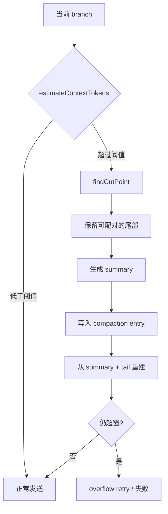

# Compaction：在上下文窗口内保留连续性

## 学习目标

本页完成后，你应该能够：

- 说明 compaction 为什么必须理解消息边界。
- 区分请求前 transform 和持久化 compaction。
- 设计包含 summary、firstKeptEntryId、tokensUsed 的 compaction entry。
- 测试工具调用配对、摘要失败和压缩后仍然超窗的情况。

## 问题：删掉旧消息会删掉什么

一个 Coding Agent 可能经历 80 轮：读取文件、运行测试、修改代码、再次测试。若只保留最后 20 条字符串，可能产生非法上下文：

```text
assistant: toolCall(edit, call-7)
// tool result 已被截掉
user: 继续
```

模型不知道 `call-7` 的结果，甚至某些 Provider 会拒绝不完整的 tool conversation。更严重的是，删掉旧消息可能丢失“测试失败的根因”和“已经尝试过的方案”。Compaction 的目标是减少 token，同时保留后续决策所需的事实和结构。

## 两种压缩

### 请求前 transform

`transformContext` 在内存中改变本次请求看到的 `AgentMessage[]`。它速度快，不一定写盘；下次请求或重启可以重新得到原始历史。

### 持久化 compaction

`packages/agent/src/harness/compaction/compaction.ts` 和 Coding Agent 的 compaction 流程会创建 summary、保留尾部，并将 compaction 作为 Session entry 写入 JSONL。之后通过该 entry 重建上下文，避免每次启动都扫描全部旧消息。



## 核心数据

一个教学级 compaction entry 可以是：

```ts
interface CompactionEntry {
  type: "compaction";
  id: string;
  parentId: string;
  summary: string;
  firstKeptEntryId: string;
  tokensBefore: number;
  tokensAfter: number;
  createdAt: string;
}
```

- `summary` 描述旧历史中的目标、决定、已改文件、测试结果和未解决问题。
- `firstKeptEntryId` 指出尾部从哪里开始，便于重建和审计。
- `tokensBefore/After` 是观测数据，不是安全证明。
- `parentId` 让压缩边界留在当前分支上。

**输入**是 root-to-leaf branch、预算和 summarizer；**输出**是可持久化 entry 和新 context；**状态变化**是 Session 多了一条压缩边界；**失败点**是 summarizer 失败、cut point 不安全、写入失败、重建后仍超窗。

## 如何选择 cut point

不能按字符数随意切。`findCutPoint` 需要从较新的消息向前寻找安全边界，通常考虑：

1. 保留最近的 user/assistant/tool 交互。
2. 不把 assistant tool call 与其 tool result 拆开。
3. 不在不可分割的多内容消息中间切断。
4. 让 summary 覆盖被移除的完整区间。
5. 让保留尾部自身符合 Provider 的角色和 id 约束。

一种可读的算法：

```text
candidate = oldest message in retained tail
while candidate breaks a tool pair:
    candidate = next newer message
return candidate
```

这会牺牲更多历史以换取结构合法。正确性优先于精确填满窗口。

## 摘要必须回答什么

好的 summary 不是“之前有很多对话”。至少写清：

```text
目标：修复 parser 的 unicode bug
已经完成：修改 parser.ts；新增 parser_test.ts
关键决定：采用 rune 索引而不是 byte 索引
验证：go test ./... 通过；集成测试仍失败
未解决：Windows 路径用例未覆盖
下一步：运行 stage-04 的 Windows fixture
```

摘要应当注明它是模型生成的压缩结果，不能把猜测写成事实。生产 Harness 可以为文件改动和测试结果附加结构化事实，降低纯摘要幻觉。

## Pi 中的 overflow retry

Coding Agent 的 `AgentSession` 在请求失败且判断为上下文溢出时，会尝试压缩后重试；`_compactBeforeNextAssistantResponse` 负责在下一次 assistant response 前安排压缩。压缩后若仍然 overflow，不能无限重试：应记录错误，保留可恢复的 Session 状态，并向 UI 报告。

这说明 `retry` 有两种不同语义：

- provider transient error：可能直接重试同一 context。
- context overflow：必须先改变 context，再重试。

不要用相同的 `for i < 3` 掩盖两者。

## 代码伪例：安全压缩

```ts
function compact(branch: Entry[], budget: number): CompactionEntry {
  const cut = findCutPoint(branch, budget);
  const removed = branch.slice(0, cut.index);
  const tail = branch.slice(cut.index);
  assertToolPairs(tail);
  const summary = summarize(removed);
  return {
    type: "compaction",
    id: randomId(),
    parentId: branch.at(-1)?.id ?? "root",
    summary,
    firstKeptEntryId: tail[0]?.id ?? "",
    tokensBefore: estimate(branch),
    tokensAfter: estimate([summary, ...tail]),
    createdAt: new Date().toISOString(),
  };
}
```

这段示例省略了持久化事务和精确 tokenizer。输入是整条 branch；输出是 entry；中间断言保证尾部结构；失败应抛出可分类错误，而不是返回空摘要。

## 实验：故意制造三个边界

### 准备

使用 Go 的 `Compactor` 或 Java 的 `Compactor`，模型使用 Fake/`ScriptedModel`。构造包含 user、assistant tool call、tool result、assistant text 的 transcript。

### 步骤

1. 设置预算大于当前 transcript，确认不压缩。
2. 降低预算到必须压缩，检查 summary 和 tail。
3. 把 cut candidate 放在 tool call 与 result 中间，检查算法向后移动。
4. 让 summarizer 返回错误，检查原 Session 是否仍可 reload。
5. 让 summary 本身很长，触发 overflow retry。
6. 重启进程，从 JSONL reload，验证压缩边界仍可解释。

### 观察点

- 压缩前后的 `tokensBefore/After` 是否记录。
- tool call/result 是否完整配对。
- summary 是否覆盖被移除的操作和未解决事项。
- 第二次 overflow 是否停止重试并提供诊断。

### 预期结果

一次成功压缩只新增 entry，不重写旧行。失败压缩不应让历史半写入；reload 后可选择继续压缩或报告不可恢复错误。

## Go 与 Java 对照

| 部件 | Go | Java | Pi |
| --- | --- | --- | --- |
| token 估算 | `estimateTokens` | `Compactor.estimate` | `estimateContextTokens` |
| cut point | `findCutPoint` | `findCutPoint` | compaction helper |
| 摘要模型 | `Summarizer` | `Model`/`ScriptedModel` | summarization request |
| 取消 | `context.Context` | `CancellationToken` | AbortSignal |
| 落盘 | JSONL append | `Files.writeString` append | SessionManager |

Go 的 `context.Context` 要传给摘要调用和持久化；Java 的 token 要在 summarizer、写盘前后检查。取消不能把已经写成功的 entry 当作没写过。

## 事实边界

**源码事实**：Pi 已有 compaction 类型、branch summarization、overflow handling 和尾部保留逻辑；Coding Agent 真实运行路径会在 context 太大时安排压缩。

**官方说明**：`packages/coding-agent/docs/compaction.md` 解释用户可见的压缩和配置行为。

**合理推断**：summary 可作为长期项目记忆，但它不是经过编译器或测试系统证明的事实。

**教学建议**：把结构化变更日志和测试结果附在 summary 旁边；不要因此声称 Pi 当前已提供完整 durable transaction。

## 思考题

1. 为什么 compaction entry 也需要 parentId？
2. 如果 summary 与保留 tail 互相矛盾，调试时优先检查什么？
3. overflow retry 的最大次数由 token 预算还是错误分类决定？
4. 怎样测试“崩溃发生在 append 的中间”而不是只测正常关闭？

## 小结

Compaction 是一次语义压缩和持久化边界，不是 `slice(-N)`。它必须同时处理预算、消息角色、tool pairing、摘要质量、写入失败和再次 overflow。把 transform、compaction、retry 分开建模，才能在重启和错误中保持可解释性。
