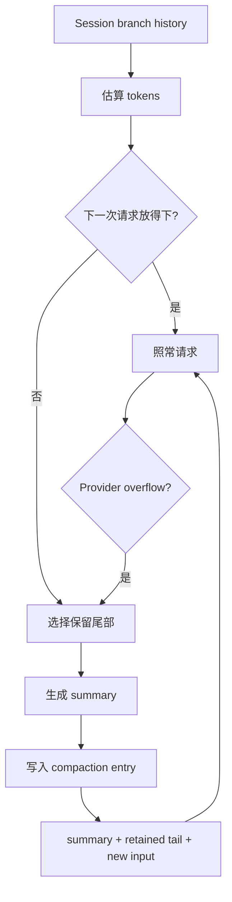

# Compaction：上下文满了怎么办

## 它解决什么问题

Context Window 是有限的。Coding Agent 的工具输出和历史会增长；一旦请求超出窗口，继续重试同一份历史没有意义。Compaction 把较早的对话压成摘要，同时保留最近的消息和继续任务所需的状态。

## 什么能压缩，什么不能丢

可以压缩旧的自然语言、已完成步骤和长工具输出；不能丢掉继续执行所需的用户目标、关键决策、未完成 Tool Call/Result 配对、错误事实和安全限制。压缩结果必须回到 Session，否则重启会重新看到旧的超长路径。

## Pi 的实现位置

`packages/coding-agent/src/core/compaction/` 包含 `shouldCompact`、`prepareCompaction`、`compact`、分支摘要和 token 估算；`AgentSession` 在下一轮请求前调用它，也处理 Provider overflow 和 retry。具体行为以当前源码和 `packages/coding-agent/docs/compaction.md` 为准，不把摘要算法假定成唯一方案。

## 失败和上限

摘要请求自身也可能失败或被取消，必须有 retry 上限；overflow recovery 只能在一次用户输入上有限触发，否则“压缩→重试→再压缩”会形成无限循环。记录原始错误有助于诊断。

## 练习

使用固定的 FakeModel 生成摘要，断言：摘要前后的 Context token 估算下降；最近 Tool Result 成对保留；摘要写入 Session 后关闭并重开仍得到同一投影。
