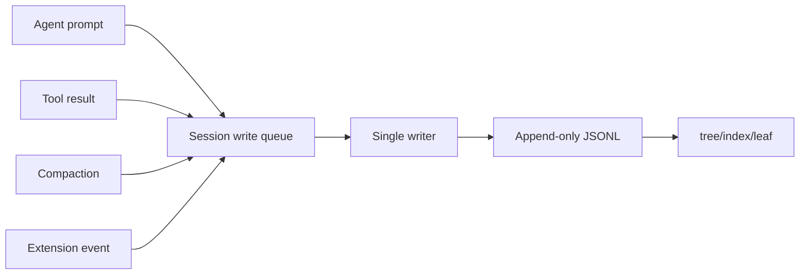

# Session Persistence：让对话可恢复而不是只存在内存

## 学习目标

本页聚焦“进程退出以后发生什么”。读完后你应能：

- 设计 append-only JSONL 的写入和读取流程。
- 解释 single writer、flush、fsync、临时文件和幂等的差异。
- 区分已经持久化的 Agent 状态与仅在内存中的请求状态。
- 写出 reload、截断尾行和重复 operation 的测试。

## 持久化的承诺

如果 UI 显示“工具执行成功”，用户会合理地期待重启后仍能看见这件事。一个最小持久化承诺是：

```text
append(entry)
  -> 序列化为一行
  -> 写入文件
  -> flush（至少交给操作系统）
  -> 根据 durability 配置 fsync
  -> 才对外发布 persisted 事件
```

如果在 write 和 flush 之间进程崩溃，内存中已有结果但 JSONL 没有该结果。Harness 不能把“函数返回成功”自动等同于“磁盘已 durable”。

## Pi 的 JSONL 模型

研究 commit：`853a80d26c90a14c1886f0ebb8ffaae133ca2185`。

`packages/coding-agent/src/core/session-manager.ts` 管理 Session 文件：创建、打开、追加 entry、构建索引、定位 leaf 和导航。`packages/coding-agent/docs/session-format.md` 描述了用户可见的 JSONL 格式和 entry 类型。

一个简化行：

```json
{"type":"message","id":"m-2","parentId":"m-1","message":{"role":"user","content":"运行测试"}}
```

这行是 transcript entry，不是完整 Provider HTTP body。Provider 请求还要经过 context projection 和 `convertToLlm`。

### 这段 JSONL 代码如何运行

- **输入**：一行 UTF-8 JSON 和当前 writer 的 parent/leaf。
- **输出**：可校验的 `SessionEntry`，或带行号的解析错误。
- **状态变化**：成功 append 后更新 children 索引和 leaf；解析阶段不应偷偷更新业务状态。
- **失败点**：坏 JSON、缺少 `id`/`parentId`、未知 type、半行和磁盘错误。

## 追加而不是重写

append-only 的优点：

- 旧记录可审计；
- 分支通过 parent link 保留；
- 写入只需要追加一行；
- 崩溃恢复可以扫描已完成的行。

代价是：

- 文件会增长，需要 compaction 或归档；
- 末尾可能存在半行；
- 并发 writer 会交错写入；
- schema 演进需要版本或兼容读取。

不要把 JSONL 误认为数据库。它提供了简单日志，不自动提供事务、锁和跨机器一致性。

## Single writer

多个异步路径都想写入时，必须有一个拥有写入权的对象：



`AgentSession`、`SessionManager` 和教学 Harness 的职责可能不同，但共同原则是：业务代码提交 entry，writer 决定顺序并更新索引。否则 assistant stream、tool result 和 compaction 可能以错误顺序落盘。

## 入队顺序和完成顺序

两个工具并行执行：A 先提交调用但 B 先完成。若按完成时间写 result，Provider transcript 可能看见 B 的 result 先于 A；这是否允许取决于协议和实现。至少要保证每个 tool result 的 `toolCallId` 可追踪，并让“assistant tool call”在其 result 之前持久化。

推荐记录：

```text
operation accepted -> intent entry
tool completed -> result entry
published -> persisted event
```

当前 Pi Agent 的普通 Session 路径不是完整 operation-intent durable transaction；不要把教学设计中的 intent/result 说成源码已经实现。

## 读取和恢复

恢复流程应分四步：

1. 顺序读取每行。
2. 校验 JSON 和最小 schema。
3. 暂存无法立即连接的 parent，扫描结束后解析。
4. 重建 children、branch path、leaf 和可投影消息。

最后一行可能只有半个 JSON 对象：

```text
{"type":"message","id":"m-3","parentId":"m-2"}
```

若 EOF 时行不完整，恢复策略要明确：忽略尾部不完整行并报警，还是将 Session 标为损坏。不能静默把坏数据当成空 Session。

## schema 演进

给 entry 预留 `version` 或通过 `type` 进行严格分派：

```ts
function decodeEntry(raw: unknown): SessionEntry {
  if (!isObject(raw) || typeof raw.type !== "string") {
    throw new Error("invalid session entry");
  }
  switch (raw.type) {
    case "message": return decodeMessageEntry(raw);
    case "compaction": return decodeCompactionEntry(raw);
    default: throw new Error(`unsupported entry type: ${raw.type}`);
  }
}
```

不要使用 `as SessionEntry` 直接越过校验。校验失败发生在读取边界，越早报告越容易定位损坏来源。

## 幂等和重复写入

网络重试或进程恢复可能再次提交同一个 operation。仅靠随机 entry id 无法判断“相同意图是否已完成”。如果业务需要幂等，应记录稳定的 `operationId`，并在 writer 中检查：

```text
operationId=op-7, result=success
再次提交 op-7
  -> 返回已知 result
  -> 不追加第二份副作用
```

这属于 Harness v2 的设计要求，不等于当前 `AgentHarness` scaffold 已经实现。普通 Session 的 entry id 主要用于树索引，不能自动承担业务幂等语义。

## 原子性边界

JSONL 单行追加是“行级可识别”，不是“跨多行事务”。若一次工具操作要写 intent、tool result、usage ledger 三行，崩溃可能只完成前两行。生产设计需要 terminal transaction、恢复扫描或可重放的 operation log；教学实现至少应在 reload 时识别不完整操作并报告。

## 实验：模拟崩溃

### 目标

确认“恢复后能继续”与“恢复后假装没发生”是不同策略。

### 步骤

1. 创建 Session 并写入 root、user、assistant tool call。
2. 在写入 tool result 前终止进程或使用可注入的 `FailingWriter`。
3. reload JSONL，检查最后一条完整 entry 和 leaf。
4. 再追加相同 `operationId`，确认不会悄悄产生重复副作用。
5. 在文件末尾写半行 JSON，检查 diagnostic。
6. 用两个 goroutine/两个 Java executor 竞争 writer，确认 single writer 维持顺序。

### 观察点

- `persisted` 事件是否只在写入成功后发布。
- reload 是否保留完整祖先路径。
- 不完整尾行是否有日志和可操作错误。
- 重试是否根据 idempotency key 去重。

### 预期结果

测试应能区分“文件损坏”“操作未完成”“模型请求取消”和“业务结果失败”。这些状态不能都变成 `error: true`。

## Go 与 Java 对照

| 责任 | Go | Java | Pi |
| --- | --- | --- | --- |
| 写队列 | channel + writer goroutine | `BlockingQueue` + executor | SessionManager 写入路径 |
| JSONL | `encoding/json` | Jackson | JSONL session format |
| 文件错误 | `error` | `IOException` | session load/write error |
| 取消 | context | token/interruption | AbortController |
| reload | scanner + index | `BufferedReader` + map | buildSessionTree |

Go 要留意 `bufio.Scanner` 默认 token 限制；Java 要决定是否使用 `FileChannel.force(true)`。两者都不应在示例里声称已经提供生产级沙箱或分布式事务。

## 源码、推断与建议

**源码事实**：Pi Coding Agent 使用 JSONL Session、`id`/`parentId`、SessionManager 和 AgentSession 事件处理。

**官方说明**：`packages/coding-agent/docs/session-format.md`、`sessions.md` 说明文件格式、列表和恢复相关用户行为。

**合理推断**：append-only 让审计和分支更自然，但不自动保证崩溃一致性。

**教学建议**：为 writer 注入故障，并把 persisted 事件放在写入成功之后；再逐步加入 intent/result 和 operation log。

## 思考题

1. flush 与 fsync 的区别是什么？你的产品需要哪一个承诺？
2. 半行应该删除、截断还是标记损坏？如何保留证据？
3. 为什么一个 `SessionEntry.id` 不足以实现工具操作幂等？
4. compaction 写入和普通 message 写入如何共享 single writer？

## 小结

持久化不仅是“把数组写成 JSONL”，还包括写入顺序、可见性、恢复、schema、幂等和崩溃边界。Pi 的 JSONL 是真实的 transcript 基础；durable Harness 仍需额外的 operation intent/result、terminal transaction 和 recovery 设计。下一页把 Agent 的运行状态与这些 Session 边界连接起来。
