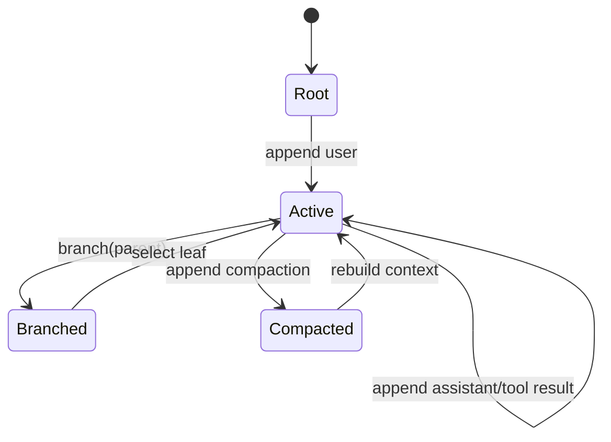

# Session Tree：为什么对话不是一条消息数组

## 学习目标

完成本页后，你可以：

- 解释 append-only JSONL 与当前 leaf 的关系。
- 根据 `id` 和 `parentId` 重建分支。
- 区分“新分支”“继续当前分支”和“切换 leaf”。
- 说明 Session entry 与 Provider message 为什么不是同一种数据。

## 问题场景：用户想保留两个尝试

用户先问：“修复测试”。Agent 修改了方案 A，但用户发现方向不对。他希望回到更早的节点，再尝试方案 B，同时保留 A 的工具输出作为参考。

如果数据模型只有：

```ts
messages.push(nextMessage)
```

回退就只能删除历史，或者复制整个数组。删除会破坏审计，复制会产生两个互不关联的 transcript。树模型用一个 `parentId` 指向上一个节点即可保留共同祖先。

## 形式化定义

一个 entry 是：

```ts
interface SessionEntry {
  id: string;
  parentId: string | null;
  type: "message" | "compaction" | "custom" | "label" | "branch_summary";
  data: unknown;
  timestamp: string;
}
```

对任意 entry `e`：

- `parentId === null` 表示 root。
- `parentId === p` 表示 `p` 必须先出现或可在加载后解析到。
- 当前 leaf 是用户选择的一个末端节点。
- 当前 context path 是从 leaf 反向跟随 parentId，再反转得到的祖先路径。

Pi Coding Agent 的 Session 文件是 JSONL。每一行保存一个 entry，而不是保存一次完整的 Provider request。

## 一个最小树

```text
root: session-start
  └─ u1: user("修复测试")
      └─ a1: assistant(toolCall=方案A)
          ├─ t1: toolResult(失败)
          │   └─ u2: user("继续方案A")
          └─ u3: user("从这里尝试方案B")
              └─ a2: assistant(toolCall=方案B)
```

`u2` 和 `u3` 共享 `a1`，但它们不是同一条线。选择 `u3` 作为 leaf 时，`t1` 仍在祖先路径中；选择 `u2` 时，`a2` 不可见。

## JSONL 具体示例

```jsonl
{"type":"session","id":"root","parentId":null,"timestamp":"2025-01-01T00:00:00Z"}
{"type":"message","id":"u1","parentId":"root","message":{"role":"user","content":"修复测试"}}
{"type":"message","id":"a1","parentId":"u1","message":{"role":"assistant","content":[]}}
{"type":"message","id":"u3","parentId":"a1","message":{"role":"user","content":"尝试方案B"}}
{"type":"message","id":"a2","parentId":"u3","message":{"role":"assistant","content":"完成"}}
```

**输入**是按行读取的 JSON 对象；**输出**是 entries、索引和 leaf；**状态变化**是 `children[parentId]` 增加一项；**失败点**包括重复 id、孤儿 parent、坏 JSON、循环 parent 和未知 entry type。

## Pi 的真实实现路径

研究 commit：`853a80d26c90a14c1886f0ebb8ffaae133ca2185`。

- `packages/coding-agent/src/core/session-manager.ts` 负责 JSONL 文件、entry 索引、leaf 和导航。
- `SessionManager.buildSessionTree` 从 entry 的 `id`/`parentId` 建立树。
- `getBranch()` 沿当前 leaf 回溯父节点，然后反转为 root-to-leaf。
- `branch()` 在当前节点下创建分支，不删除旧分支。
- `navigateTo(id)` 把 leaf 移到已有节点，并重新生成上下文。
- `packages/agent/src/harness/session/session.ts` 是更小的教学 Session 抽象，强调单写入者与 reducer。

真实 Coding Agent 主路径是 `AgentSession + SessionManager + Agent`，不是把 `AgentHarness` scaffold 当作已经替代它的实现。

## 状态转换图



这里的 `Compacted` 不是“删除旧消息”的状态。它表示树上新增了一个压缩边界，投影器在该边界后使用 summary 和保留尾部。

## Entry 和 Provider Message 的差异

Session entry 可能承载：

- UI 事件或 label；
- compaction metadata；
- branch summary；
- user/assistant/tool message；
- extension 的自定义记录。

Provider message 通常只接受 system、user、assistant、tool 等角色和它们规定的 content shape。`packages/agent/src/harness/session/context.ts` 的 `sessionEntryToContextMessages` 会过滤或转换 entry；`packages/agent/src/agent-loop.ts` 再调用 `convertToLlm` 适配 provider。

因此不能这样实现：

```ts
const messages = entries.map(entry => entry.data as Message);
```

这会把 label 当消息，把 summary metadata 当 content，或者丢失 tool call pairing。

## 分支操作的伪代码

```ts
function append(tree: Tree, entry: Entry): Tree {
  if (entry.parentId !== tree.leafId) {
    throw new Error("append parent must be current leaf");
  }
  tree.entries.set(entry.id, entry);
  tree.children.get(entry.parentId)?.push(entry.id);
  tree.leafId = entry.id;
  return tree;
}

function branch(tree: Tree, parentId: string): void {
  if (!tree.entries.has(parentId)) throw new Error("unknown parent");
  tree.leafId = parentId;
}
```

这段代码只描述内存关系，不包含并发锁、磁盘 fsync、跨进程写入和恢复。教学实现可以从这里开始，但生产实现必须为每个失败点设计测试。

## 如何重建一条 branch

```text
leaf = a2
path = []
while leaf != null:
  path.prepend(leaf)
  leaf = entry[leaf].parentId
```

若 `a2 → u3 → a1 → u1 → root`，结果就是 root 到 a2。构建时不要依赖文件行的“最后一条就是当前 leaf”：用户可以 navigate 到旧节点，或者最后写入的是另一个分支的 entry。

## 实验：从 JSONL 重建树

### 目标

测试 append、branch、navigation、坏输入和 reload。

### 步骤

1. 在 `examples/go-agent/internal/agent/session_test.go` 中建立 root、u1、a1。
2. 从 a1 创建两个 child，分别代表方案 A 和方案 B。
3. 把 B 设为 leaf，调用 `BranchPath()`，检查不包含 A 的后代。
4. 序列化为 JSONL，关闭 Session，再 reload。
5. 导航到 A 的 child，确认 leaf 改变且 B 仍存在。
6. 手动加入重复 id、孤儿 parent 和循环 parent，检查返回错误。

Java 对应测试在 `examples/java-agent/src/test/java/learning/agent/AgentTest.java`，可使用 Jackson 对每行读取并断言 `parentId`。

### 观察点

- append 只改变 leaf，不删除旧节点。
- navigate 只改变当前投影，不重写历史。
- reload 后树结构应与内存中一致。
- 解析失败不能静默跳过，否则会产生不可解释的缺口。

## Go 与 Java 对照

| 能力 | Go | Java | Pi |
| --- | --- | --- | --- |
| Entry | `SessionEntry` struct | `Session.Entry` record | `SessionEntry` 类型族 |
| 存储 | `bufio.Scanner` + JSON | Jackson `ObjectMapper` | `SessionManager` JSONL |
| 索引 | `map[string]Entry` | `Map<String, Entry>` | tree index |
| 当前节点 | `leafID` | `leafId` | SessionManager leaf |
| 错误 | `error` | `IOException`/`IllegalArgumentException` | 解析/导航错误 |

Java 的 record 便于表达不可变 entry；Go 的 struct 便于显式处理零值。两者都要避免把 `map` 的遍历顺序当作 branch 顺序。

## 失败案例

### 只保存线性数组

无法保留方案 A，回退需要复制或删除。

### 只存 parentId 不校验

孤儿节点在重启后无法建立 context，错误会延迟到模型请求阶段。

### 把 JSONL 末行当 leaf

导航到历史节点后，末行仍然是旧写入顺序，不代表用户当前选择。

### 只重建消息不重建 metadata

compaction、model selection 或 branch summary 丢失，导致重启行为不同。

## 小结

Session tree 用 append-only entry 和 parent link 把审计、分支和回退统一起来。`leaf` 决定当前视角，`branch path` 决定历史投影，`convertToLlm` 决定 Provider 最终看到的消息。先重建树，再投影 context；不要把 JSONL 文件、树和 Provider messages 混成一个类型。
