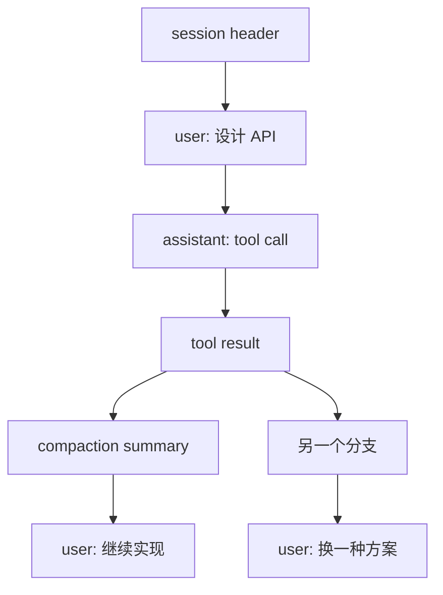

# Session、Message 与分支树

## `List<Message>` 的问题

Coding Agent 经常需要从旧节点分叉、回到某个检查点、记录 model change、compaction、custom message、label 和 usage。把所有内容放进一条可变列表会丢失父子关系，也难以解释“当前 Context 来自哪条路径”。

Pi 的 `SessionManager`（`packages/coding-agent/src/core/session-manager.ts`）以 JSONL 保存 header 和 entry，每个 entry 有 `id` 与 `parentId`。当前叶子沿父链回溯，得到一条分支；历史共享前缀，不需要复制整段消息。

## Tree entry 和 Context message

Session entry 可以是 `SessionMessageEntry`、`CompactionEntry`、`BranchSummaryEntry`、`CustomEntry`、`LabelEntry`、`SessionInfoEntry` 等。`sessionEntryToContextMessages` 把适合模型的 entry 投影成 AgentMessage；事实、标签和 UI-only 信息可以不进入 Provider Context。

## 分支不是复制

分支只保存新节点和 parent link。导航改变当前 leaf，不删除旧历史；下一次 prompt 从新 leaf 继续。这样既能保留实验方案，也能让用户回到稳定检查点。

## 练习

画出一次“读文件→修改→测试失败→从修改前分支”的树。分别标记：Session 中保存的 entry、当前 leaf、实际发给模型的 messages，以及不会进入 Context 的 label。
