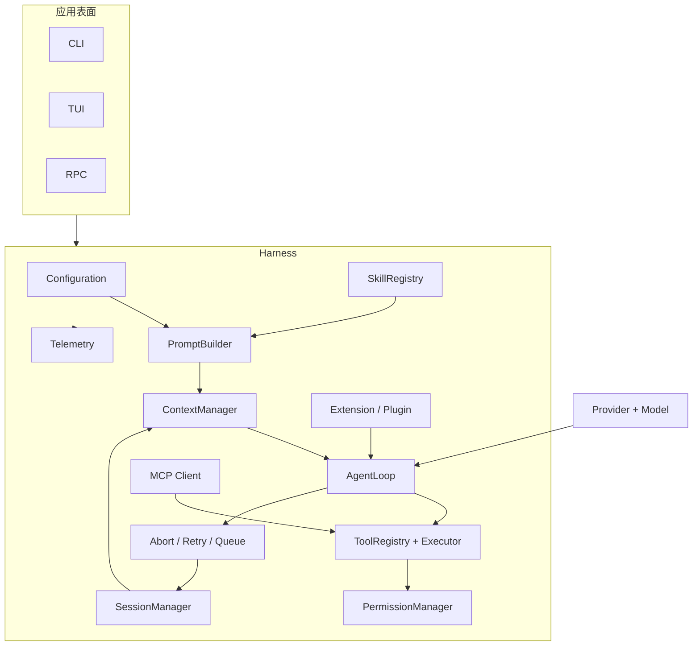

# Harness 全景架构

## 能力对照表

| Harness 能力 | 解决的问题 | Pi 对应模块/文件 | Go 计划 | Java 计划 |
| --- | --- | --- | --- | --- |
| Model abstraction | 不把 Loop 绑死于厂商 | `packages/ai/src/types.ts`、`models.ts` | `Model` interface + HTTP adapter | `Model` interface + `HttpClientModel` |
| Provider adapter | 统一消息、流和错误 | `packages/ai/src/api/*.ts` | JSON/SSE decoder | HttpClient/SSE decoder |
| Prompt/Context | 决定本轮看到什么 | `core/system-prompt.ts`、`agent-loop.ts` | `ContextManager` | `ContextManager` |
| Tool registry | 找到并验证 Tool | `core/tools/index.ts`、`agent-loop.ts` | map + schema/policy | map + interface/policy |
| Agent loop | 多轮请求与结果回传 | `packages/agent/src/agent-loop.ts` | `AgentLoop.run` | `AgentLoop.run` |
| State/queue | 取消、steer、follow-up | `agent.ts`、`AgentSession` | channels + state | queue + futures |
| Session | 重启后继续 | `core/session-manager.ts` | JSONL store | JSONL store |
| Compaction | 控制 Context Window | `core/compaction/` | token estimate + summary | token estimate + summary |
| Extension | 不改核心增加行为 | `core/extensions/` | explicit registry | SPI/ServiceLoader |
| Skill | 按需加载指令 | `core/skills.ts` | frontmatter scanner | frontmatter scanner |
| MCP | 跨进程外部 Tool | Pi Core 当前无默认 MCP | JSON-RPC stdio client | JSON-RPC stdio client |
| Permission/Sandbox | 防止危险副作用 | `core/project-trust.ts`、bash executor | path/command policy | path/command policy |
| Telemetry | 诊断延迟、成本、错误 | `packages/telemetry`、`core/telemetry.ts` | `Trace`/events | `Trace`/listeners |
| CLI/TUI/RPC | 接入用户和远程客户端 | `src/modes`、`src/rpc-entry.ts` | demo CLI | demo CLI |

这张表写的是当前学习实现计划，不代表每一项都由同一个 Pi 类完成；边界正是源码阅读要回答的问题。
