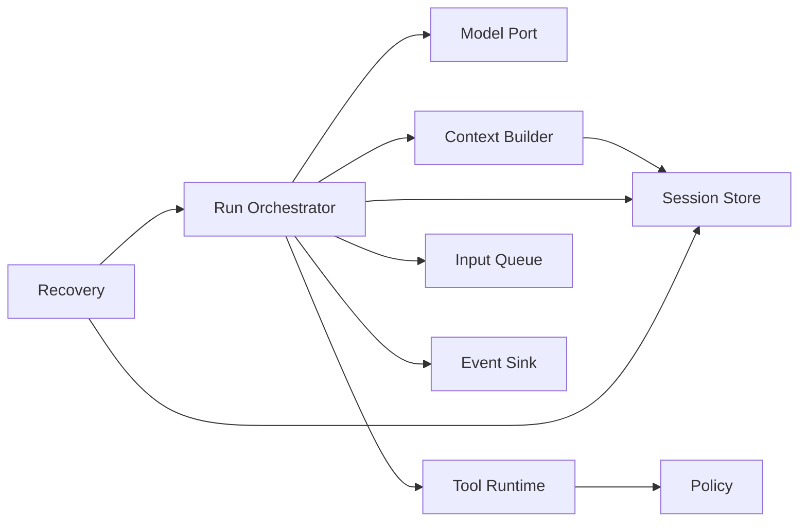
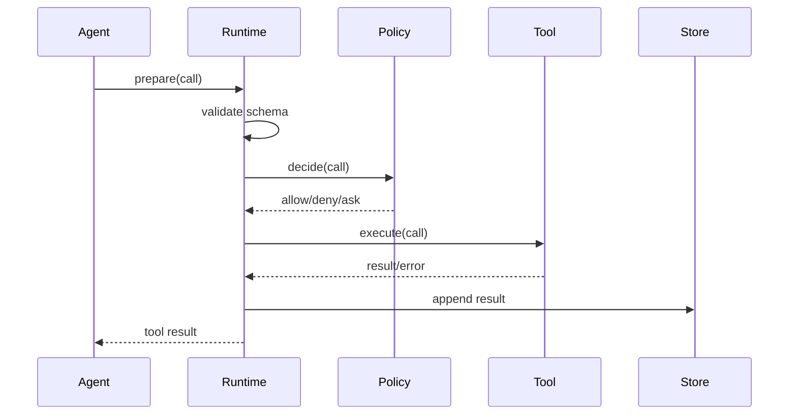

# Harness 架构：用边界组织复杂运行

## 学习目标

你将学会把一个 Harness 拆为小的可测试部件，并理解每个部件的输入、输出、状态和失败点：

- Model Port；
- Tool Runtime；
- Context Builder；
- Session Store；
- Policy；
- Scheduler；
- Event Sink；
- Recovery。

## 先画依赖，而不是先写类



推荐依赖方向是“Orchestrator 依赖 ports”，而不是每个 Tool 自己写 Session、每个 UI 自己执行 shell。

## Ports：接口是隔离点

```go
type Model interface {
    Stream(ctx context.Context, req Request) (<-chan Event, error)
}

type SessionStore interface {
    Append(ctx context.Context, entry Entry) error
    Load(ctx context.Context, id string) (Snapshot, error)
}

type Policy interface {
    Decide(ctx context.Context, call ToolCall) (Decision, error)
}
```

Java 对照：

```java
interface Model {
    List<ResponseEvent> stream(Request request, CancellationToken token);
}
interface SessionStore {
    void append(Entry entry) throws IOException;
    Snapshot load(String id) throws IOException;
}
interface Policy {
    Decision decide(ToolCall call);
}
```

**输入**是端口规定的领域对象；**输出**是显式结果/事件；**状态变化**由拥有者决定；**失败点**以 error/exception 返回。接口不应泄漏 Provider SDK 的对象，否则替换模型时整个 Harness 都被绑定。

## 状态与数据不要混成一个 map

建议显式区分：

```ts
interface RunState {
  status: "idle" | "running" | "waiting_tool" | "aborting" | "failed" | "completed";
  runId: string | null;
  turn: number;
  pendingSteering: string[];
  pendingFollowUps: string[];
  lastPersistedEntryId: string | null;
}
```

`RunState` 描述现在发生什么；Session entries 描述发生过什么；Context 是从 entries 和资源计算出的投影；Event 是通知观察者。四者应当有不同类型。

## 单写入者与事件发布

```text
业务动作
  -> append command
  -> single writer 排序/写入
  -> 更新 durable snapshot
  -> publish persisted event
```

事件发布不能早于持久化承诺。如果 UI 先收到 `tool_result`，进程随后崩溃且文件没有结果，重启界面会显示矛盾。可以发布 `tool_result_observed` 和 `tool_result_persisted` 两类事件，或明确事件只代表内存观察。

## Context Builder 是纯投影优先

```text
Snapshot + ResourceSnapshot + ToolRegistry + Options
  -> ContextBuilder.build()
  -> ProviderContext
```

Builder 不应执行 shell，不应修改 Session，不应发模型请求。它可以：

- 取当前 branch；
- 读取已加载的 project context；
- 生成 system prompt；
- 选择 active skills；
- 转换消息；
- 计算 token budget。

副作用放在 Loader、SessionStore 或 Runtime，使测试可以对每层单独断言。

## Tool Runtime 的三段边界



`prepare`、`decide`、`execute` 分开，能防止“验证参数时已经执行副作用”。权限拒绝也应产生可解释的 result 或 error entry，而不是直接消失。

## Scheduler：串行运行，队列输入

很多 Agent API 在运行中拒绝第二个 prompt。Pi Agent 对并行调用有明确边界：运行中不能直接再次启动同一 Agent；应使用 Steering 或 FollowUp。Harness 的 scheduler 可以把 UI 输入路由到不同队列：

```text
idle + prompt -> start run
running + steering -> pendingSteering
running + follow-up -> pendingFollowUps
running + prompt -> reject "already running"
```

这不是 UI 的小优化，而是避免两个 loop 同时修改同一 transcript 和 writer。

## 事件总线与 reducer

`packages/agent/src/harness/events.ts` 定义领域事件，`reducer.ts` 把事件应用为状态。一个 reducer 应满足：

```text
state0 + event -> state1
相同 state0 + 相同 event -> 相同 state1
```

副作用（网络、写盘、发 telemetry）不能隐藏在 reducer 中。这样可以重放事件，比较恢复前后状态，并测试非法转换。

## 失败矩阵

| 部件 | 失败例子 | Harness 动作 | 是否可重试 |
| --- | --- | --- | --- |
| Model | timeout | 记录 attempt，按策略重试 | 视 provider 错误 |
| Context | overflow | compact/缩减 active tools | 可改变 context 后重试 |
| Policy | deny | 写拒绝结果，停止该 call | 通常不可自动重试 |
| Tool | exit 1 | 记录错误，交给模型修复 | 可由模型决定 |
| Store | disk full | 阻止发布 durable 状态 | 先恢复存储 |
| Event sink | listener throw | 隔离 listener | 不应中止运行 |
| Abort | user cancel | 传播取消，保存 partial 状态 | 不自动重试 |

## 实验：替换所有外部依赖

### 步骤

1. 使用 `ScriptedModel` 返回固定 tool call。
2. 使用内存 `SessionStore`，记录 append 顺序。
3. 使用 `DenyAllPolicy`，断言工具函数未被调用。
4. 使用可控 `FakeTool`，在执行中阻塞。
5. 用队列提交 steering 和 follow-up。
6. 用 `RecordingEventSink` 保存状态事件。
7. 让 Store 在第 N 次 append 失败，验证 event 顺序和恢复。

### 观察点

测试不应依赖真实网络、shell 或时间。每个 port 都可用 deterministic fake 替换；若必须 sleep 才能测试顺序，优先引入可控 latch。

## Go 与 Java 对照

Go：

- channel 所有权要明确，关闭 channel 的责任只有一个。
- `context.Context` 从 orchestrator 传到 Model、Tool、Store。
- 不要把 `map[string]any` 当作整个状态模型。

Java：

- `ExecutorService` 的 shutdown 和 `Future.cancel` 要分别测试。
- `CancellationToken` 应由调用者传入，而非 Tool 自己创建。
- 用不可变 record 表达事件，避免 listener 修改共享状态。

## Pi 源码锚点

- `packages/agent/src/agent.ts`：Agent facade、queues、abort 和 event subscription。
- `packages/agent/src/agent-loop.ts`：run loop、tool execution、context transform。
- `packages/agent/src/harness/reducer.ts`：事件到 state 的纯转换。
- `packages/agent/src/harness/session/context.ts`：Session 到 context 的投影。
- `packages/coding-agent/src/core/agent-session.ts`：Coding Agent 的 orchestrator。
- `packages/coding-agent/src/core/extensions/runner.ts`：扩展事件钩子。

## 事实边界

**源码事实**：Pi 已有 Agent loop、事件、队列、SessionManager 和若干 Harness 类型。

**源码事实**：Coding Agent 主路径并不是 `AgentHarness` 单类包办；它由多个 core 模块组合。

**教学推断**：ports + reducer + single writer 是便于测试和恢复的架构选择。

**未实现声明**：harness v2 中的 durable operation intent/result、terminal transaction、crash recovery 目前属于设计约束，不能当作现有实现。

## 思考题

1. 为什么 Context Builder 不应该自己加载任意文件？
2. Policy deny 是否要发送给模型？什么信息会泄漏？
3. Event sink 抛异常时，是否应结束 Agent run？
4. 哪些状态必须 durable，哪些状态可以在重启后丢失？

## 小结

Harness 架构的核心是边界：ports 隔离外部系统，reducer 管理状态，single writer 管理顺序，Context Builder 做纯投影，Policy 与 Runtime 分离。按这个方向设计，Go、Java 和 Pi 都能共享概念，但不会把教学 scaffold 误写成生产能力。
