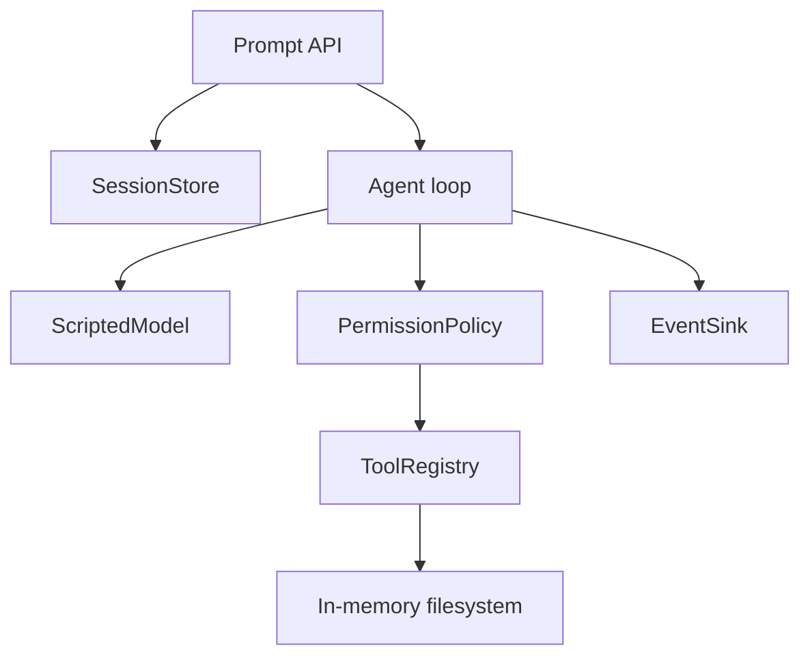

# 动手构建一个最小 Harness

## 学习目标

本页不追求生产功能，而是建立可扩展的正确骨架。完成实验后你应能：

- 用 Fake Model 重现一个完整 tool loop。
- 把 policy、session、queue 和 event sink 注入 Harness。
- 测试 steering、follow-up、abort 和 reload。
- 清楚列出教学实现与 durable production 实现的差距。

## 目标行为

我们构造一个只支持 `read` 和 `edit` 的工作区 Agent：

```text
user prompt
  -> ScriptedModel 请求 read
  -> Policy 检查
  -> Fake read 返回文件
  -> ScriptedModel 请求 edit
  -> Policy 检查
  -> Fake edit 更新内存文件
  -> ScriptedModel 返回完成文本
```

所有副作用都在内存文件系统中，不访问真实 API、真实 shell 或真实用户目录。

## 最小领域对象

```go
type Entry struct {
    ID       string
    ParentID string
    Kind     string
    Data     []byte
}

type ToolCall struct {
    ID   string
    Name string
    Args map[string]string
}

type Decision string
const (
    Allow Decision = "allow"
    Deny  Decision = "deny"
)
```

Java 可以用 `record Entry(String id, String parentId, String kind, JsonNode data)` 和 `record ToolCall(...)`。这里使用明确字段，不把任意 JSON map 当作所有层的接口。

## Harness 接口

```go
type Harness struct {
    model  Model
    tools  *ToolRegistry
    policy Policy
    store  SessionStore
    events EventSink
    queue  *QueueSource
}

func (h *Harness) Prompt(ctx context.Context, text string) (RunResult, error)
func (h *Harness) Steer(text string)
func (h *Harness) FollowUp(text string)
func (h *Harness) Abort()
```

构造函数注入依赖，便于测试。不要让 `Prompt` 内部读取环境变量并创建 HTTP client，否则 Fake Model 无法替换。

## 组件关系



这张图对应一个可替换的教学实现：Model 只产生决定，Policy 决定是否允许，Tool 才接触 FakeFS，Store 负责 transcript。若把 FakeFS 换成真实文件系统，必须重新评审路径校验和沙箱。

## 代码块一：Prompt 的主路径

```go
func (h *Harness) Prompt(ctx context.Context, text string) (RunResult, error) {
    if h.queue.Running() {
        return RunResult{}, errors.New("agent is already running; use Steer or FollowUp")
    }
    runID := newID()
    if err := h.store.Append(ctx, UserEntry(runID, text)); err != nil {
        return RunResult{}, err
    }
    h.events.Emit(Event{Kind: "run_started", RunID: runID})
    return h.loop(ctx, runID)
}
```

**输入**是 ctx 和用户文本；**输出**是 RunResult/error；**状态变化**是 user entry、running 状态和 run_started；**失败点**是重复运行、写盘失败。这里还没有 intent/result transaction，故它是教学实现。

Java 对应可以在 `Harness.prompt` 中先调用 `session.append`，再提交 `AgentLoop.run` 到 executor；不要在 Future 返回前忘记保存 run id。

## 代码块二：模型和工具循环

```go
func (h *Harness) loop(ctx context.Context, runID string) (RunResult, error) {
    for turn := 0; turn < 8; turn++ {
        if err := ctx.Err(); err != nil {
            return h.finishAborted(ctx, runID, err)
        }
        req, err := h.context(ctx, runID)
        if err != nil { return h.finishError(ctx, runID, err) }
        response, err := h.model.Next(ctx, req)
        if err != nil { return h.finishError(ctx, runID, err) }
        if response.Text != "" {
            if err := h.store.Append(ctx, AssistantEntry(runID, response.Text)); err != nil {
                return h.finishError(ctx, runID, err)
            }
        }
        if len(response.ToolCalls) == 0 {
            return h.finishCompleted(runID, response.Text), nil
        }
        for _, call := range response.ToolCalls {
            result, err := h.execute(ctx, runID, call)
            if err != nil { return h.finishError(ctx, runID, err) }
            _ = result
        }
    }
    return h.finishMaxTurns(ctx, runID), nil
}
```

这段代码的教学重点是循环边界，不是复制 Pi 的全部实现。真实 Pi 会处理 streaming、tool call pairing、hooks、usage、compaction 和更多终止原因。

## 代码块三：权限先于副作用

```go
func (h *Harness) execute(ctx context.Context, runID string, call ToolCall) (ToolResult, error) {
    if err := validate(call); err != nil { return ToolResult{}, err }
    decision, err := h.policy.Decide(ctx, call)
    if err != nil { return ToolResult{}, err }
    if decision == Deny {
        result := ToolResult{CallID: call.ID, Error: "permission denied"}
        if err := h.store.Append(ctx, ToolResultEntry(runID, result)); err != nil { return result, err }
        return result, nil
    }
    tool, ok := h.tools.Get(call.Name)
    if !ok { return ToolResult{}, fmt.Errorf("unknown tool: %s", call.Name) }
    result, err := tool.Execute(ctx, call.Args)
    if err != nil { result.Error = err.Error() }
    if appendErr := h.store.Append(ctx, ToolResultEntry(runID, result)); appendErr != nil {
        return result, appendErr
    }
    return result, nil
}
```

校验、policy 和执行严格分开。Schema 合法不代表路径安全；`PermissionPolicy` 也不等于 OS sandbox。

## Context 函数

```go
func (h *Harness) context(ctx context.Context, runID string) (Request, error) {
    snapshot, err := h.store.Load(ctx, runID)
    if err != nil { return Request{}, err }
    messages := ProjectMessages(snapshot)
    return Request{System: "You are a test agent", Messages: messages,
        Tools: h.tools.Definitions()}, nil
}
```

真实版本要加入 project context、Skill metadata、token budget、compaction 和 provider-specific conversion。先保持纯函数，测试才能断言输入到输出的关系。

## Steering 和 Follow-up

```go
func (h *Harness) Steer(text string) { h.queue.Steering <- text }
func (h *Harness) FollowUp(text string) { h.queue.FollowUps <- text }
```

主循环在安全边界读取 steering：

```text
tool result persisted
  -> drain steering
  -> 把 steering 加入下一次 context
  -> 继续 model turn
run completed
  -> drain follow-ups
  -> 启动下一次 run
```

不要让 channel 写入无限阻塞；生产实现要同时监听 `ctx.Done()`。如果 steering 要中断一个不可取消工具，需要在文档里说明它只能在工具结束后生效。

## Abort

```go
func (h *Harness) Abort() {
    if h.cancel != nil { h.cancel() }
}
```

`cancel()` 只是发信号。Model、Tool、Store 和 queue 都要观察 context。`edit` 已经写入内存文件后收到取消，不会自动恢复旧内容；可逆操作需要自己的 transaction 或 backup。

## 实验步骤

### 1. 基线

使用 ScriptedModel 返回 read、edit、text 三步，断言最终文件内容和 `completed`。

### 2. 拒绝

注入 deny-all policy，断言 edit function 从未调用，tool result 有拒绝原因。

### 3. Steering

让 read tool 阻塞，提交 steering，释放 read，确认 steering 出现在下一次 model request。

### 4. Follow-up

在 run 完成前提交 follow-up，确认它排队；完成后启动新 run，而不是并发修改旧 transcript。

### 5. Abort

在工具等待期间 cancel context，断言返回 `aborted`，并检查 partial entries。

### 6. Reload

把 entries 写成 JSONL，重建 Harness，读取当前 leaf，继续一次 follow-up。

## 失败检查表

| 检查 | 预期 |
| --- | --- |
| prompt 重入 | 返回明确错误 |
| 未知 tool | 不执行，记录错误 |
| 非法 args | policy 前拒绝 |
| policy deny | 工具函数不调用 |
| writer 失败 | 不报告 persisted |
| cancel | 传播到等待点 |
| max turns | 有稳定结束原因 |
| reload | branch path 可重建 |

## Go 与 Java 对照

| 组件 | Go 文件 | Java 文件 |
| --- | --- | --- |
| 主 Agent | `internal/agent/agent.go` | `Agent.java` |
| loop | `loop.go` | `AgentLoop.java` |
| Harness | `harness.go` | `Harness.java` |
| Session | `session.go` | `Session.java` |
| Fake Model | `model_test.go` | `ScriptedModel.java` |
| 取消 | `context.Context` | `CancellationToken` |

## 与 Pi 的关系

上述代码借鉴 Pi 的边界，但不是替换实现。对应源码包括：

- `packages/agent/src/agent.ts`：Agent API、queues、abort。
- `packages/agent/src/agent-loop.ts`：真实模型/工具 loop。
- `packages/coding-agent/src/core/agent-session.ts`：产品级 session orchestration。
- `packages/coding-agent/src/core/session-manager.ts`：JSONL tree。
- `packages/agent/src/harness/agent-harness.ts`：Harness scaffold。

研究基线：`853a80d26c90a14c1886f0ebb8ffaae133ca2185`。

## 实现边界声明

当前示例没有完整实现：

- durable operation intent/result；
- 跨进程 single writer；
- terminal transaction；
- 远端副作用 reconciliation；
- 生产权限沙箱；
- 精确 tokenizer 和所有 Provider quirks。

这些是进一步工程化的任务，不应被示例的测试通过掩盖。

## 思考题

1. 如何把 `ToolResultEntry` 和工具真实副作用绑定起来？
2. 如果进程在 `tool.Execute` 返回后、append 前崩溃，reload 该做什么？
3. 哪些方法必须由同一个 goroutine/executor 顺序调用？
4. 为什么 Context 函数最好先做成纯函数？

## 小结

最小 Harness 的学习顺序是：Fake Model → Session → Policy → Tool Runtime → Queue → Abort → Reload。每一步都能由测试替身验证。它足以教会控制平面的基本边界，但不应被包装成当前 Pi 已完成的 durable Harness。
