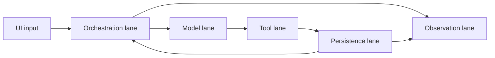
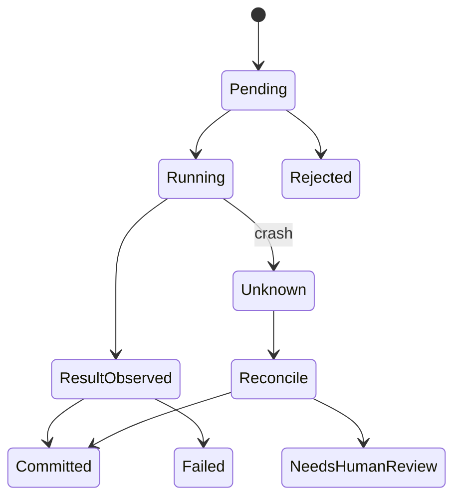

# Durable Harness 最终设计：从教学骨架到生产约束

## 学习目标

本页是本单元的设计评审，而不是声称已有实现。读完后你应能：

- 为一个有副作用的 Agent run 定义 durable 边界。
- 解释 lanes、operation intent/result、terminal transaction 和 crash recovery。
- 写出从最小 Harness 迁移到生产 Harness 的里程碑。
- 明确哪些结论来自 Pi 源码，哪些来自 harness v2 设计。

## 设计前提

Agent 的模型调用通常是可重放或可重新请求的，但工具副作用不一定可重放。文件写入、数据库更新、发布消息、支付和发送邮件都可能在本地进程崩溃后已经发生。

因此 Harness 要分别记录：

- **输入**：模型的 tool intent、用户取消、Policy decision 和外部 side-effect evidence。
- **输出**：可重放的 log record、明确的 terminal state、恢复诊断和关联事件。
- **状态变化**：operation 从 pending 进入 running，再进入 committed、rejected、aborted 或 unknown。
- **失败点**：写入中断、远端结果未知、重复提交、hash 不匹配和 schema 不兼容。

```text
模型想做什么
工具是否被允许
工具可能何时执行
工具结果是什么
结果是否已经成为 durable 事实
恢复时是否可以再次执行
```

这比“transcript 有一条 tool result”更严格。

## lanes：隔离不同节奏

harness v2 设计把不同类型工作放入 lanes。教学上可分为：

- **orchestration lane**：接受 prompt、处理 steering/follow-up、推进 run。
- **model lane**：发送 provider request、消费 stream、处理 retry。
- **tool lane**：执行工具和 runtime side effect。
- **persistence lane**：single writer、append、flush、索引和 recovery。
- **observation lane**：发布事件、metrics、traces，不能阻塞核心状态。



lane 不一定等于线程。它首先是顺序和责任边界；实现可以用 goroutine、executor 或单个事件循环。

## Operation log

一次 tool operation 至少要有稳定的 `operationId`：

```jsonl
{"kind":"operation_intent","operationId":"op-9","tool":"edit","argsHash":"h1","parentId":"e7"}
{"kind":"operation_result","operationId":"op-9","status":"success","outputHash":"h2"}
{"kind":"operation_terminal","operationId":"op-9","status":"committed"}
```

### intent

表示 Harness 已接受要执行的意图。写入 intent 后崩溃，恢复器知道存在一个未决操作。

### result

表示执行器观察到返回值。它必须关联 `operationId`，并可包含 output hash、exit code、changed paths 和错误分类。

### terminal

表示系统已经把结果提交为最终状态，或明确标为 rejected/aborted/unknown。terminal 是恢复器停止重放的依据。

**注意**：这是 durable Harness 设计要求，不是说当前 Pi `AgentHarness` 已经实现了这组三段事务。

## Terminal transaction

终止状态应满足互斥性：

```text
pending -> running -> committed
pending -> rejected
pending -> aborted
running -> failed
running -> unknown
```

`committed`、`rejected`、`aborted`、`failed` 和 `unknown` 不能互相覆盖。重复恢复只允许把相同状态重新确认，不能将 `committed` 变成 `running`。



对 `unknown` 的处理取决于副作用可观察性。若没有证据确认未执行，禁止盲目自动重试不可逆操作。

## Crash recovery 算法

```text
读取所有完整 log records
  -> 校验 schema 和 hash
  -> 按 operationId 分组
  -> 找到缺失 terminal 的 operation
  -> 查询可用外部证据/工具状态
  -> 提交 terminal 或 needs-human-review
  -> 重建 Session leaf 和 RunState
  -> 继续只允许的 model work
```

若尾行是半行，保留损坏偏移并停止或截断，策略必须可配置且可审计。恢复不能仅靠“忽略最后一行”，因为最后一行可能是完成标记。

## 幂等策略

幂等至少分三层：

1. **Log 幂等**：相同 record id 不重复追加。
2. **Operation 幂等**：相同 operationId 返回已有 result。
3. **External side effect 幂等**：远端服务接收 idempotency key，重复请求只产生一次副作用。

Session entry id 只自动解决第一层的部分索引问题，不能代表后两层。

## Context 和 durable state 的关系

Compaction 只解决 token budget，不解决副作用一致性：

```text
old messages -> summary + retained tail
operation log -> intent/result/terminal
```

summary 适合告诉模型“已经尝试了什么”；operation log 适合告诉恢复器“是否可以重做”。不要用模型摘要充当事务日志。

## 权限与恢复

权限决策也应记录关键事实：

```json
{"kind":"policy_decision","operationId":"op-9","decision":"deny","policyVersion":"p3","reason":"outside workspace"}
```

但记录决策不等于授予权限。真正的执行边界仍由 Runtime、OS sandbox、容器、网络策略和人工审批共同决定。Go/Java 示例的 `PermissionPolicy` 只用于教学测试，不能阻止恶意进程逃逸。

## 取消语义

取消有三个阶段：

```text
requested -> observed -> terminal(aborted)
```

如果工具已经完成而 abort 信号晚到，结果可能是 committed，不应事后改写成 aborted。模型流停止也不意味着远端 HTTP 请求或子进程已停止；事件中要区分 `abort_requested` 和 `abort_observed`。

## 观测与审计

生产实现应为每个运行建立关联链：

```text
sessionId -> runId -> turnId -> operationId -> entryId
```

指标可以包括：

- model latency、retry count、tokens；
- tool duration、exit code、policy decision；
- persistence flush/fsync latency；
- recovery count、unknown operation count；
- compaction before/after tokens；
- queue depth 和 abort latency。

敏感 prompt、文件内容和 secrets 应脱敏或不记录。`packages/agent/src/harness/telemetry.ts` 可作为 schema 参考，但不是部署安全策略。

## Go 与 Java 对照

Go 版本通常用 goroutine 表达 lane，用 channel 传递事件和队列输入，用 `context.Context` 贯穿取消。Java 版本通常用 `ExecutorService` 表达执行 lane，用 `BlockingQueue` 传递输入，用 `CancellationToken` 配合 `Future` interruption。两种实现都需要显式 single writer 和 operation state，不应依赖调度器碰巧保持顺序。

| 设计责任 | Go | Java |
| --- | --- | --- |
| 编排 lane | goroutine | executor task |
| 持久化 lane | writer goroutine | single-thread executor |
| operation record | struct + JSON | record + Jackson |
| 取消 | `ctx.Done()` | token/interruption |
| 恢复 | scanner + reducer | reader + reducer |

## Go 迁移方案

### Milestone 1：纯内存

完成 `Model`、`ToolRegistry`、`PermissionPolicy`、`Session` 和 typed events。所有测试用 Fake。

### Milestone 2：JSONL single writer

引入 writer goroutine、错误注入和 reload；声明只支持单进程。

### Milestone 3：operation records

为副作用工具追加 intent/result/terminal，使用 `operationId` 去重。

### Milestone 4：recovery worker

启动时扫描缺失 terminal 的操作；对 unknown 进入人工确认。

### Milestone 5：外部约束

接入 OS sandbox、网络策略、真实数据库事务或外部 idempotency API。

## Java 迁移方案

### Milestone 1

用 `ScriptedModel`、`ToolRegistry`、record events 和内存 Session 建立确定性测试。

### Milestone 2

用单独 `ExecutorService` 作为 persistence lane，测试 `Future` cancel 和 shutdown 行为。

### Milestone 3

使用 Jackson JSONL 写 operation records，schema 错误必须带行号。

### Milestone 4

启动恢复器，针对 missing terminal 和 duplicate operation 做测试。

### Milestone 5

根据 runtime 部署方式加入 sandbox、数据库事务、权限与密钥管理。

## Pi 的真实边界

研究 commit：`853a80d26c90a14c1886f0ebb8ffaae133ca2185`。

**源码事实**：

- `Agent` 管理 loop、transcript、事件、steering/follow-up 和 abort。
- `AgentSession`、`SessionManager`、`ExtensionRunner` 和资源加载器组成 Coding Agent 主路径。
- JSONL Session 使用 entry、`id`、`parentId` 并支持 branch/tree 语义。
- compaction 有摘要、保留尾部和 overflow 处理。

**设计事实**：

- `packages/agent/docs/harness.v2.md` 提出 lanes、append-only tree、operation log、intent/result、single writer、usage ledger 和 crash recovery。

**未实现声明**：

- 当前 `packages/agent/src/harness/agent-harness.ts` 仍是 scaffold；
- 不能把本页的 durable operation 和 terminal transaction 写成已交付源码能力；
- 教学 Go/Java transcript 实现不等于生产恢复系统。

## 最终评审清单

- [ ] Model 与 Tool Runtime 可替换。
- [ ] Policy 在副作用之前执行。
- [ ] Prompt、steering、follow-up 不会并发修改同一 transcript。
- [ ] 所有 durable entry 由 single writer 排序。
- [ ] Tool operation 有稳定 id 和明确终态。
- [ ] 崩溃后的 unknown 被识别而不是盲目重放。
- [ ] compaction 不破坏 tool pairing。
- [ ] abort 传播到模型、工具和等待点。
- [ ] UI 事件和 durable 事件语义不同且可解释。
- [ ] telemetry 不泄露秘密。
- [ ] 测试覆盖错误注入、reload、重复提交和半行。

## 综合实验

### 任务

实现一个 `edit` Tool，进程可能在三个阶段崩溃：intent 后、文件写入后、terminal 前。

### 验收

1. 重启能识别 operation 状态。
2. 文件写入具有 backup 或可查询证据。
3. 相同 operationId 不重复修改。
4. unknown 进入人工确认而非自动重试。
5. Session context 能告诉模型当前已恢复到哪一步。
6. 所有事件关联同一个 session/run/operation 链。

### 反例

如果实现只把 `tool_result` 写进 transcript，却没有 intent 和 terminal，那么崩溃恢复时无法区分“未开始”“已执行但未记录”和“结果已提交”。这不是 durable Harness。

## 小结

最终设计的核心不是增加更多类，而是把不可逆副作用变成可识别、可恢复、可审计的状态机。Pi 当前源码提供了 Agent、Session、loop、事件和 compaction 的重要基础；harness v2 的 lanes、operation log 和 terminal recovery 是下一层设计约束。实现时逐个里程碑验证，避免用摘要或 demo 冒充生产保证。
