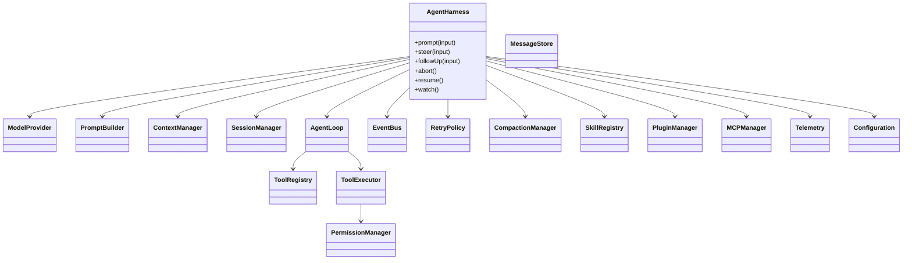

# 最终 Harness 设计

## 组件边界

- `AgentLoop` 不知道文件格式和 TUI；它消费统一 Model、Context、Tool。
- `SessionManager` 保存树/消息/usage；`ContextManager` 决定本轮投影。
- `PermissionManager` 在副作用前工作，不能由模型 prompt 取代。
- `EventBus` 观察发生的事实；Hook/Plugin 才能在受控点改变输入。
- `RetryPolicy` 同时限制 Provider request 和 Agent step 的次数。
- `MCPManager` 把外部协议适配为 Tool，但仍经过本地权限层。

## Go 与 Java 取舍

Go 版用 `context.Context` 贯穿请求和 Tool，channel 传事件/队列，显式 registry 避免动态加载；Java 版用 interface、`ExecutorService`/`Future`、Listener 和 `ServiceLoader`，把可插拔边界交给类型和 SPI；如果把同步 loop 暴露成异步 API，可以再用 `CompletableFuture` 包装。两者都不复刻 Node 的动态 import。

## 交付定义

成熟不是“功能清单很长”，而是每个状态有：输入、持久化边界、取消语义、恢复动作、测试和观测字段。先完成 Milestone 1–4，再加 Compaction、Steering、Plugin、Skill、MCP；不要在最小 Loop 未稳定前引入框架。
