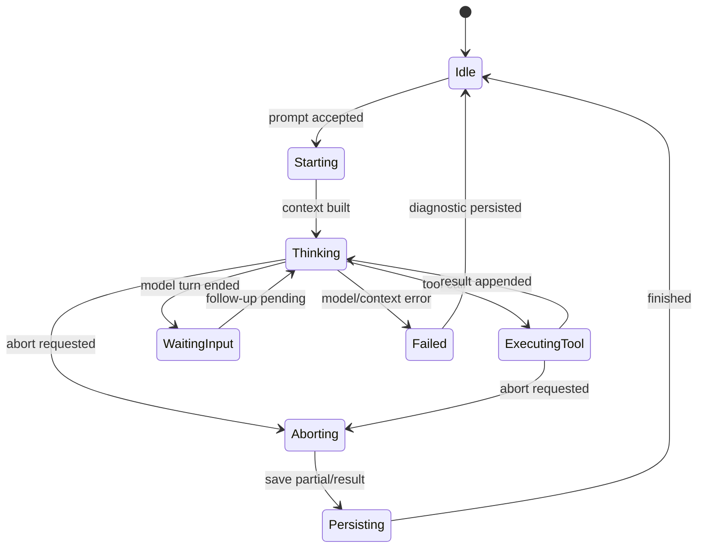

# Harness 生命周期：从 prompt 到可恢复结果

## 学习目标

本页把一次运行拆成明确阶段。完成后你应能：

- 画出 start、turn、tool、queue、abort 和 finish 的状态机。
- 区分 steering、follow-up 和 abort 的时机与语义。
- 说明 partial response 和终止原因如何记录。
- 用 Fake Model 重现每个边界，而不是等待真实模型“碰巧”触发。

## 生命周期总览



状态不是 UI 文案。`ExecutingTool` 代表可能有副作用；`Aborting` 代表取消已请求但未必已经停止；`Persisting` 代表结束事件尚未必 durable。

## 阶段一：接受输入

`prompt` 进入 Harness 时先检查：

- 当前是否已经有 run；
- Session 是否可写；
- 输入是否为空或超限；
- 是否需要创建新 branch；
- 是否有 active policy 或项目上下文变化。

运行中再次 `prompt` 不应偷偷启动第二个 loop。Pi `Agent` 已经区分运行状态和 steering/follow-up 队列；Go 示例也会返回类似 `agent is already running; use Steer or FollowUp` 的错误。

**输入**是用户文本和当前 session id；**输出**是 accepted/rejected；**状态变化**是创建 run id 或进入队列；**失败点**是重复运行、不可写 Session、输入拒绝。

## 阶段二：建立 Context

Harness 根据当前 leaf 生成 branch，再加入 system prompt、tools、options 和当前 user message。这个阶段可能触发：

- ResourceLoader reload；
- project context 发现；
- Skill metadata 更新；
- Extension 修改 prompt；
- compaction；
- token budget 检查。

建立成功后才应发送 Provider。若 context overflow，应走压缩/裁剪路径，而不是把同一个过大的 request 重试三次。

## 阶段三：运行 Model Turn

`packages/agent/src/agent-loop.ts` 在模型边界执行消息转换，并消费 stream event。一个 turn 可能只产生文本，也可能产生多个 tool call。

```text
turn_started
  -> assistant_delta*
  -> assistant_message / toolCall
  -> 如果有 toolCall：结束当前 model turn
  -> 工具结果进入 transcript
  -> next model turn
```

流式 delta 适合 UI；完整 assistant message 适合 Session 边界。不要在每一个 token 都写一个 JSONL entry，除非产品确实需要 token-level recovery 且能承受文件增长。

## Steering、Follow-up、Abort

### Steering

Steering 是对正在进行的 Agent 给出方向修正。Pi `Agent` 会通过 steering queue 在合适的 turn 边界取出；是否中断当前工具取决于具体执行策略。它通常用于“不要继续这个方案，改检查 X”。

### Follow-up

Follow-up 是当前 run 的后续输入，通常等待当前 agent loop 完成后才作为下一次请求进入。它不等价于修改当前正在生成的 assistant message。

### Abort

Abort 是取消当前运行。`AbortController` 发出信号后，模型流、工具和等待操作应尽快观察信号并停止；已发生的远端副作用无法被取消回滚。partial output 和 abort reason 要有明确持久化策略。

```text
running
  ├─ steer -> pendingSteering（方向修正）
  ├─ followUp -> pendingFollowUps（排队的新输入）
  └─ abort -> aborting（取消当前执行）
```

## 工具阶段

当模型返回 tool call：

1. 解析 tool name 和 JSON arguments；
2. `prepareToolCall` 做存在性/结构检查；
3. `executePreparedToolCall` 执行 hooks、权限和函数；
4. 记录 tool result 或错误；
5. 决定是否继续下一轮。

工具阶段不应直接把字符串拼进下一条 user message。结果要带 tool call id，并进入受控的 context 转换。

## 结束条件

一次 run 可能因下列原因结束：

- 模型返回纯文本且没有继续工具；
- 模型触发 stop/reasoning finish；
- 达到 max turns；
- 工具或 provider 错误不可恢复；
- 用户 abort；
- Session write 失败；
- policy 阻止并且产品选择终止。

终止原因应是枚举或稳定字符串，而不是只记录最后一条异常：

```ts
type FinishReason =
  | "completed"
  | "max_turns"
  | "aborted"
  | "model_error"
  | "tool_error"
  | "context_overflow"
  | "persistence_error";
```

## 事件和 durable 状态

建议将状态更新顺序写成：

```text
产生结果
  -> 构造 entry
  -> single writer append
  -> 更新 reducer state
  -> 发布 persisted event
```

如果产品允许内存事件先于落盘，必须在事件名中体现 `observed`，并在恢复时接受 UI 暂时显示过但最终丢失的 partial result。不要在文档里模糊这两个语义。

## 实验：脚本化整个生命周期

### Fake Model 脚本

```text
step 1: toolCall(read, {path: "a.txt"})
step 2: toolCall(edit, {path: "a.txt", content: "fixed"})
step 3: text("已完成")
```

### 测试步骤

1. 发送 prompt，断言 `run_started` 和 user entry。
2. 在 step 1 tool 执行中排入 steering。
3. 让 read 返回成功，检查下一轮是否看见 steering。
4. 在 edit 执行中调用 abort。
5. 让 Fake Tool 阻塞，手动释放或响应 cancellation。
6. reload Session，确认 partial assistant、tool error 和 abort reason 的策略。
7. 再发送 follow-up，确认它不会与已取消 run 重叠。

### 观察点

记录每个事件的 `runId`、`turn`、`entryId` 和时间。若只打印文本，无法判断事件顺序和重复写入。

### 预期结果

steering 与 follow-up 进入不同队列；abort 传播到当前等待点；结束事件只发布一次；重启后状态仍能说明 run 是 completed 还是 aborted。

## Go 与 Java 对照

| 语义 | Go | Java | Pi |
| --- | --- | --- | --- |
| 运行协程 | goroutine | executor task | Agent run |
| 取消 | `context.WithCancel` | `CancellationToken` + Future | `AbortController` |
| steering | channel | `BlockingQueue` | steering queue |
| follow-up | channel | `BlockingQueue` | follow-up queue |
| 事件 | typed channel | `EventSink` | Agent events |

Go 的 channel 发送也可能阻塞，因此 abort 时要用 `select` 监听 `ctx.Done()`。Java 的 `Future.cancel(true)` 只是发出 interruption，工具必须主动响应 token/interruption。

## Pi 源码清单

- `packages/agent/src/agent.ts`：`prompt`、`steer`、`followUp`、`abort`、`waitForIdle`。
- `packages/agent/src/agent-loop.ts`：`runAgentLoop`、`streamAssistantResponse`、终止和工具循环。
- `packages/coding-agent/src/core/agent-session.ts`：prompt、事件持久化、overflow retry。
- `packages/coding-agent/src/core/session-manager.ts`：entry append、leaf 和 branch。
- `packages/agent/src/harness/reducer.ts`：状态转换和恢复可重放性。

## 事实边界

**源码事实**：Agent 有 steering/follow-up queue 和 AbortController；Coding Agent 有 AgentSession orchestration。

**源码事实**：取消信号不会自动撤销已经发送到远端或已经发生的文件/网络副作用。

**教学建议**：把 run/turn/operation id 写入事件和持久化 entry，方便诊断。

**未实现声明**：完整 terminal transaction 和 crash recovery 属于 durable Harness 设计，不是 `AgentHarness` 当前已交付功能。

## 思考题

1. Steering 发生在 tool 执行中时，安全的切入点是什么？
2. 取消后的 partial assistant 是否应进入下一次 context？
3. 为什么 finish event 要幂等？
4. Session 写失败时，是否可以把 run 标为 completed？

## 小结

Harness 生命周期是一组可观测状态转换，而不是一次 `await agent.run()`。输入接受、Context 构建、模型 turn、工具执行、队列处理、取消、持久化和结束都要有边界。下一页进一步把失败、重试和恢复放在同一模型中。
