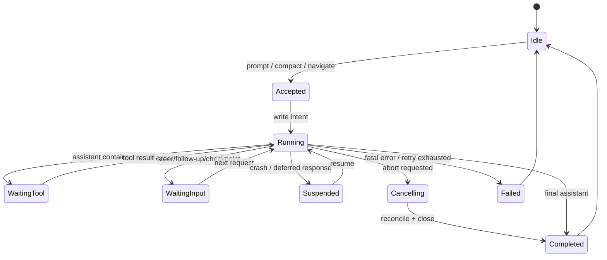

# Harness 生命周期

## 接受和执行必须分开

调用 `prompt` 不应只在内存里设置 `busy=true`。接受边界至少写入 run id、原始规范化输入、当前 leaf 和待产生的 id；之后才开始 Provider request。崩溃发生在意图和结果之间时，恢复逻辑才能判断是重试、重放还是合成结果。

## Pi Agent 的较轻生命周期

`Agent.runWithLifecycle` 创建 `AbortController`，设置 `isStreaming`，调用低层 `runAgentLoop`，最后在 `finishRun` 清理 runtime state。`processEvents` 先更新 state，再按订阅顺序等待 listeners；`agent_end` 事件发出不代表 listener 已经结束。这是可以直接运行的 Agent 层事实，不等同于 durable operation log。

## 关闭边界

关闭时要停止接受新操作、向当前 Provider/Tool 发 signal、等待或标记未完成 effect，并保证下次恢复不会重复提交不可重放副作用。TUI 只是展示这些状态；它不应私自清空队列或修改 Session。
