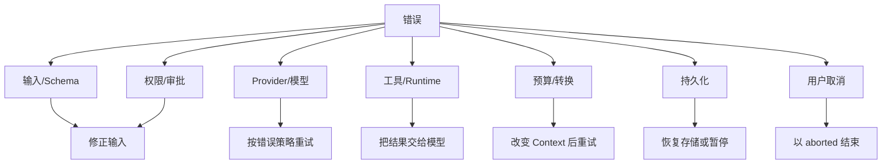
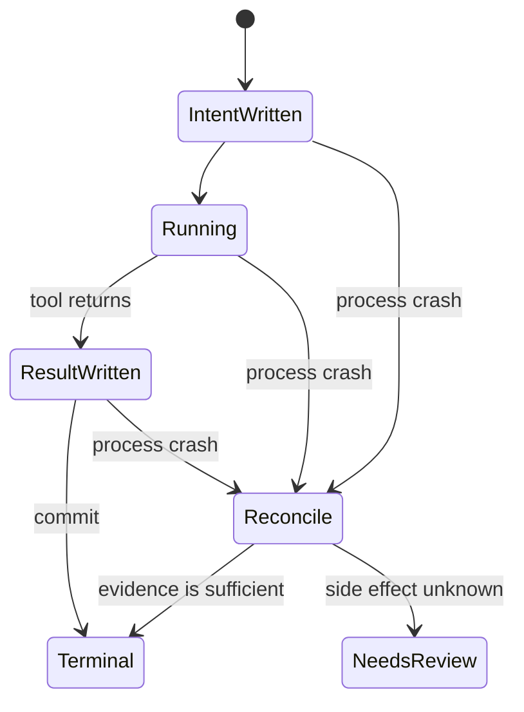

# Harness Reliability：失败不是一个布尔值

## 学习目标

本页结束时，你应能：

- 将 Model、Tool、Policy、Context 和 Storage 错误分层。
- 判断什么可重试、什么必须改变输入或状态后再试。
- 设计 durable operation 的 intent/result/terminal 状态。
- 用故障注入测试崩溃、重复提交和取消。

## 可靠性从承诺开始

先写产品承诺，再选择机制。例如：

```text
承诺：UI 显示“已保存”后，重启仍能恢复该结果。
机制：result 写入并满足 durability 条件后才发布 persisted 事件。
测试：在 write、flush、fsync 各边界注入崩溃。
```

如果承诺只是“尽量继续”，就不需要把所有中间 token 写盘。但必须把这个限制写清，而不能用“实时持久化”这种模糊词。

## 错误分类



每类错误的恢复动作不同：

| 类别 | 示例 | 自动重试 |
| --- | --- | --- |
| Schema | JSON 参数缺字段 | 否，先让模型修正 |
| Policy | 不允许写 `/etc` | 否，除非审批改变 |
| Provider | 429/暂时网络故障 | 可，带退避 |
| Tool | `go test` 失败 | 通常由模型决定下一步 |
| Context | window overflow | 可，先 compact |
| Store | disk full | 不应继续制造新状态 |
| Abort | 用户按停止 | 否 |

## 重试的三个问题

任何 retry 都先回答：

1. **相同请求是否安全？** `edit`、支付、发邮件通常不是。
2. **失败是否暂时？** JSON 参数错误不会因等待而变好。
3. **重试前是否改变了状态？** overflow 必须改变 context，重复 operation 必须查幂等记录。

指数退避只是时间策略，不是幂等策略：

```text
attempt 1: 100ms
attempt 2: 200ms + jitter
attempt 3: 400ms + jitter
```

若 operation 已写入成功，网络响应丢失，再试可能造成重复副作用。用 `operationId`、provider idempotency key 或结果查询解决。

## Durable operation：intent/result/terminal

harness v2 设计稿要求把有副作用的操作分成可恢复记录：

```text
intent(op-7, tool=edit, argsHash=...)
  -> running
  -> result(op-7, success, outputHash=...)
  -> terminal(op-7, committed)
```

恢复时：

- 只有 intent：检查工具是否可能已执行，进入 reconciliation，而不是盲目重跑。
- 有 result 无 terminal：验证 result 是否完整，再决定提交 terminal 或回滚标记。
- 有 terminal：视为已完成，重复请求返回既有结果。

这是一种设计要求。当前 Pi `AgentHarness` 是 scaffold，不能宣称它已经提供这些 durable transaction 语义。

## Crash recovery 状态机



“未知是否执行”是最危险的状态。对不可逆操作宁可要求人工确认，也不要基于猜测自动重放。

## 单写入者解决什么，不解决什么

Single writer 能保证本进程内的 entry 顺序，但不能自动解决：

- 两个进程同时打开同一文件；
- OS 缓存尚未落盘；
- 远端 side effect 已发生但本地没记录；
- 机器断电；
- schema 版本不兼容。

生产系统可能需要 file lock、数据库事务、外部 operation coordinator 或工具本身的幂等 API。教学 Harness 可以先明确只支持单进程，并在启动时拒绝第二 writer。

## 取消和可靠性

取消是控制信号，不是时间旅行：

```text
abort requested
  -> model stream stops when it observes signal
  -> running tool observes signal if supported
  -> remote request may already have been accepted
  -> persist aborted/partial state
```

Go 使用 `context.Context` 传递取消；Java 使用 `CancellationToken` 和 `Future` interruption。工具必须在阻塞 I/O、循环和子进程等待点检查。若工具不支持取消，应将它标记为 non-cancellable 并在 UI 明示。

## 观测设计

每个事件至少带：

```json
{
  "runId":"run-3",
  "turn":2,
  "operationId":"op-7",
  "sessionEntryId":"e-10",
  "kind":"tool_result_persisted",
  "attempt":1,
  "durationMs":82
}
```

不要把 user prompt、token 或工具输出无条件写日志；它们可能包含秘密。Telemtry 的结构见 `packages/agent/src/harness/telemetry.ts`，安全层必须再做 redaction 和访问控制。

## 故障注入实验

### 场景 A：Provider timeout

让 Fake Model 第一次 timeout、第二次成功。断言相同 operation 是否允许重试、attempt 增加、最终只生成一个逻辑结果。

### 场景 B：权限拒绝

Policy deny `edit`。断言 execute 函数没有被调用，Session 记录拒绝原因，Agent 收到受控 tool error。

### 场景 C：写入失败

Writer 在 tool result 后返回 disk full。断言不发布 persisted 事件，run 不标为 completed，并保留可恢复的错误状态。

### 场景 D：崩溃

在 intent、result、terminal 三个边界分别终止进程。reload 后断言状态机落入预期 recovery 分支。

### 场景 E：重复提交

重新发送同一 `operationId`，断言不会第二次调用不可逆 Tool。

## Go 与 Java 对照

| 能力 | Go | Java | 测试方式 |
| --- | --- | --- | --- |
| 退避 | `time.Timer` | `ScheduledExecutorService` | 注入 Clock |
| 幂等表 | `map`/文件（教学） | `Map`/JSONL（教学） | 重放 operation |
| 故障 | 返回 `error` | throw exception | Failing fake |
| 取消 | `ctx.Done()` | token/interruption | latch + cancel |
| 事件 | typed struct | record | collecting sink |

不要用真实 sleep 测试退避；注入 clock 或把 retry scheduler 抽象出来。不要用真实 shell 测试崩溃恢复；使用可控 Fake Tool。

### 故障注入代码的四个边界

- **输入**：可控的 Model/Tool/Writer 故障和 attempt 配置。
- **输出**：稳定的错误分类、事件序列和最终 RunState。
- **状态变化**：retry 只增加 attempt；recovery 只推进合法 terminal 状态。
- **失败点**：重复副作用、无限重试、过早发布 persisted 事件和 unknown 被误判为失败。

这些断言应使用 fake clock、latch 和 failing writer，而不是依赖网络、真实时间或真实 shell。

## Pi 源码锚点

- `packages/agent/src/agent-loop.ts`：Provider retry、tool error 和 loop termination。
- `packages/agent/src/agent.ts`：abort、queue、运行中调用边界。
- `packages/coding-agent/src/core/agent-session.ts`：overflow retry、事件和 Session 连接。
- `packages/coding-agent/src/core/session-manager.ts`：JSONL append 和 tree reload。
- `packages/agent/src/harness/reducer.ts`：状态恢复和非法事件。
- `packages/agent/src/harness/telemetry.ts`：事件/指标 schema。

## 事实边界

**源码事实**：Pi 具备模型/工具循环、Provider retry、abort、Session 和 telemetry 类型。

**源码事实**：工具取消不能保证撤销远端副作用；JSONL append 也不自动是跨操作事务。

**设计事实**：harness v2 要求 lanes、operation intent/result、terminal transaction、single writer 和 crash recovery。

**未实现声明**：这些 durable 设计约束不能写成当前 `AgentHarness` 已完成的实现能力。

## 思考题

1. result 已写入但 terminal 未写入时，如何安全恢复？
2. 对 `edit` 和 `send_email`，幂等 key 应由谁生成？
3. 为什么 context overflow 不是普通 provider retry？
4. 哪些 telemetry 字段必须脱敏？

## 小结

可靠 Harness 不把错误压成一个布尔值。它分类错误、明确重试前提、记录 operation 阶段，并用 single writer、幂等和恢复处理崩溃。取消、失败和完成都应留下可解释状态；下一页将把这些原则落实为一个最小但诚实的教学实现。
