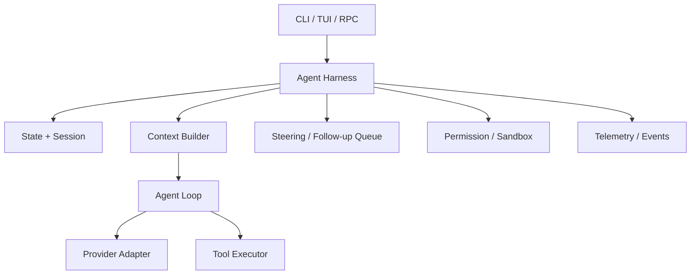

# Agent 与 Agent Harness

## 一个具体 trace

用户要求“修复测试”。模型返回 `read` Tool Call。Agent Loop 可以完成验证、执行、回传和下一轮；但真实产品还要回答：用户同时按了 abort 怎么办？进程在写结果前崩溃怎么办？重启后是否重复写文件？模型凭据在哪？哪个 Session leaf 是当前分支？工具是否允许访问这个目录？这些问题不是模型推理本身。

## 定义

**Agent** 是围绕模型输出建立行动闭环的运行时。

**Agent Harness** 是让这个闭环在真实应用中可控、可恢复、可观察、可扩展的工程边界：它管理操作状态、Session、Context、Tool registry、队列、取消、重试、权限、资源、Extension、MCP、Telemetry，以及 CLI/TUI/RPC 的连接面。

## 不是无限循环

`while (true)` 只能描述控制流，不能描述 durability、崩溃恢复、并发线性化、权限和可观测性。一个最小教学 Harness 可以先没有分布式存储，但必须显式有 `maxSteps`、`Context`、Tool registry、取消、Session 和测试模型。

## Pi 的事实边界

- `packages/agent/src/agent.ts` 的 `Agent` 持有 transcript、事件 listener、Tool hooks、steering/follow-up queue 和 AbortController。
- `packages/coding-agent/src/core/agent-session.ts` 把 Agent、SessionManager、ResourceLoader、ExtensionRunner、compaction 和 model runtime 组合成 Coding Agent 运行时。
- `packages/agent/src/harness/agent-harness.ts` 定义了更广的 `AgentLane`/`AgentHarness` API，但本 commit 中仍有未实现方法。因此教材中的最终 Harness 是学习设计，不是假称 Pi 已经提供完成品。
