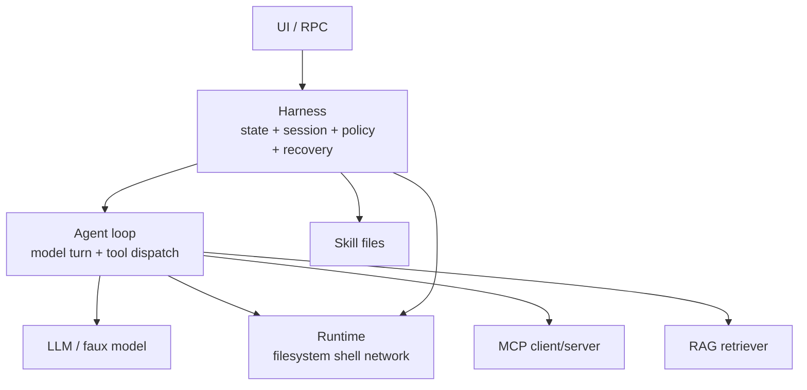

# Harness 是什么：Agent 之上的控制平面

## 学习目标

本页要建立一张不会混淆职责的地图。读完后，你应能：

- 定义 Agent、Runtime 和 Harness。
- 判断某个功能属于模型、工具、Session、UI 还是权限层。
- 解释当前 Pi `AgentHarness` 为什么不能被描述为完整 durable Harness。
- 为 Go/Java 应用划分可测试的接口。

## 一个具体问题

用户说：“修复这个 bug。”模型提出调用 `edit`。真正的系统需要同时处理：

1. 模型请求是否合法、参数是否符合 schema；
2. 用户是否允许写文件；
3. 写文件前是否需要确认；
4. 工具结果是否写入 Session；
5. 运行中用户的 steering 是否排队；
6. 进程崩溃后能否恢复；
7. UI 是否能显示可解释的状态；
8. MCP 工具是否来自可信服务器；
9. RAG 返回的文本是否只是证据而非指令。

如果这些都放进一个 `Agent.run()`，短期能跑，长期无法测试和恢复。Harness 是围绕 Agent 的控制平面，用明确的状态和边界协调它们。

## 严格定义

本文采用以下教学定义：

- **Model**：根据输入 context 产生文本或 tool call 的远端/本地推理组件。
- **Agent**：驱动模型调用、解析响应、执行工具、继续循环的运行组件。
- **Runtime**：实际执行工具、网络、文件、进程和取消的环境。
- **Harness**：负责生命周期、Session、Context 组装、队列、权限、重试、持久化、观测和恢复的控制层。
- **UI**：把事件呈现给人，并收集 prompt、steering、审批和导航。
- **MCP**：一种把外部工具/资源接入客户端的协议，不是权限系统。
- **Skill**：可按需展开的工作方法和约束，不是可执行函数。
- **RAG**：检索外部资料的证据通道，不保证证据可信或正确。

## 边界图



箭头表示协作，不表示信任自动传递。MCP server 返回的文本仍是外部数据；RAG 文档仍需来源和权限检查；Tool schema 仍不授予 Runtime 权限。

## Agent 不等于 Harness

Pi 的 `packages/agent/src/agent.ts` 中，`Agent` 负责：

- 保存和更新消息 transcript；
- 启动 `agent-loop.ts`；
- 监听事件；
- 管理 steering/follow-up queue；
- 通过 `AbortController` 中止当前运行；
- 暴露 tool hooks。

Coding Agent 的真实产品路径由 `AgentSession`、`SessionManager`、`ExtensionRunner`、resource loader 和 system prompt builder 组合完成。

`packages/agent/src/harness/agent-harness.ts` 则是更广泛 Harness API 的 scaffold。它可以作为接口和研究方向的入口，但当前仍有未完成能力。不能写成“Pi 已经拥有带崩溃恢复、幂等和 durable operation log 的完整 Harness”。

## Runtime 和权限的边界

Runtime 说“能不能执行”；权限层说“此次是否允许执行”。例如：

```text
Tool: bash("rm -rf build")
Schema: 参数是合法字符串
Policy: 当前项目只允许读操作 -> deny
Runtime: 即使 shell 可执行，也不应被调用
```

JSON Schema 解决结构，不解决文件路径越界、命令危险性、网络出口或用户授权。Go/Java 示例的 `PermissionPolicy` 是教学策略，不是操作系统沙箱。

## Harness 的最小接口

```ts
interface Harness {
  prompt(input: string): Promise<RunResult>;
  steer(input: string): void;
  followUp(input: string): void;
  abort(reason?: string): void;
  load(sessionId: string): Promise<void>;
  subscribe(listener: (event: HarnessEvent) => void): () => void;
}
```

接口只是表面；实现还要回答：

- 同时 `prompt` 怎么处理？
- `steer` 是否中断工具？
- `followUp` 什么时候加入 context？
- `abort` 后 partial assistant 是否落盘？
- `load` 时如何处理坏 JSONL？
- listener 抛错是否影响 agent？

这些问题就是 Harness 的价值，而不是额外装饰。

### 接口的输入、输出和失败边界

- **输入**：UI/RPC 的用户意图、当前 Session、Policy 和资源快照。
- **输出**：RunResult、领域事件和可恢复的 Session entry。
- **状态变化**：Harness 从 idle 进入 running，随后进入 completed、failed 或 aborted。
- **失败点**：重入 prompt、不可写 Session、权限拒绝、模型错误、工具错误和 listener 异常。

接口只描述调用方式，不能替实现承诺未完成的 durable transaction；需要在实现和测试中逐项证明。

## 一次运行的事件

```text
run_started
  -> turn_started
  -> model_delta*
  -> assistant_message
  -> tool_call
  -> tool_execution_started
  -> tool_result
  -> turn_finished
  -> run_finished
```

失败可能在任何节点：provider timeout、参数错误、权限拒绝、tool crash、写盘失败或用户 abort。Harness 应把状态和事件分开：状态用于恢复和决策，事件用于 UI/telemetry。

## 实验：给 Agent 外面加一个 Harness

### 目标

用 Fake Model 验证“同一个 Agent 可以由不同 Harness 控制”。

### 准备

使用 `examples/go-agent/internal/agent` 或 `examples/java-agent`，模型使用 Scripted/Fake，不需要真实 API。

### 步骤

1. 建立一个只会请求 `read` 的脚本模型。
2. 给 Agent 注入内存 Tool Registry。
3. Harness 在 `tool_call` 前执行 `PermissionPolicy`。
4. 把 user、assistant 和 tool result 写入教学 Session。
5. 订阅事件并打印状态转移。
6. 在工具运行中调用 `steer`，再比较 steering 与 follow-up。
7. 让 writer 故障，确认 Agent 与持久化错误分开报告。

### 观察点

- Agent 负责产生 tool call，Harness 决定是否允许。
- UI 只发送意图，不应直接操作文件。
- Fake Model 使测试能重复同一序列。
- Session failure 不应伪装成 model failure。

### 预期结果

你能指出至少四个注入点：Model、Tool Registry、Policy、Session Writer；不需要修改 Pi 核心源码。

## Go 与 Java 对照

| 层 | Go 示例 | Java 示例 | 典型测试替身 |
| --- | --- | --- | --- |
| Agent | `Agent` | `Agent` | scripted model |
| Harness | `Harness` | `Harness` | in-memory session |
| Runtime | `ToolRegistry` | `ToolRegistry` | fake tools |
| 权限 | `PermissionPolicy` | `PermissionPolicy` | deny-all policy |
| 观测 | `Telemetry`/events | `Telemetry`/events | collecting sink |

Go 的接口通常以小 interface 组合；Java 可以用 interface、record 和 `ExecutorService`。不要为了模仿 TypeScript 而在 Java 中创建一个包办所有职责的类。

## 判断题

- “Tool schema 合法，所以执行安全。”——错，schema 只描述结构。
- “Session entry 就是 Provider message。”——错，必须投影和转换。
- “MCP 是权限审批机制。”——错，MCP 是接入协议。
- “Skill 的描述出现了，所以正文已执行。”——错，可能只是 progressive disclosure。
- “AgentHarness 文件存在，所以 durable recovery 已实现。”——错，需核对方法体、状态机和测试。

## 源码阅读清单

- `packages/agent/src/agent.ts`：Agent 生命周期、队列和 abort。
- `packages/agent/src/agent-loop.ts`：模型边界、tool call loop 和 context transform。
- `packages/agent/src/harness/agent-harness.ts`：scaffold API 和未完成能力。
- `packages/coding-agent/src/core/agent-session.ts`：实际 Coding Agent orchestration。
- `packages/coding-agent/src/core/session-manager.ts`：JSONL、tree 和 leaf。
- `packages/coding-agent/src/core/extensions/runner.ts`：Extension hook 执行边界。

## 小结

Harness 不是“更大的 Agent”，而是把运行控制、状态、持久化、权限、队列、恢复和观测组合起来的层。当前 Pi 的 Agent 与 Coding Agent 已实现许多运行能力，`AgentHarness` 仍是 scaffold；本课程后续的 durable 设计属于教学目标，必须与现状明确区分。
