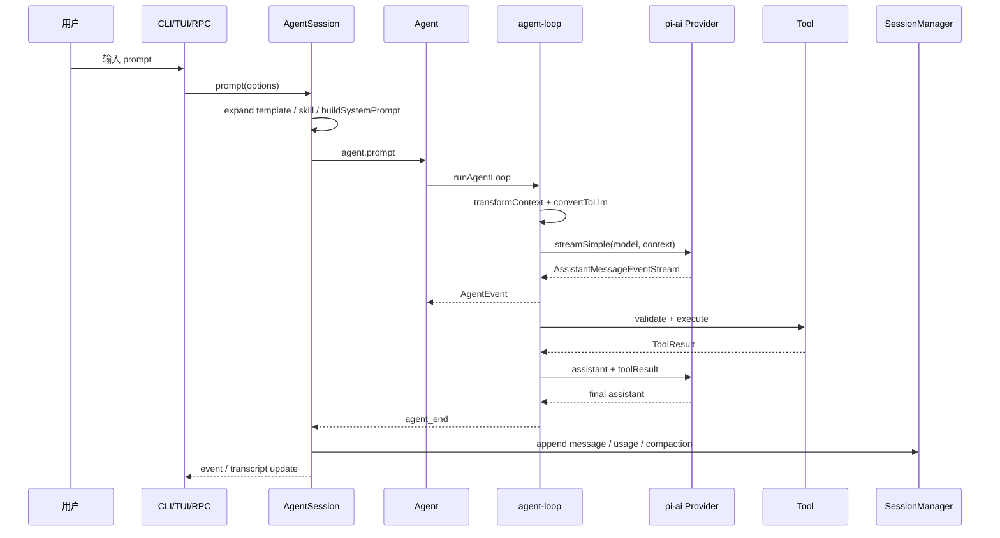

# 一次请求的完整调用链

## 谁负责什么

| 问题 | 当前入口 |
| --- | --- |
| 创建 session | coding-agent CLI/session manager 组合 |
| 构建 system prompt | `buildSystemPrompt` + `AgentSession` |
| 调用模型 | `Agent` 的 stream function，经 `pi-ai` dispatch |
| 读取 streaming | `streamAssistantResponse` 消费 async stream |
| 发现 Tool Call | assistant content 中的 `type: "toolCall"` |
| 执行 Tool | `executeToolCalls`，工具实现来自 registry |
| 放回 Tool Result | `createToolResultMessage` 后 append context |
| 决定下一轮 | `runLoop` 的 tool/steering/follow-up 分支 |
| 记录 Session | `AgentSession._handleAgentEvent` + `SessionManager` |
| 发 Event | Agent listener、AgentSession event、ExtensionRunner |
| 更新 UI | interactive mode 订阅 session/agent 事件 |

源码事实和 durable `harness.v2.md` 的设计不要混写：当前请求链可运行，但新 Harness scaffold 不承担完整恢复。
