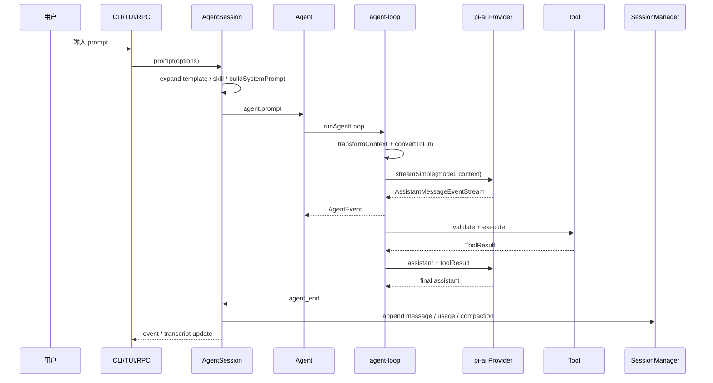
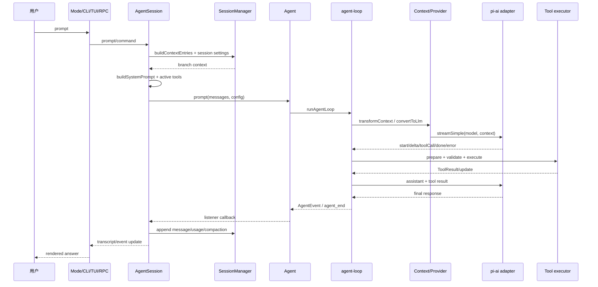

# 一次请求的完整调用链



## 谁负责什么

| 问题 | 当前入口 |
| --- | --- |
| 创建 session | coding-agent CLI/session manager 组合 |
| 构建 system prompt | `buildSystemPrompt` + `AgentSession` |
| 调用模型 | `Agent` 的 stream function，经 `pi-ai` dispatch |
| 读取 streaming | `streamAssistantResponse` 消费 async stream |
| 发现 Tool Call | assistant content 中的 `type: "toolCall"` |
| 执行 Tool | `executeToolCalls`，工具实现来自 registry |
| 放回 Tool Result | `createToolResultMessage` 后 append context |
| 决定下一轮 | `runLoop` 的 tool/steering/follow-up 分支 |
| 记录 Session | `AgentSession._handleAgentEvent` + `SessionManager` |
| 发 Event | Agent listener、AgentSession event、ExtensionRunner |
| 更新 UI | interactive mode 订阅 session/agent 事件 |

源码事实和 durable `harness.v2.md` 的设计不要混写：当前请求链可运行，但新 Harness scaffold 不承担完整恢复。

## 学习目标与前置知识

本页要建立一条可以打断、定位和测试的真实调用链，而不是一张“LLM ↔ Agent”的概念图。读完后，你应能回答“谁创建 session、谁构造 system prompt、谁消费 stream、谁执行 tool、谁写 session、谁刷新 UI”。前置知识是会读 TypeScript 函数调用和异步 `await`；可以把它类比为 Java 方法调用加 Future，或 Go 函数加 `context.Context`。

## 先看失败 trace：为什么只看最终答案不够

```text
用户输入“把 config 改成 5”
 -> UI 显示 assistant final
 -> 文件没有变化
 -> 日志只有“request succeeded”
```

这个 trace 不能区分五种故障：tool definition 没进请求；模型返回了 tool call 但 registry 找不到；权限 hook 拒绝；tool 成功但结果没有回传；文件已经写了但 session 没保存。要定位问题，必须记录跨层边界的输入输出，而不是只打印 final text。

## 分层调用链



## 步骤 1：输入进入 mode

CLI 解析参数后选择 print、interactive、json 或 RPC mode；TUI 还要把编辑器内容转换成 prompt action。mode 不应自己拼 provider payload。它调用 `AgentSession` 的 public operation，让应用级权限、session 和设置仍在同一入口。

**输入：** 文本、模式 options、cwd、session path。**输出：** session operation 或 UI event。**调用方：** `packages/coding-agent/src/modes/`、CLI/RPC 入口。**被调用方：** `AgentSession`。

## 步骤 2：AgentSession 准备上下文

`AgentSession` 从 `SessionManager` 的当前 leaf 构建 branch entries，通过 `buildContextEntries` 和 `sessionEntryToContextMessages` 过滤 UI-only entries；再用 `buildSystemPrompt` 合并 project context、skills、tools 和环境信息。这里是“这次请求看到什么”的最后应用级边界。

如果把整个 JSONL 文件直接传给模型，label、session metadata 或 branch 结构可能变成模型误以为的对话。Context projection 的目的就是把持久化树转换成 provider 能理解的 message sequence。

## 步骤 3：Agent 和 Loop 创建 turn

`Agent` 管理 running state、abort signal 和 steering/follow-up 队列；`runAgentLoop` 处理真正的 turn。每一轮先应用允许在边界消费的 steering，再调用 stream function；有 tool call 就进入 prepare/execute/finalize，没有则检查 follow-up 或结束。

```text
AgentSession.prompt
  -> Agent.prompt / Agent.run
    -> runAgentLoop(config)
      -> runLoop
        -> streamAssistantResponse
        -> executeToolCalls
        -> append tool result to context
        -> next turn or agent_end
```

## 步骤 4：Provider stream 与统一事件

`pi-ai` 的 `Models` 根据 `model.api` dispatch 到 `src/api/` 的 adapter。adapter 将厂商的 content block、delta、tool call argument、usage、thinking 和 stop reason 转成统一 `AssistantMessageEvent`。Loop 只依赖统一事件，不应读取 Anthropic block index 或 OpenAI Responses item 的私有字段。

**流事件的含义：** `start` 建立 assistant message，`text_delta` 更新文本，`thinking_delta` 更新 reasoning，`toolcall_*` 逐步组装调用，`done` 给出 settled message；`error` 终止当前请求。流结束不等于 Agent 结束，因为 tool call 会开启下一轮。

## 步骤 5：Tool 生命周期

模型返回 `name` 和 JSON arguments 只是候选动作。`executeToolCalls` 为每个调用执行 lookup、参数准备和 schema validation，再运行 before hook、真正的 `AgentTool.execute`、update callback 和 after hook。未知工具、非法参数、权限拒绝和执行异常都应变成可归因的 tool result，而不是静默 final。

```text
toolCall from model
 -> prepareToolCall
 -> validate arguments
 -> beforeToolCall
 -> executePreparedToolCall
 -> finalizeExecutedToolCall
 -> createToolResultMessage
 -> append context
```

`length` stop reason 是重要例外：如果 assistant tool call 可能被截断，Pi 不应执行不完整参数，而应创建错误 tool result，让下一轮模型看到失败原因。

## 步骤 6：Session 与 UI 更新

Agent listener 看到 `message_start/update/end`、tool events 和 `agent_end`；`AgentSession._handleAgentEvent` 将可持久化的 user/assistant/tool 内容交给 `SessionManager`，并更新 UI-facing state。TUI 只订阅这些事件做渲染；JSON mode 序列化事件；RPC mode 将状态发给远程 client。

`SessionManager` 的 entry tree 是长期事实，UI transcript 是一种投影。两者更新顺序必须可观察：如果 UI 先显示“已写入”而 Session 写失败，用户会得到错误事实，所以写失败应有明确事件/错误。

## 谁拥有哪个问题

| 问题 | 真实拥有者 | 核心证据 |
| --- | --- | --- |
| 创建/恢复 session | `SessionManager` 与 AgentSession 组合 | `session-manager.ts` |
| 组装 system prompt | `buildSystemPrompt` | `system-prompt.ts` |
| 调用 provider | `streamAssistantResponse` → configured stream function | `agent-loop.ts` |
| 消费 stream | Agent loop 的 assistant response handler | `agent-loop.ts` |
| 发现 tool call | settled assistant content/toolCall blocks | `agent-loop.ts`/`types.ts` |
| 执行工具 | `executeToolCalls` + AgentTool | `agent-loop.ts` |
| 回传 tool result | `createToolResultMessage` | `agent-loop.ts` |
| 决定下一轮 | run loop 的 tool/follow-up/stop 分支 | `agent-loop.ts` |
| 保存消息 | `_handleAgentEvent` + SessionManager | `agent-session.ts` |
| 发事件 | Agent listeners / ExtensionRunner | `agent.ts`、extensions |
| 更新 TUI | mode/UI listener | `modes/`、`tui/` |

## 源码事实、推断、可选设计

> **源码事实：** 当前 `AgentSession` 把 Agent、SessionManager、资源和 Extension 组合；`Agent` loop 通过统一 stream function 与工具接口工作。
>
> **推断：** 让 SessionManager 输出 provider-neutral context，可以减少 session tree 与厂商消息结构的耦合；这是从转换函数边界得出的分析。
>
> **可选设计：** 自建 Harness 可以把事件和持久化写进同一个 transaction，但那会牺牲 print/RPC/TUI 共享同一事件模型的灵活性。

## 实验：追踪一次 calculator

**目标：** 使用 faux provider 观察一条 tool call 从生成到保存。

**准备：** 阅读 `packages/agent/test` 的 faux provider 和 `packages/coding-agent/test` 的 AgentSession 测试；禁用真实网络。

**步骤：**

1. 在工具注册处记录 calculator definition 的 name/schema。
2. 在 loop 的 stream done 处记录 tool call id、name、arguments。
3. 在 prepare/execute 前后记录校验结果和 tool result。
4. 在 `_handleAgentEvent` 记录哪些事件生成 session entry。
5. 在 TUI/JSON listener 记录同一事件怎样被投影。

**观察点：** `toolCall` 先作为模型输出进入内存，执行成功后才产生 tool result；session entry 和 UI event 不是同一个对象。

**预期结果：** 你能用文件和 symbol 指出每个边界，而不是把所有事情归咎于 `Agent`。

**思考题：** 如果 provider stream 在 tool arguments 中途断开，哪一层决定“不执行”？如果 Session 写入成功但 UI listener 抛错，是否应该重做 tool？为什么？

## 小结

一次 Coding Agent 请求至少穿过 mode、AgentSession、SessionManager、Agent、loop、provider、tool executor、session writer 和 UI projection。每一层都应有可观测输入输出；否则“模型没做对”会掩盖真正的边界错误。
