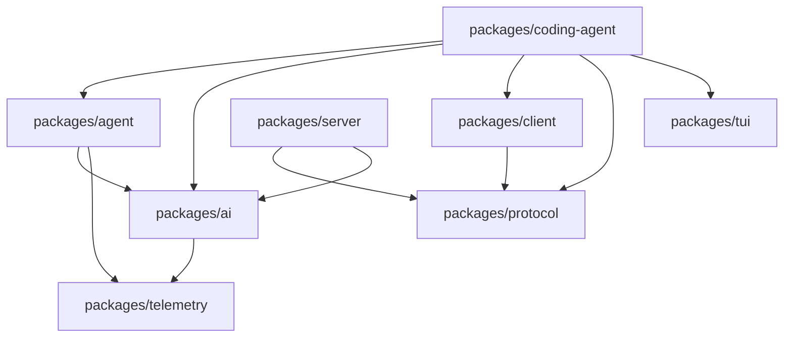

# Pi Monorepo 架构

## 依赖关系

这是从当前 `package.json` 的 workspace dependencies 和源码 imports 归纳的主干，不是按目录名猜测。`packages/evals` 是评估工具，未放在运行时主链。

## 包职责

| Package | 解决的问题 | 主要入口 | 自建 Harness 是否需要 |
| --- | --- | --- | --- |
| `pi-ai` | Model、Provider、API 转换、统一 stream/message/usage | `src/index.ts`、`src/models.ts` | 需要 Provider 层 |
| `pi-agent-core` | Agent 状态、Loop、Tool lifecycle、事件 | `src/agent.ts`、`src/agent-loop.ts` | 需要 Loop 核心 |
| `pi-coding-agent` | Coding tools、Session、资源、Extensions、CLI/TUI/RPC | `src/core/agent-session.ts`、`src/cli.ts` | 需要应用编排层 |
| `pi-tui` | 终端组件和渲染 | `src/index.ts` | 可选 UI |
| `pi-protocol` | 进程/客户端间 framing、schema、CBOR | `src/index.ts` | 远程 surface 需要类似协议 |
| `pi-client` | 连接和远程 session facade | `src/client.ts` | 多进程时需要 |
| `pi-server` | session 服务和 transport | `src/server.ts` | 多会话服务时需要 |
| `pi-telemetry` | 通用遥测 context/导出 | `src/index.ts` | 生产 Harness 建议需要 |

## 读法

先从叶子接口看上游，再追 `AgentSession` 如何组合它们；不要从 CLI 入口开始就被参数和 TUI 细节淹没。源码索引提供每个核心 symbol 的固定路径。
