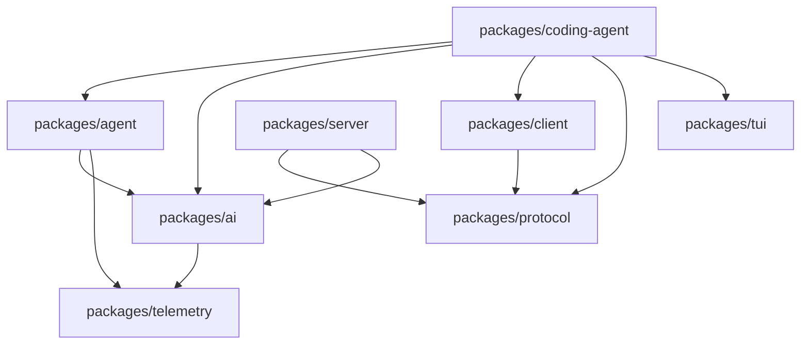
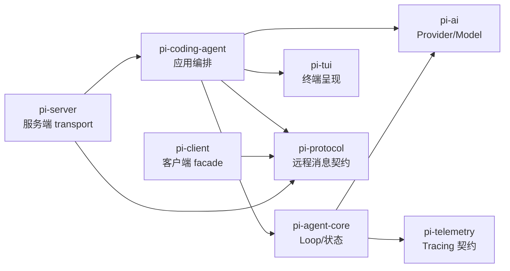

# Pi Monorepo 架构

## 依赖关系



这是从当前 `package.json` 的 workspace dependencies 和源码 imports 归纳的主干，不是按目录名猜测。`packages/evals` 是评估工具，未放在运行时主链。

## 包职责

| Package | 解决的问题 | 主要入口 | 自建 Harness 是否需要 |
| --- | --- | --- | --- |
| `pi-ai` | Model、Provider、API 转换、统一 stream/message/usage | `src/index.ts`、`src/models.ts` | 需要 Provider 层 |
| `pi-agent-core` | Agent 状态、Loop、Tool lifecycle、事件 | `src/agent.ts`、`src/agent-loop.ts` | 需要 Loop 核心 |
| `pi-coding-agent` | Coding tools、Session、资源、Extensions、CLI/TUI/RPC | `src/core/agent-session.ts`、`src/cli.ts` | 需要应用编排层 |
| `pi-tui` | 终端组件和渲染 | `src/index.ts` | 可选 UI |
| `pi-protocol` | 进程/客户端间 framing、schema、CBOR | `src/index.ts` | 远程 surface 需要类似协议 |
| `pi-client` | 连接和远程 session facade | `src/client.ts` | 多进程时需要 |
| `pi-server` | session 服务和 transport | `src/server.ts` | 多会话服务时需要 |
| `pi-telemetry` | 通用遥测 context/导出 | `src/index.ts` | 生产 Harness 建议需要 |

## 读法

先从叶子接口看上游，再追 `AgentSession` 如何组合它们；不要从 CLI 入口开始就被参数和 TUI 细节淹没。源码索引提供每个核心 symbol 的固定路径。

## 学习目标与前置知识

读完本页，你应能解释：为什么 `packages/ai` 不直接执行文件工具；为什么 `packages/agent` 不依赖 TUI；为什么 RPC 与 MCP 不能因为都使用 JSON 就合并。前置知识是会读 `package.json` 的 `dependencies` 和 TypeScript 的顶层 import；不要求先掌握 pnpm workspace 的全部细节。

## 先看一个失败 trace

假设把所有代码放进一个 `agent.ts`：

```text
CLI 解析参数
 -> 拼 provider 请求
 -> 读取 SSE
 -> 判断 tool call
 -> 直接 fs.writeFile
 -> 把字符串打印到 TUI
```

第一次能跑，第二次就会遇到三个具体问题：换 Anthropic 时请求结构污染 loop；RPC 客户端需要结构化事件却只能解析终端文本；测试工具时必须启动整个 TUI。问题不是目录不够漂亮，而是一个变化同时穿过协议、控制流、副作用和呈现层。

解决办法是把变化按责任隔离。`pi-ai` 隔离 provider wire format，`pi-agent-core` 隔离 loop 和状态，`pi-coding-agent` 负责应用编排，`pi-tui` 只负责终端呈现；`pi-protocol`、`pi-client`、`pi-server` 处理远程控制的边界。包边界因此成为测试边界，而不只是发布边界。

## 从 package.json 证明依赖

研究基线是 `853a80d26c90a14c1886f0ebb8ffaae133ca2185`。先打开各包的 `package.json`，再用 `rg 'from "@.*pi|from "\.\.' packages/*/src` 检查 imports。不要根据包名推断箭头方向：workspace dependency 说明构建依赖，源码 import 说明实际调用点，二者都应与图核对。



图中的箭头表示“上层可以使用下层契约”，不表示下层能反向调用 UI。比如 `Agent` 发出 `AgentEvent`，但它不知道事件最终由 TUI、JSON mode 还是测试 listener 消费。

## 每个包为什么独立

### `packages/ai`

它拥有 `Model`、`Provider`、统一 `Context`、`AssistantMessage`、`ToolCall`、`Usage` 和事件流类型，并在 `src/api/` 放 Anthropic/OpenAI/Google 等适配器。输入是 provider-neutral 的 context 和 model，输出是 `AssistantMessageEventStream`。它故意不拥有本地工具执行，否则 provider 层会同时承担文件系统权限，无法复用到纯聊天服务。

### `packages/agent`

`src/agent-loop.ts` 处理一次 assistant step、tool batch、steering/follow-up 和终止；`src/agent.ts` 的 `Agent` 维护生命周期、队列和 abort。输入是 loop config、stream function、工具和消息，输出是事件及新的消息。它不保存 coding-agent 的 JSONL 文件，因此可以在内存测试中复用。

### `packages/coding-agent`

这是产品编排层。`AgentSession` 把 `Agent`、`SessionManager`、`ResourceLoader`、工具注册、ExtensionRunner、settings 和 mode 接起来。它知道 cwd、项目提示词、session tree 和 TUI 状态，这些知识不应该泄漏进通用 agent core。

### `packages/tui`

它提供编辑器、选择器、Markdown 渲染、overlay 和终端布局。输入可以是用户按键，输出是 UI 操作；它不拥有 provider 请求。这样 `print`、JSON 和 RPC 可以不用加载交互组件，TUI 也可以用 fake event 测试。

### `packages/protocol`

它定义跨进程消息的 schema、framing/编码约束（当前源码还包含 CBOR 相关边界）。它回答“消息怎样可靠穿过进程”，不回答“外部服务提供什么工具”。后者是 MCP 的职责。

### `packages/client` 与 `packages/server`

`client` 给远程调用者一个 session facade，`server` 管理连接、请求和 session 运行。它们把 transport 生命周期从应用 loop 中分离出来。一个内嵌式 Harness 可以没有这两个包；多客户端、多 session 或远程 TUI 才需要它们。

### `packages/telemetry`

它提供通用 tracing/context 契约；具体 Agent 或 coding-agent 决定 span 的语义。Telemetry 是旁路观察，不应成为下一轮 loop 的输入，也不应替代 session persistence。

## 调用方、被调用方和数据方向

| 文件 | 核心 symbol | 调用方 | 被调用方 | 输入/输出 |
| --- | --- | --- | --- | --- |
| `packages/ai/src/models.ts` | `streamSimple`、`Models` | Agent loop/AgentSession | provider adapter | Model + Context → event stream |
| `packages/agent/src/agent-loop.ts` | `runAgentLoop` | `Agent` | stream function、tool hooks | messages → AgentEvent |
| `packages/coding-agent/src/core/agent-session.ts` | `AgentSession` | mode/SDK | Agent、SessionManager、extensions | user command → session/event |
| `packages/protocol/src/index.ts` | protocol types | client/server | encoder/decoder | request/event → framed data |

一个实用判断是：如果某个类型包含 provider 的原始 HTTP 字段，它更可能属于 `pi-ai` adapter；如果包含 `leafId`、`parentId` 或 session entry，它更可能属于 coding-agent persistence；如果只描述 assistant/tool 生命周期，它更可能属于 `agent`。

## 源码事实、推断与可选设计

> **源码事实：** 当前仓库的 package manifests 和 imports 形成上述主链；`Agent` 的 loop API 不要求 TUI。
>
> **合理推断：** 将 TUI 与 loop 分开，可以让 print/RPC 复用相同控制流并降低测试成本。这是从依赖方向得到的分析，不是作者在每个文件中都明说的动机。
>
> **可选设计：** 自建 Harness 可以把 protocol 与 client/server 合成一个包；如果只做单进程 CLI，这样更小，但以后增加远程控制时要补回 framing、认证和连接状态。

## 实验：从依赖图追一条箭头

**目标：** 用证据验证 `coding-agent → agent → ai`，而不是背图。

**准备：** 在仓库根目录，使用固定 commit 的工作区；打开三个 package.json 和 `agent-session.ts`。

**步骤：**

1. 在 `packages/coding-agent/package.json` 找 `@earendil-works/pi-agent-core` 依赖。
2. 在 `agent-session.ts` 找 `Agent`、`AgentLoopConfig` 或 `AgentEvent` 的 import。
3. 沿着 `Agent` 的 stream function 找到 `packages/ai/src/models.ts`。
4. 再检查 `packages/agent/package.json` 是否直接声明 `pi-ai`。
5. 记录一个“目录存在但没有被调用”的模块，说明为什么不能把目录名当架构证据。

**观察点：** package dependency 是粗粒度证据，import 和实际调用链是细粒度证据；循环依赖通常提示边界放错或类型需要下沉。

**预期结果：** 你能指出 `Agent` 不直接知道终端组件，`AgentSession` 才是应用级胶水。

**思考题：** 如果把 `SessionManager` 移进 `packages/agent`，通用 agent 是否必须理解 branch tree？如果把 provider adapter 移进 `coding-agent`，另一个 CLI 是否还能复用它？

## 小结

Monorepo 的价值不是把文件分成很多目录，而是让 provider、loop、应用编排、持久化、transport 和 UI 各自拥有可测试的变化边界。阅读 Pi 时先读 package manifest，再读 import 和入口 symbol；任何设计动机都要标为源码事实、推断或可选方案。
