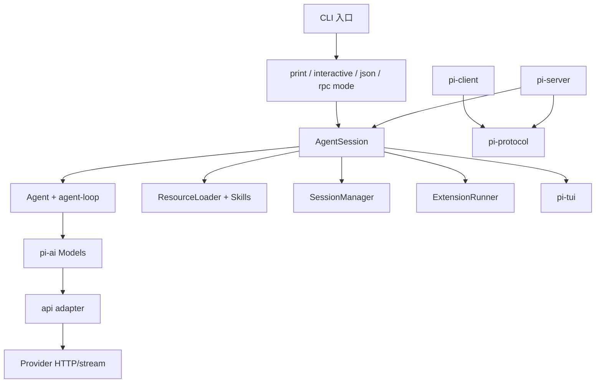

# Pi 各包导读

## `pi-ai`

它把 OpenAI Completions/Responses、Anthropic Messages、Google、Bedrock、Mistral 等实际 API 变成统一的 `AssistantMessageEventStream`。`Model` 是描述和能力，`Provider` 是适配器集合，`models.ts` 负责注册/查找/stream dispatch。它不执行本地 Tool。

## `pi-agent-core`

`Agent` 保存 `AgentState`，`agent-loop.ts` 负责多轮请求、Tool prepare/execute/finalize、事件和队列。核心不假定 TUI，也不保存 Coding Agent 的 JSONL Session；`convertToLlm` 是应用连接上下文和 Provider 的显式边界。

## `pi-coding-agent`

`AgentSession` 是编排层：它把 Agent、SessionManager、SettingsManager、ResourceLoader、ModelRuntime、ExtensionRunner 和 compaction 接起来。`core/tools` 提供 read/write/edit/bash 等工具；`modes` 提供 print、interactive、json、rpc。

## `pi-client`/`pi-server`/`pi-protocol`

它们把“控制一个远程 session”和“在本进程跑 Loop”分开。协议层负责 schema/framing，server 管理连接和 session，client 提供调用 facade。RPC 和 MCP 都可能传 JSON，但目的不同：前者控制 Agent，后者发现/调用外部能力。

## `pi-tui`/`pi-telemetry`

TUI 只负责终端组件、编辑器、Markdown 和布局；Telemetry 保存跨应用的 tracing/属性契约。把展示和观测从 Loop 拆开，便于 print/RPC 和测试复用同一核心。

## 学习目标与前置知识

本页的目标不是记住包名，而是建立“输入由谁拥有、状态由谁保存、副作用由谁执行”的地图。读完后，你应能从一个 symbol 反推出它的调用方、被调用方和测试边界。前置知识是 Java package/module 与 interface；TypeScript 的 `type`、泛型和 `import type` 只需按“编译期契约”理解。

## 先看一个错误的拆分

```text
把 Provider、Agent、Session、TUI 写在一个类里
 -> Provider 换厂商，要改 loop
 -> Session 换 JSONL，要改 TUI
 -> RPC 输出结构化事件，只能解析屏幕字符串
 -> Tool 测试必须启动真实进程
```

这个失败 trace 的根因是“按调用顺序混合责任”。正确拆分不是每个类只做一件极小的事，而是让同一种变化尽量留在一个包中：API wire format 变化留在 `pi-ai`；loop 控制流变化留在 `agent`；产品资源、session、extensions 留在 `coding-agent`。

## `pi-ai`：模型边界

**入口和类型：** `packages/ai/src/index.ts`、`models.ts`、`types.ts`。核心是 `Model`、`Provider`、`Context`、`AssistantMessage`、`ToolCall`、`Usage` 和 `AssistantMessageEvent`。`models.ts` 根据 model 的 `api` 选择 provider streams，`src/api/` 负责把原始厂商响应映射成统一事件。

**输入：** system/user/assistant/tool context、tool definitions、model 配置和请求 options。**输出：** event stream，最终可收敛为 assistant message；错误、stop reason 和 usage 也在统一边界表达。

它不负责打开文件。即使请求中出现 `read` 的 schema，`pi-ai` 也只发送 JSON；执行需要 `AgentTool.execute` 和应用权限。

## `pi-agent-core`：控制流边界

**入口：** `packages/agent/src/agent-loop.ts` 与 `agent.ts`。`runAgentLoop` 接受 stream function、tool 集合、上下文和事件回调；`Agent` 维护 `AgentState`，把 `prompt`、`steer`、`followUp`、`nextRun`、`abort` 串成生命周期。

一个 step 的输入是当前 messages 和工具定义，输出是 assistant event、tool result message 和终态。它可以执行顺序或并行 tool，但不决定 session 文件放在哪里。这样 faux stream 可以直接测试 loop，不必依赖 provider 网络。

## `pi-coding-agent`：应用编排边界

`packages/coding-agent/src/core/agent-session.ts` 是组合点。它还要处理 project context、`AGENTS.md`、skills、prompt templates、settings、session tree、compaction、extensions 和 mode。`SessionManager` 把 entry tree 投影成下一次 provider context；`ResourceLoader` 将文件系统资源转换为 prompt 可见信息。

一个容易误解的点是：`AgentSession` 不是“第二个 Agent Loop”。它监听 Agent 事件、更新 session/UI 状态，并在合适边界重新构造配置；真正决定是否继续 tool turn 的控制流仍在 agent loop。

## `pi-tui`：呈现与输入边界

TUI 的输入是键盘、粘贴和终端尺寸，输出是组件树和 ANSI 绘制。它消费 AgentSession 或 mode 产生的事件，而不是调用 `fs` 或 provider。TUI 中的“取消”应转换为宿主的 abort action，不应自行杀掉一个任意线程。

## `protocol`、`client`、`server`：远程边界

`protocol` 定义消息类型、编码和 framing；`server` 把应用暴露给连接；`client` 把远程请求包装为 facade。它们解决的是“如何可靠控制一个 Agent session”。MCP 解决“如何让 Agent 发现和调用外部 server 提供的能力”，即便两者可能都使用 JSON-RPC，也不能混为一谈。

## 包之间的调用图



箭头语义是调用/依赖，不是事件回流；例如 `AgentEvent` 可以被 `AgentSession`、Telemetry 和 TUI 监听，但 `pi-ai` 不应反向导入 TUI。

## 真实入口表

| 能力 | 文件 | Symbol | 调用方 | 结果 |
| --- | --- | --- | --- | --- |
| Provider dispatch | `packages/ai/src/models.ts` | `Models`、`streamSimple` | AgentSession/loop adapter | 统一 stream |
| Loop | `packages/agent/src/agent-loop.ts` | `runAgentLoop` | `Agent` | AgentEvent |
| 生命周期 | `packages/agent/src/agent.ts` | `Agent` | AgentSession | state/queue |
| 应用编排 | `packages/coding-agent/src/core/agent-session.ts` | `AgentSession` | mode/SDK | session/UI 更新 |
| Session 投影 | `packages/coding-agent/src/core/session-manager.ts` | `buildContextEntries` | AgentSession | context entries |
| 工具注册 | `packages/coding-agent/src/core/tools/index.ts` | `createCodingTools` | AgentSession | active tools |

## 源码事实、推断、可选设计

> **源码事实：** 当前入口和类型位于上表文件；核心 loop 不需要 TUI。
>
> **推断：** 独立 `pi-ai` 让同一个 provider adapter 可服务 Agent、SDK 和不同 mode；这是由依赖方向支持的解释，不是额外 API 保证。
>
> **可选设计：** 自建小型 CLI 可以只保留 `Model`、`AgentLoop`、`Session` 三个包；当需要远程操作或丰富 TUI 时再引入 protocol/client/server。

## 实验：故意找错依赖

**目标：** 区分“目录存在”和“代码实际依赖”。

**准备：** 打开固定 commit 下的 package.json、`models.ts`、`agent-session.ts`。

**步骤：**

1. 记录 `coding-agent` 对 `agent`、`ai`、`tui` 的 workspace dependencies。
2. 在 `agent-loop.ts` 搜索 TUI import，确认它是否直接依赖终端组件。
3. 在 `agent-session.ts` 找到 Agent event listener，写下它如何把事件交给 session/UI。
4. 在 `protocol` 中找 framing/schema，不要把它当成 MCP `tools/list`。
5. 画出一条从 mode 到 provider 的箭头，并为每条箭头写一个 symbol。

**观察点：** 包 manifest 是静态边界，调用方关系还需看 imports；事件依赖通常不是 import 反向调用，而是 callback/listener。

**预期结果：** 你能解释为什么替换 UI 不应改变 loop 的 tool termination。

**思考题：** 如果 `pi-ai` 直接导入 `AgentSession` 会形成什么层级倒置？如果 RPC 直接执行 `bash` 而不经过 AgentSession，哪些权限和审计会消失？

## 小结

`pi-ai` 负责“怎样和模型说话”，`agent` 负责“怎样循环”，`coding-agent` 负责“怎样把循环放进产品”，其余包分别提供呈现、远程协议和观测。读源码时先问责任和数据方向，再问类名；这比记住一张静态目录图更能迁移到自己的 Harness。
