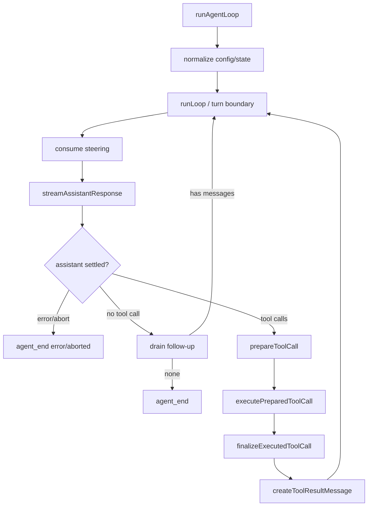

# 精读 `agent-loop.ts`

**源码**：`packages/agent/src/agent-loop.ts`；**symbol**：`runAgentLoop`、`runLoop`、`streamAssistantResponse`、`executeToolCalls`；**commit**：`853a80d26c90a14c1886f0ebb8ffaae133ca2185`。

## 调用者和被调用者

`Agent.runPromptMessages` 调用 `runAgentLoop`；它调用 `streamAssistantResponse`；后者调用配置中的 `transformContext`、`convertToLlm` 和 `streamFunction`。当 assistant content 有 `toolCall`，`executeToolCalls` 调用 `prepareToolCall`、`executePreparedToolCall`、`finalizeExecutedToolCall`，然后回到 `runLoop`。

## 两层循环

```text
outer loop:
  inner loop: tool calls 或 steering 尚未耗尽
    可选 prepareNextTurn
    注入 steering
    stream assistant
    execute tool calls
    emit turn_end
  drain follow-up
```

`error`/`aborted` 直接发 `turn_end` 与 `agent_end`。没有 Tool Call 时先检查 follow-up；有 Tool Call 时除非整个 batch 的结果都 `terminate`，否则下一轮让模型看到结果。

## 一个容易忽略的安全点

当 stop reason 是 `length` 且消息含 Tool Call，Pi 不执行这些可能被截断的参数，而是为每个 call 创建错误 Tool Result。参数即使“勉强能解析”，也不代表它完整。

## 事件顺序

`agent_start -> turn_start -> message_start/update/end -> tool_execution_start/update/end -> tool result message_start/end -> turn_end -> agent_end`。Agent 类在 `processEvents` 中先更新 runtime state，再等待 listeners，因此 UI 的 `agent_end` listener 完成才算真正 idle。

## 调试实验

用 `packages/agent/test/agent-loop.test.ts` 的 faux stream 思路记录 `convertToLlm` 输入、Provider events 和 Tool executor；不要调用真实 provider。测试 parallel mode 时同时检查 execution completion order 和 result message source order。

## 学习目标与前置知识

读完本页，你应能在 `agent-loop.ts` 中定位一次 turn 的开始、模型 stream、tool prepare/execute/finalize、steering/follow-up 和 `agent_end`。前置知识是 Promise/async iterator 的基本概念；可以把 async generator 理解为“异步地产生事件的 Java Iterator”，把 `AbortSignal` 理解为传给每层的取消令牌，而不是强制杀线程。

## 失败 trace：为什么“有 tool call”仍可能没有执行

```text
assistant stream
 -> 收到 toolCall delta
 -> stream 以 stopReason=length 结束
 -> 代码照常 executeToolCalls
 -> 参数被截断，文件被错误修改
```

另一个常见失败是：模型请求成功、工具也执行成功，但 tool result 没有按 `toolCallId` 放回 context，下一轮 provider 把结果当普通 user 文本。Pi 的 loop 需要把“流已经完成”和“Agent run 可以结束”分开：stream done 只结算一次 assistant response；是否继续由 tool calls、terminate、steering、follow-up 和 abort 一起决定。

## 文件职责和调用关系

**文件：** `packages/agent/src/agent-loop.ts`。**调用方：** `packages/agent/src/agent.ts` 中的 `Agent` lifecycle；在 coding-agent 中由 `AgentSession` 提供 loop config、context converter、stream function 和工具。**被调用方：** `streamAssistantResponse`、`executeToolCalls`、tool hooks、配置的 `streamFunction`。**输出：** `AgentEvent` 流以及最终状态，不直接写 TUI 或 session 文件。



## 输入和输出

loop config 典型包含：当前 `messages`、`tools`、`streamFunction`、`convertToLlm`、`transformContext`、`getSteeringMessages`、`getFollowUpMessages`、`signal`、tool execution mode 和事件回调。输入的 message 可能是 Agent 内部格式，不能假设它已经满足每个 provider 的 wire format。

一次 assistant response 的输出包括：文本或 thinking 增量、零个或多个完整 `ToolCall`、usage、stop reason 和可能的错误。`runAgentLoop` 进一步把它们投影成 `message_start/update/end`、tool execution events、`turn_end` 和 `agent_end`。事件是观察数据，不自动等于持久化记录。

## 逐步控制流

### 1. 初始化

入口先建立 abort/事件上下文，保留 caller 提供的 converter 和 stream function。不要把默认 provider 写死在 loop；provider 选择发生在上层 `Models` 或应用配置。

### 2. turn boundary

循环在边界读取 steering。运行中的 user 输入不能偷偷修改已经发出的 provider request；它应等待下一次 request 的安全边界。这个细节也是 Go/Java 实现用 queue 的原因。

### 3. `streamAssistantResponse`

它把 context 经过 `transformContext`、`convertToLlm` 后交给 stream function。收到每个 event 时更新 assistant message，并向 listener 发 update；收到 done 时才拥有 settled assistant message。stream error 应立即结束本轮，并保留可用于诊断的错误信息。

### 4. stop reason 分支

没有 tool call 且 stop reason 为正常 stop 时，先查 follow-up；有 follow-up 就把它加入下一轮，而不是把原 final 当作整个 Agent run 的 final。`length` 表示输出被截断；若其中包含不完整 tool call，不能执行。`error` 和 `aborted` 不应伪装成成功 final。

### 5. `executeToolCalls`

它处理一个 assistant message 的 tool batch。核心阶段可以按下列伪代码理解：

```text
for call in assistant.toolCalls:
    prepared = prepareToolCall(call, registry, signal)
    if prepared.error:
        result = errorResult(prepared.error)
    else:
        result = executePreparedToolCall(prepared, signal, hooks)
        result = finalizeExecutedToolCall(result, hooks)
    append createToolResultMessage(call.id, result)
```

并行模式只应并行真实 execute 阶段；prepare/finalize 的顺序、result 与原始 call 的配对要稳定。实际实现的函数名和参数以固定 commit 文件为准，伪代码只帮助建立边界。

## Tool lifecycle 的安全含义

`prepareToolCall` 负责 lookup、参数准备、schema/类型边界和 before hook。这里失败时不应触碰文件或 shell。`executePreparedToolCall` 才可能产生外部副作用；取消要传到 tool。`finalizeExecutedToolCall` 负责 after hook、details/patch 等结果调整。`createToolResultMessage` 把结果和 `toolCallId` 组成下一轮 context 能理解的消息。

因此，“模型生成了 call”与“工具执行成功”是两个事实。UI 可以先显示 tool execution start，但只有 result event 或 session entry 才能说明执行结果。生产 Harness 还需要在 effect 前后的 durable intent/result；当前普通 Pi loop 不应被描述成已经提供 durable operation ledger。

## steering、follow-up、abort 的位置

- **steering：** 当前 run 中改变下一步方向，通常在 turn boundary 消费。
- **follow-up：** assistant 本来没有 tool call、看似要结束时追加的新 user intent。
- **abort：** 取消 signal，使当前 provider/tool 尽快停止；它不是一条要发给模型的消息。
- **max steps：** loop 的硬上限，防止持续 tool call 即使模型不停止。

队列 callback 是 Agent 与 loop 的桥：loop 不拥有 UI 输入队列，只在安全点调用 getter。`Agent` 则拥有 running 状态和 queue 的互斥访问。

## 事件顺序与观察者

一次正常 tool run 可观察为：

```text
agent_start
 -> turn_start
 -> message_start/update/end
 -> tool_execution_start/update/end
 -> tool result message_start/end
 -> turn_end
 -> next turn or agent_end
```

监听器可能是 TUI、JSON mode、Telemetry 或测试。它们不应修改主 context；如果某个 hook 能修改 request，应明确放在 transform/before hook 边界，而不是偷偷改事件对象。

## 源码事实、推断与可选设计

> **源码事实：** 固定 commit 的 loop 将 stream assistant、tool batch、队列消息和终止事件组织在一起；`Agent` 负责外层 lifecycle。
>
> **合理推断：** prepare/execute/finalize 分层可以把“验证失败”和“副作用失败”区别开，便于测试和错误呈现。
>
> **可选设计：** 另一种 loop 可以把每个 tool call 拆成独立状态机并持久化 intent；这比当前内存 loop 更耐崩溃，但需要 writer/reducer 和幂等策略。

## 实验 A：观察一次 faux tool call

**目标：** 证明第二轮 request 的 tool result 来自 Runtime，而不是模型自己补写。

**准备：** 使用 `packages/agent/test` 的 faux stream；不要设置真实 API key。准备一个 calculator tool 和两次 response：第一轮 tool call，第二轮 final。

**步骤：**

1. 在 stream function 返回 done 前打印 call id/name/arguments。
2. 在 `prepareToolCall` 前打印 registry lookup 结果。
3. 在 execute 前后打印 tool result 和 `toolCallId`。
4. 打印第二次 `convertToLlm` 的 messages。
5. 对照事件顺序和最终 `agent_end`。

**观察点：** 第一轮只有候选 call；第二轮消息包含 assistant call 与 tool result；最终 final 不代表 tool 一定成功。

**预期结果：** 能指出至少三个不同事件和两个不同 message。

## 实验 B：验证截断与并行

将 faux response 的 stop reason 改成 `length` 并截断 arguments，断言没有真实 execute；再返回两个 read-only calls，让第一个 tool 延迟，检查完成事件可能先后不同而 result message 仍按 source order 配对。最后注入 abort，观察 provider signal 和 tool signal 的传播。

## 思考题

1. 为什么 tool result 不能只按数组位置保存而不保存 `toolCallId`？
2. 如果 after hook 抛错，应该把 tool 当成功、失败还是未知？你的选择需要怎样记录？
3. 并行 tool 中一个失败时，是否取消其他 tool？Pi 的 execution mode 与你的业务依赖有什么关系？
4. 如果 listener 永远不 resolve，为什么 agent end 可能迟迟不出现？是否需要 listener timeout？

## 小结

`agent-loop.ts` 的核心不是一个 `while`，而是安全地把 settled assistant、tool lifecycle、队列和事件串起来。`Agent` 管生命周期，loop 管控制流，Provider stream 管模型边界，Tool executor 管副作用。读源码时沿着这些阶段找 symbol，才能准确解释 abort、length、parallel 和 follow-up。
