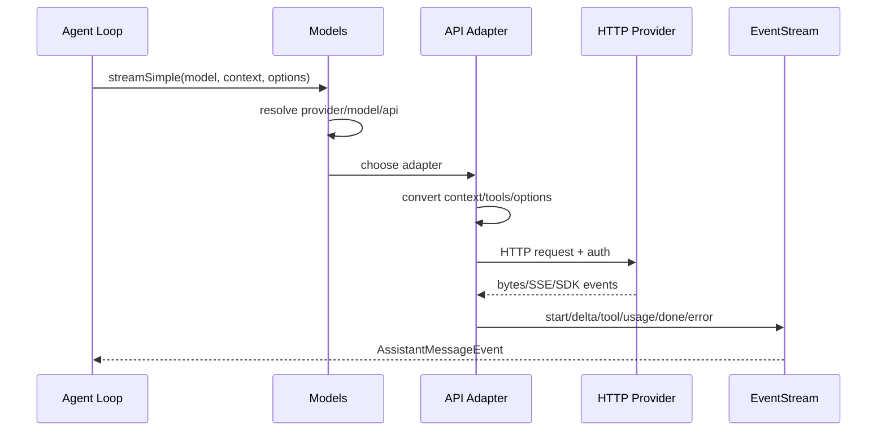

# 精读 `pi-ai` Provider 层

**文件**：`packages/ai/src/types.ts`、`models.ts`、`providers/all.ts`、`api/*.ts`；**symbol**：`Model`、`Provider`、`Models`、`ProviderStreams`、`AssistantMessageEventStream`；**commit**：`853a80d26c90a14c1886f0ebb8ffaae133ca2185`。

## 数据流

```text
AgentLoop Context
 -> Models.streamSimple(model, context, options)
 -> provider 根据 model.api 选择 adapter
 -> adapter 转换 Message/Tool/Thinking
 -> HTTP/SDK stream
 -> AssistantMessageEventStream
 -> AgentLoop
```

`ProviderStreams` 统一要求 `stream`/`streamSimple`，能力允许时可有 `fetchDeferred`/`cancelDeferred`。`Model` 保存 provider/model id、api、contextWindow、maxTokens、cost、reasoning 和 input 能力。

## 为什么 adapter 必要

OpenAI Responses 的 output item、Anthropic content block、Google parts 不同；它们的 tool-call 增量、thinking replay、stop reason、缓存字段也不一致。统一层把差异限制在 `src/api/`，上层只处理 `AssistantMessage` 和 `AssistantMessageEvent`。

## 当前 provider 列表

`providers/all.ts` 的 `builtinProviders()` 明确列出构建时支持的 provider 工厂，包括 OpenAI/Anthropic/Google/Bedrock、OpenRouter、Mistral、xAI、DeepSeek、Qwen/Xiaomi 等。列表不是可用凭证清单；认证由 runtime/environment 解决。

## 实验

阅读一个 `openai-*` adapter 和 `anthropic-messages.ts` 的同一段：比较 system、tool schema、stream delta、usage 和 stop reason 的转换。用 faux provider 测试，不把 API key 写进测试。

## 学习目标与前置知识

本页要回答一个工程问题：为什么 Agent Loop 可以只调用一个统一的 `streamSimple`，却支持多种厂商 API。读完后，你应能把 Provider、Model、API adapter、stream event、credential、retry 和 Agent Loop 的边界画出来。前置知识是 HTTP JSON、SSE 和 Java interface；不要求知道每个厂商 SDK。

## 失败 trace：把原始 API 泄漏到 loop

```text
AgentLoop 直接构造 Anthropic request
 -> 上层换 OpenAI Responses
 -> loop 里出现 output item、content block、tool_use 三套分支
 -> 测试必须准备真实厂商响应
```

这个设计的失败不是“厂商字段太多”，而是控制流依赖 wire format。它会让 retry、usage、thinking 和 stop reason 的处理散落在所有调用方，导致一个 adapter 修 bug 需要修改多个 package。

解决办法是定义 provider-neutral 的 `Model`、`Context`、`AssistantMessage` 和 `AssistantMessageEvent`。适配器独占厂商差异；loop 只依赖统一事件。注意：统一类型不是抹平所有差异，无法表达的能力要么用可选字段，要么以 capability/options 明确暴露。

## 真实文件和 symbol

**研究 commit：** `853a80d26c90a14c1886f0ebb8ffaae133ca2185`。

- `packages/ai/src/types.ts`：`Context`、`Message`、`AssistantMessage`、`ToolCall`、`Usage`、`StopReason` 和 event 类型。
- `packages/ai/src/models.ts`：`Model`/`Provider`/`Models`、model resolution 和 `streamSimple` dispatch。
- `packages/ai/src/providers/all.ts`：`builtinProviders`、`builtinModels`，以及 provider factory 列表。
- `packages/ai/src/api/anthropic-messages.ts`：Anthropic Messages 的 message/content block 与 stream event 转换。
- `packages/ai/src/api/openai-completions.ts`、`openai-responses.ts`：两种 OpenAI API 形状的适配。
- `packages/ai/src/api/google-generative-ai.ts`：Google parts、function call 和 finish reason 的适配。
- `packages/ai/src/utils/event-stream.ts`：`EventStream` 和 `AssistantMessageEventStream`，让事件生产与消费解耦。
- `packages/ai/src/utils/provider-retry.ts`：`retryProviderRequest` 等 provider 请求重试边界。

调用方是 Agent loop/AgentSession 提供的 stream function；被调用方是 adapter 的 HTTP/API 实现。`pi-ai` 不执行本地 Coding Tool。

## 三层数据流



`Models` 是选择和能力边界，adapter 是 wire format 边界，`EventStream` 是异步事件通道。不要把 `EventStream` 误认为 Agent Loop；它只传递一次模型请求的事件。

## Model 和 Provider 的分工

`Model` 是“一个可选用的模型配置”：provider id、model id、api、context window、max output tokens、cost、reasoning/thinking 能力和输入模态等。它帮助 runtime 在发送前做容量与能力判断。

`Provider` 是一组能创建 stream 的 provider-specific operations 和 credential/header 逻辑。`Models` 负责按 provider/model 找到它，并暴露统一调用入口。Provider 不是 Model：一个 provider 可有多个模型，同一模型也可能以不同兼容 API 配置。

## Message 归一化

不同 API 的消息结构不同：

| 供应商形状 | 原始差异 | 统一结果 |
| --- | --- | --- |
| Anthropic Messages | content blocks、`tool_use`、`tool_result` | assistant content/tool call/message |
| OpenAI Completions | `choices[].delta`、function call fragments | text/tool call deltas |
| OpenAI Responses | output items、response status、item id | response event/tool call/usage |
| Google | `parts`、functionCall/functionResponse | content/tool call/result |

adapter 要维护 role、tool call id、arguments 增量和必要的 provider-specific metadata。一个常见错误是只取文本，丢掉工具调用的 id 或 arguments；这样下一轮无法把 result 与 call 配对。

## Tool Call 的增量组装

流式 tool arguments 往往分多个 delta 到达。adapter 需要按 provider 的 index/id 累积 name 和 JSON 字符串，直到 done 才形成完整 `ToolCall`。JSON 字符串尚未闭合时不能调用工具；解析和 schema validation 属于后续 runtime 阶段。

```text
start assistant
 -> text delta: "我先读取"
 -> tool delta: id=call-1 name=read args="{\"path\":"
 -> tool delta: args="\"a.go\"}"
 -> done: AssistantMessage(toolCall=call-1, arguments=完整 JSON)
```

这解释了为什么“收到一个 tool delta”不等于“可以执行 tool”。adapter 只负责构造统一输出，execute 仍属于 Agent Loop。

## Thinking、Usage、StopReason 和 Error

- **Thinking/reasoning：** 某些 provider 以独立 block 或 summary 字段返回；统一 event 需要保留可选 thinking，而不能把它误当用户可见文本。
- **Usage：** 输入、输出、缓存和 reasoning token 可能字段不同；adapter 转成 `Usage`，费用计算保留明确的 model cost 配置。
- **Stop reason：** `stop`、`length`、`toolUse`、`error` 等要映射到统一枚举/union。`length` 影响 tool 是否安全可执行。
- **Error：** HTTP status、provider error body、stream parse error 和取消要保留可诊断信息；不要将所有错误包装成“模型返回空文本”。

统一的目的不是让所有语义都一样，而是让上层能稳定地处理主要控制分支，并通过可选字段携带无法抽象的细节。

## Retry 的边界

Provider retry 只适合明确的请求级暂时错误，例如网络断开、429 或部分 5xx；不能无条件重放已经产生外部副作用的 tool。`retryProviderRequest` 应遵守 attempts、backoff、abort signal 和错误分类；如果流已产生不可逆 token 或 deferred handle，重试策略必须单独定义。

```text
request attempt 1 -> 429 -> backoff (abortable)
request attempt 2 -> stream starts -> parse error
=> expose provider error; do not pretend tool ran
```

Agent Loop 的 retry 和 Tool retry 不是一回事。前者重做模型请求，后者可能重做外部副作用，后者必须要求 tool 幂等或有 operation id。

## 认证与配置

Provider adapter 可以读取 credential store、环境变量和自定义 headers，但模型对象不应把 secret 打进日志。`builtinProviders()` 列出代码支持的 factories，不代表当前环境拥有凭证或模型可用。自定义 provider 要在 `models.ts` 的统一边界接入，而不是让 loop 识别新厂商字段。

## 源码事实、推断、可选设计

> **源码事实：** `packages/ai/src/api/` 存在按 API 形状划分的 adapter，`models.ts` 负责统一 model/provider dispatch，stream events 返回给上层。
>
> **推断：** 将 wire format 限制在 adapter，可以让 faux provider 直接测试 Agent Loop；这是从依赖方向和测试边界得到的工程分析。
>
> **可选设计：** 自建 Harness 可以用单一 OpenAI-compatible adapter 起步；但保留 provider-neutral message types，未来加入 Anthropic/Google 时不需要重写 loop。

## 实验 A：对照两个 adapter

**目标：** 找出“同一语义、不同字段”的转换点。

**准备：** 打开 `anthropic-messages.ts`、`openai-responses.ts`、`types.ts` 和 faux provider 测试；不要连接真实 API。

**步骤：**

1. 写一条含 system、user、tool definition 的内部 context。
2. 分别找到 adapter 生成 request payload 的函数。
3. 找到文本 delta、tool-call delta、usage 和 finish 的处理分支。
4. 记录两者最终都如何产生 `AssistantMessageEvent`。
5. 对照 Agent Loop，确认 loop 没有读取原始 `content_block_delta` 或 `output_item`。

**观察点：** 统一的是上层需要的语义，不是每个 provider 的所有元数据。

**预期结果：** 能指出一个 message 字段、一个 tool call 字段和一个 stop reason 的归一化位置。

## 实验 B：构造失败响应

用本地 fake HTTP server 返回 429、空 choices、非法 SSE JSON 和正常 `[DONE]`。断言 retry 只发生在配置允许的请求错误；断言 adapter parse error 进入 error event；断言没有 tool executor 被调用。再记录 usage 是否在错误路径仍可诊断。

## 思考题

1. 为什么 `Model` 不能等同于 provider name 字符串？
2. 一个 stream 已经发出 tool call delta 后断开，应该重试、报错还是生成 synthetic result？请按副作用边界说明。
3. 如果某 provider 不支持 reasoning token，统一 `Usage` 应使用零、unknown 还是可选字段？
4. 为什么把 HTTP retry 和 Agent Loop retry 写在同一层会造成重复请求？

## 小结

Provider 层的价值是把厂商变化挡在 adapter 里，同时保留足够的 message、tool call、thinking、usage、stop reason 和 error 语义。`Models` 选择能力，adapter 翻译 wire format，EventStream 传递一次请求，Agent Loop 决定是否执行工具和开启下一轮；这几个责任不能合并。
