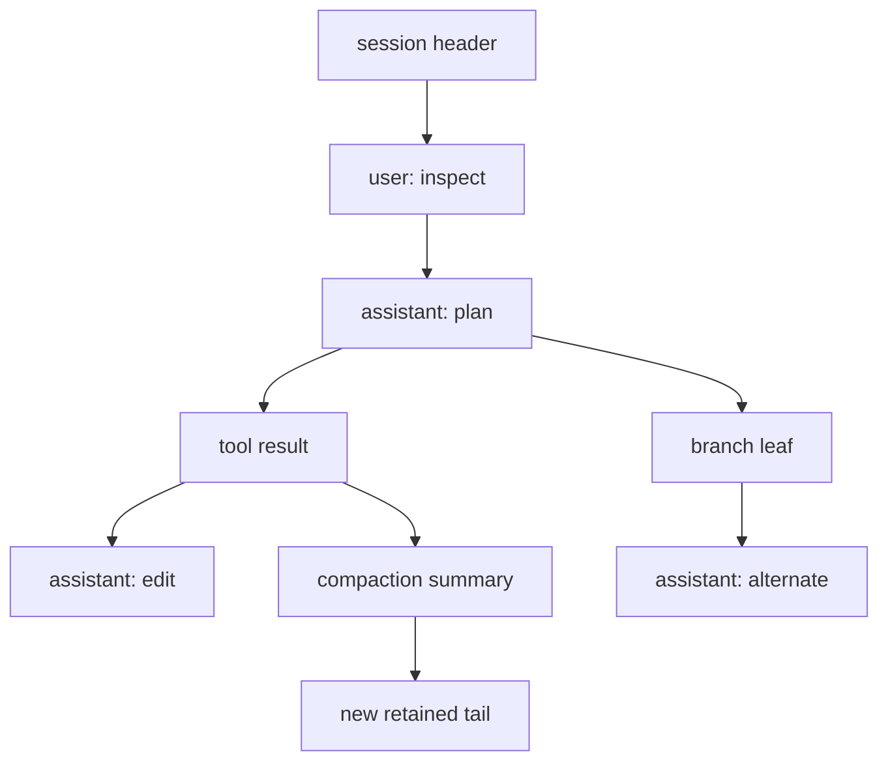
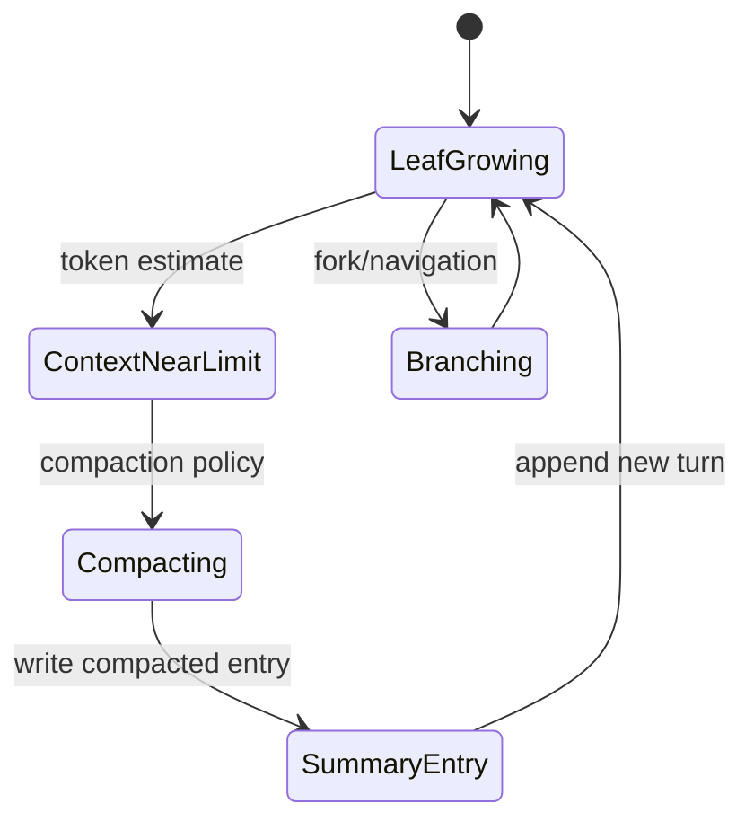

# 精读 SessionManager 与 AgentSession

**文件**：`packages/coding-agent/src/core/session-manager.ts`、`agent-session.ts`；**symbol**：`SessionManager`、`buildContextEntries`、`sessionEntryToContextMessages`、`AgentSession._handleAgentEvent`；**commit**：`853a80d26c90a14c1886f0ebb8ffaae133ca2185`。

## 两个职责

`SessionManager` 负责 header、entry、parentId、leaf 和 JSONL 读写；`AgentSession` 负责把 Agent 事件映射为保存、compaction、retry、Extension 事件和 UI 状态。Session entry 不等于每个 entry 都要发给模型。

## 消息如何落盘

`_handleAgentEvent` 在 `message_end` 看到 user/assistant/toolResult 时追加 `SessionMessageEntry`；custom message 用 custom entry；compaction/branch summary 走专门路径。这样 event lifecycle 是保存的触发点，而不是 TUI 自己抄一份 transcript。

## Context 投影

`buildContextEntries` 沿当前 leaf 构建路径，`sessionEntryToContextMessages` 将可投影 entry 转成 AgentMessage，之后 Agent Loop 再经 `convertToLlm`。这两层过滤避免 label、session info 或 UI-only 数据污染 Provider。

## 恢复注意

当前 Session v3 JSONL 与 `harness.v2.md` 设想的 operation log 不同。不要把 `CURRENT_SESSION_VERSION = 3` 写成 durable Harness 已经具备 operation recovery 的证据。

## 学习目标与前置知识

本页要解决的是：“进程结束后，下一次请求怎样知道上下文和当前分支？”读完后，你应能区分 Session entry tree、provider context、Agent state 和 durable operation record，并能追踪 `AgentSession` 从消息事件到 JSONL entry 的路径。前置知识是 JSONL、树结构和不可变列表；不要求先理解所有 compaction 算法。

## 失败 trace：只保存 `List<Message>`

```text
保存 [user, assistant, tool]
 -> 用户从旧分支继续
 -> 不知道哪个 assistant 是当前 leaf
 -> label、model change、compaction 丢失
 -> 恢复时 tool call/result 可能失配
```

`List<Message>` 能恢复一段线性聊天，却不能表达“从哪一个节点分叉”“当前模型配置何时改变”“哪些旧消息已经被 summary 取代”。Coding Agent 需要保存结构化 entry，并在每次请求前从 tree 投影出 provider messages。

## 文件、symbol 和调用关系

**研究 commit：** `853a80d26c90a14c1886f0ebb8ffaae133ca2185`。

- `packages/coding-agent/src/core/session-manager.ts`：`SessionManager`、`buildContextEntries`、`sessionEntryToContextMessages`、leaf/tree 查询和 JSONL persistence。
- `packages/coding-agent/src/core/agent-session.ts`：`AgentSession`、`_handleAgentEvent`、compaction/retry 与 Agent listeners。
- `packages/coding-agent/src/core/system-prompt.ts`：将项目资源和 active tools 组装进 system prompt。
- `packages/agent/src/types.ts`：Agent message/event 类型，定义 loop 可消费的内存契约。
- `packages/coding-agent/docs/session-format.md`：v3 session 文件形状；它与 `harness.v2.md` 的 operation records 是不同设计。

调用方是 mode/SDK 触发的 `AgentSession.prompt`；被调用方是 Agent、SessionManager、resource loader 和 ExtensionRunner。SessionManager 不负责发 HTTP，Agent Loop 不负责决定 JSONL 路径。

## Tree 和 leaf

把 session 想成一棵 append-only message tree：每个 entry 有 id、parentId、type、timestamp；一个 `leafId` 指向当前上下文末端。普通 prompt 沿 leaf 追加；branch/fork 让另一个 leaf 继续旧节点，不复制所有历史。model change、thinking level、active tools、compaction 和 branch summary 也是 tree entry 或相关元数据。



`parentId` 决定历史关系；`leafId` 决定下一次 context 取哪条路径。不能只按写入顺序把所有 session entry 全塞给模型，因为另一条 branch、UI label 和 session metadata 不都是 conversational message。

## `SessionManager` 的输入输出

### `buildContextEntries`

输入是当前 leaf、session entries、compaction 信息和配置；输出是沿 parent chain 选择出的可见 entry 序列。它负责停止在 compaction boundary 或 branch boundary，并保留足以恢复 provider 对话的 tail。

### `sessionEntryToContextMessages`

输入是一个 session entry；输出是零个或多个 Agent context message。message entry 可以转成 user/assistant/tool，model change 不一定转成聊天消息，label/session info 通常不应进入 provider。

```text
leafId
 -> buildContextEntries(leafId)
 -> filter/project entries
 -> sessionEntryToContextMessages
 -> Agent messages
 -> convertToLlm
 -> provider request
```

这是两个转换：tree → context entries，以及 entries → Agent messages。不要把 Session 的持久化格式当作 Provider 的 API 格式。

## `AgentSession._handleAgentEvent`

Agent 发出 message/tool/compaction 等事件，`AgentSession` 作为 listener 更新当前 session。典型路径是：

```text
message_start/update
 -> 内存中的 assistant/tool 状态
message_end
 -> 创建 SessionMessageEntry
tool execution update
 -> UI/telemetry 状态（不一定逐字写 entry）
agent_end
 -> 完成 lifecycle、触发后续 persistence/UI
```

“每个 delta 都写 JSONL”通常既昂贵又难恢复；应在稳定边界写 settled entry，同时让 UI 从事件看到增量。具体是否每种事件都持久化，以当前 `agent-session.ts` 分支和 session format 为证据。

## Compaction 如何改变投影

当 context window 不够，compaction 把旧 path 转成 summary/retained tail，并写入新的 compaction entry。后续 `buildContextEntries` 从 compaction boundary 开始构造 context，而不是重复读取全部旧消息。summary 是给模型的压缩上下文，不等价于原始事实；关键 tool result、文件状态和用户约束必须按策略保留。



## Session、Context、Memory 的辨析

- **Session：** 进程间可恢复的交互历史和树结构。
- **Context：** 某一次 provider request 实际选择的 system/messages/tools。
- **Memory：** 更长期、可检索或业务定义的事实，可能来自数据库/RAG。

一个 session 可以生成多个不同 context（不同 branch、model、tool allowlist）；RAG memory 可以进入 context，却不自动成为 session entry。Compaction 也不是把内容写入向量库。

## v3 与 durable Harness 的边界

当前 coding-agent session format 主要描述 header、entries、parent/leaf、compaction 和 metadata；`harness.v2.md` 设计的 `operation_started`、`tool_started`、`operation_finished`、queue record 和 recovery reducer 属于更强的 durable execution contract。前者可以恢复对话树，后者还要恢复“副作用做到哪一步”。不要以 `CURRENT_SESSION_VERSION = 3` 推断后者已实现。

## 源码事实、推断、可选设计

> **源码事实：** `SessionManager` 提供 session tree/context projection，`AgentSession` 监听 Agent event 并协调保存，当前文件格式是 v3 语义。
>
> **推断：** 把 tree entry 转成 provider context 的独立函数，能防止 UI-only metadata 污染模型请求。
>
> **可选设计：** 自建 Harness 可以使用 SQLite 代替 JSONL，但仍需保存 parent/leaf、版本、原子写和 corruption 检测；数据库并不会自动带来恢复语义。

## 实验 A：观察 branch projection

**目标：** 证明同一个 session tree 的两个 leaf 会得到不同 context。

**准备：** 使用 Pi 的 session tests 或临时 JSONL；找到一个 root、assistant、tool result 和 branch entry。

**步骤：**

1. 记录每个 entry 的 id、parentId、type。
2. 将 leaf 指到主分支，运行 `buildContextEntries`。
3. 将 leaf 指到分支，比较输出 entries。
4. 对每个 entry 调用/追踪 `sessionEntryToContextMessages` 的结果。
5. 记录哪些 metadata 被过滤，哪些 message 被保留。

**观察点：** 写入顺序相近的 entries 可能不在同一 branch context；provider 只看到投影后的 messages。

**预期结果：** 你能解释 branch 是 tree navigation，不是复制一份 List。

## 实验 B：损坏与 compaction

复制 session 文件，删除一行 tool result 或改错 parentId，再观察加载器如何报错；将 context token estimate 调低，观察 compaction entry 后的 retained tail。不要在真实 session 上做破坏实验。

## 思考题

1. 为什么 tool call 和 tool result 必须保持配对？
2. compaction summary 丢失文件路径时，后续模型会怎样误判？应该保留哪些结构化 facts？
3. 如果两个进程同时写同一个 JSONL，单调 seq 和原子 rename 还能保证什么？不能保证什么？
4. Session 恢复成功是否等于外部 shell 副作用已恢复？为什么需要 operation ledger？

## 小结

SessionManager 保存和查询 tree，AgentSession 把 Agent event 接到应用生命周期，projection 函数把持久化结构转换为一次请求的 context。Session 不是 Memory，Context 不是完整历史，v3 transcript 也不是 durable operation recovery；读源码时必须把这些层分开。

**继续阅读：** 先用 `source-map.mdx` 定位 `buildContextEntries`，再回到 compaction 和 persistence 章节验证本页的投影边界。
