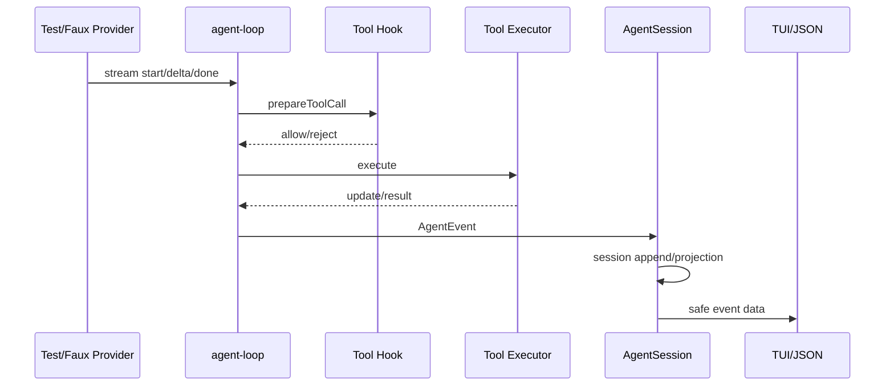

# 调试一次 Tool Call

## 准备

使用仓库已有的 faux provider/test harness，不需要 API key。先读 `packages/agent/test/agent-loop.test.ts`、`packages/agent/test/agent.test.ts` 和 `packages/coding-agent/test` 中相关测试，确认测试使用的 stream 事件形状。

## 观察点

<Steps>
  <Step title="注册">
    在 `packages/coding-agent/src/core/tools/index.ts` 观察 `createCodingTools` 返回 definition 与 executor。
  </Step>
  <Step title="模型响应">
    在 `streamAssistantResponse` 的 `done` 分支观察最终 `AssistantMessage`；记录 `content` 中的 `id/name/arguments`。
  </Step>
  <Step title="准备和验证">
    在 `prepareToolCall` 观察 lookup、`prepareArguments`、schema validation、`beforeToolCall`。
  </Step>
  <Step title="执行和回传">
    在 `executePreparedToolCall` 和 `createToolResultMessage` 观察 signal、result、`isError`、`toolCallId`。
  </Step>
  <Step title="下一轮">
    检查 `currentContext.messages` 和下一次 `convertToLlm` 输入，确认 Tool Result 已配对。
  </Step>
</Steps>

调试日志只能临时添加，完成后撤销；更好的方式是写事件 sink 和断言。断点不应打印 API key、完整 prompt 中的凭据或用户私密文件。

## 修改实验

把 `toolExecution` 设为 `sequential`，再换回 `parallel`；保留同一 faux script，比较 execution end 事件和 result message 顺序。

## 学习目标与前置知识

本实验页的目标是把一次静态源码阅读变成可复现证据。完成后，你应能在不暴露 API key、文件内容和完整 prompt 的前提下，观察 definition、stream event、prepare、execute、result、session entry 和 UI event。前置知识是 Node 调试器、断点和测试断言；不要求会使用所有 VS Code 调试功能。

## 失败 trace：只在 UI 上加 console.log

```text
TUI 显示“正在调用 read”
 -> 终端看起来卡住
 -> 无法判断是 stream、hook、tool 还是 session write
 -> 加一条 console.log(整个 context)
 -> 凭据和私密文件进入日志
```

这个方法同时缺少边界和造成泄露。调试日志应打印稳定 id、事件类型、长度、stop reason 和错误类别，而不是完整 arguments、prompt 或 tool output。对于最终行为，优先使用 faux provider 与测试断言；断点只是辅助。

## 源码定位表

研究 commit：`853a80d26c90a14c1886f0ebb8ffaae133ca2185`。

| 观察问题 | 文件/symbol | 应记录什么 |
| --- | --- | --- |
| 工具怎样出现 | `core/tools/index.ts#createCodingTools` | names、definition count |
| stream 返回什么 | `agent-loop.ts#streamAssistantResponse` | event type、delta length、stop |
| 参数何时校验 | `agent-loop.ts#prepareToolCall` | tool name、validation outcome |
| 谁产生副作用 | `agent-loop.ts#executePreparedToolCall`、tool `execute` | duration、success/error |
| result 怎样回传 | `createToolResultMessage` | call id、result size |
| session 何时保存 | `agent-session.ts#_handleAgentEvent` | event type、entry type |
| UI 怎样呈现 | modes/TUI listener | render event、not raw secret |

## 观察图



## 具体操作步骤

### 1. 固定测试入口

先跑单个 faux test，而不是整个 suite。使用 `packages/agent/test/agent-loop.test.ts`、`packages/agent/test/agent.test.ts` 和 coding-agent tool/session tests 中已经存在的 fake model/stream。记录测试文件、case 名和 commit；这样别人可以复现。

### 2. 设置 source map 或断点

在 VS Code 中把 workspace root 设为仓库根，使用 TypeScript 调试配置启动测试 runner。断点放在 symbol 定义而不是行号附近：`runAgentLoop`、`streamAssistantResponse`、`prepareToolCall`、`executePreparedToolCall` 和 `_handleAgentEvent`。

### 3. 观察模型边界

在 stream event handler 记录：`start`/`delta`/`done`/`error`、累计文本长度、tool call id、arguments 长度和 stop reason。对 arguments 做 hash 或只打印字段名；不要打印完整内容。确认 done 后才形成 settled assistant message。

### 4. 观察工具边界

记录 lookup 是否成功、schema validation 是否通过、before hook 是否允许、execute duration 和最终 `isError`。如果是 `read`，记录相对路径和行范围，不记录文件内容；如果是 `bash`，记录命令分类而不是完整命令和环境。

### 5. 观察下一轮和 session

在 `convertToLlm` 入口统计 messages 的 role/call id，不输出内容。检查下一轮是否包含 assistant tool call 与配对 tool result。再在 `_handleAgentEvent` 记录 event 到 session entry 的类型映射。

## 断点顺序和预期状态

```text
runAgentLoop: running=true
stream start: assistant draft exists
stream done: assistant settled, maybe toolCalls
prepare: registry + validated args
execute: external effect may happen
finalize: result patched by after hook
next request: tool result appended
agent_end: no further tool/follow-up or terminal error
```

如果在 `stream done` 看不到 tool call，先查 adapter，不要直接修改 loop。如果 prepare 通过但 execute 没发生，查 before hook/abort；如果 execute 发生但下一轮缺 result，查 result message 构造和 context append；如果 session 缺 entry，查 AgentSession listener 是否收到 message_end。

## 调试异常路径

### 截断输出

让 faux response 使用 `length` stop reason，确认不完整 tool call 不会执行。若执行了，说明安全边界被错误放在 parse 后而不是 settled response 判定处。

### 未知工具

返回未注册 name；预期是明确 error tool result，且真实 executor 调用计数为零。

### 用户 abort

在 provider delay 或 tool update 中调用 abort。预期 signal 被传递、当前 run 结束为 aborted/error，后续工具不应因为旧队列自动继续。

### listener 抛错

使用测试 listener 主动抛异常，观察宿主是隔离 listener 错误还是终止 run。不要把实验结论推广为 durable recovery 语义；事件是观察层，session record 另有边界。

## 源码事实、推断、可选设计

> **源码事实：** Pi 有 faux provider 和 Agent/AgentSession event boundary，可以在不访问真实 provider 的情况下测试 loop。
>
> **推断：** 通过稳定 id、长度和分类字段调试，既能重建控制流又降低敏感数据泄露，这是工程上的折中。
>
> **可选设计：** 自建 Harness 可以引入 structured logger、trace/span 和 deterministic scheduler；但日志不应自动成为恢复记录。

## 练习：写一个不泄密的 trace recorder

**目标：** 记录一次完整 tool lifecycle，但不记录 prompt、文件正文、API key 或命令原文。

**准备：** 使用 faux provider、临时 workspace 和测试 event sink；建立一个 JSONL 临时输出文件。

**步骤：**

1. 为每个事件输出 `runId`、event type、tool name、duration、payload length。
2. 将 path 规范化为 workspace 相对路径。
3. 将 arguments/output 替换为长度与 hash。
4. 记录 validation、permission 和 execution 的结果。
5. 断言同一 call id 的 start/end 成对出现。
6. 用 `length`、unknown tool 和 abort 各跑一次。

**观察点：** 一个可用 trace 需要顺序和关联 id，不需要复制所有业务数据。

**预期结果：** 能从 trace 判断故障层，并可将日志交给其他人复现。

**思考题：** 为什么把 session JSONL 当 debug log 会妨碍恢复？哪一个字段应脱敏？如果 tool 已执行但 `tool_end` 丢失，trace 和 durable intent 各自能说明什么？

## 小结

源码调试的最小闭环是：固定测试、稳定 symbol、脱敏事件、断点验证状态、用异常路径反证边界。先区分 stream、loop、tool、session 和 UI，再写日志；否则一条“调用失败”无法说明真正失败在哪里。
